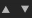

# Interfaz heredada de Bakers

Esta es la descripción de la interfaz baker disponible en las versiones de [Adobe Substance 3D Designer](https://www.adobe.com/es/products/substance3d-designer.html) anteriores a la 6.0.4.

## Información general

El panel panadero se divide en 4 partes:

### 1: Escena

Permite definir qué parte de la malla participa en el proceso de cocción.

Nuevo en la versión 6, también puede seleccionar por material:

### 2: Panaderos

Pulsando el botón , puede agregar los panaderos deseados a la lista de procesamiento

>[!NOTE]
>
> Las panificaciones se procesan siguiendo el orden de la lista (de arriba abajo): esto puede ser importante si desea reutilizar el resultado de una cocción (como el mapa normal) en otro proceso de cocción

Al hacer clic en el signo &quot;+&quot; en el diseño de los panaderos, puede añadir los panaderos en una pila (puede colocar tantos panaderos como desee en una pila).

.

Puede quitar un proceso de procesamiento de la lista presionando 

Puede reordenar la lista de procesos bancarios seleccionando un proceso bancario y usando 

### 3: Parámetros de panaderos

En esta sección se muestran las opciones específicas para el panadero seleccionado actualmente.

### 4: Parámetros comunes

Muestra los parámetros que se comparten entre panaderos.

>[!NOTE]
>
> De forma predeterminada, cambiar uno de estos parámetros; afectará a todos los panaderos, excepto si marca Ignorar parámetros, común a todos los panaderos: en ese caso, los cambios serán locales para el panadero actual.

* **El campo Nombre del recurso** le permite cambiar el nombre del mapa de bits generado, si lo desea.
* **La lista desplegable Formato de archivo** le permite cambiar el formato de archivo predeterminado (formato de mapa de bits de Windows u OS/2, &quot;BMP&quot;).
* **La casilla de verificación** **Colocar** recurso en una carpeta específica de malla le permite elegir si el mapa de bits generado se almacena en el mismo nivel que el modelo o dentro de una nueva subcarpeta denominada &quot;Resources&quot;.
* **El método** le permite definir si el nuevo recurso de mapa de bits debe vincularse o incrustarse en el paquete de Substance.
* **La carpeta** le permite definir dónde guardar los mapas.

Pulsando el botón OK en la parte inferior derecha de la ventana de panadería se iniciará el proceso de panadería.

Novedad en la versión 6: ahora puede cancelar el proceso de procesamiento con el botón cancelar:

