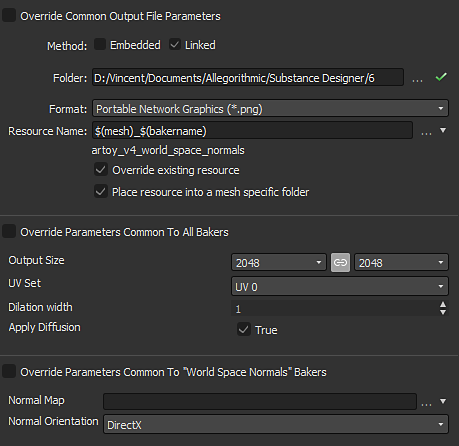
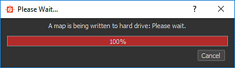

# Interfaz heredada de Baker

Esta es la descripción de la interfaz de baker disponible en [Adobe Substance 3D Designer](https://www.adobe.com/es/products/substance3d-designer.html) versiones anteriores a la 6.0.4.

## Información general

El panel baker se divide en 4 partes:

### 1: Escena

Permite definir qué parte de la malla está implicada en el proceso de hacer un bake.

Nuevo en la versión 6, también puede seleccionar por material:

### 2: Bakeres

Pulsando el botón , puede agregar los bakeres deseados a la lista de procesamiento

>[!NOTE]
>
> Las panificaciones se procesan siguiendo el orden de la lista (de arriba abajo): esto puede ser importante si desea reutilizar el resultado de una hace un bake (como el mapa de normales) en otro proceso de hace un bake

Al hacer clic en el signo &quot;+&quot; en el diseño de bakeres, puede añadir los bakeres en una pila (puede colocar tantos bakeres como desee en una pila).

.

Puede quitar un proceso de hacer un bake de la lista presionando 

Puede reordenar la lista de procesos de hacer un bake seleccionando un proceso de hacer un bake y utilizando 

### 3: Parámetros de bakeres

Esta sección muestra las opciones específicas del baker seleccionado actualmente.

### 4: Parámetros comunes

Muestra los parámetros compartidos entre bakeres.

>[!NOTE]
>
> De forma predeterminada, cambiar uno de estos parámetros; afectará a todos los bakeres, excepto si marca la casilla Sustituir parámetros, común a todos los bakeres: en ese caso, los cambios serán locales para el baker actual.

* **El campo Nombre del recurso** le permite cambiar el nombre del mapa de bits generado, si lo desea.
* **La lista desplegable Formato de archivo** le permite cambiar el formato de archivo predeterminado (formato de mapa de bits de Windows u OS/2, &quot;BMP&quot;).
* **La casilla de verificación** **Colocar** recurso en una carpeta específica de malla le permite elegir si el mapa de bits generado se almacena en el mismo nivel que el modelo o dentro de una nueva subcarpeta denominada &quot;Resources&quot;.
* **El método** le permite definir si el nuevo recurso de mapa de bits debe vincularse o incrustarse en el paquete de Substance.
* **La carpeta** le permite definir dónde guardar los mapas.

Al pulsar el botón Aceptar en la parte inferior derecha de la ventana bakeres, se iniciará el proceso de hace un bake.

Novedad en la versión 6: ahora puede cancelar el proceso de hacer un bake con el botón cancelar:

