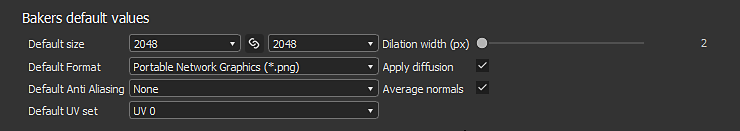

# Bakers

Horneado se refiere a la acción de **transferir información basada en malla a texturas**. A continuación, los sombreadores o los filtros de Substance leen esta información para generar efectos o texturas más avanzados.

>[!NOTE]
>
> Para obtener más información sobre el horneado, consulta la [Documentación de horneado](https://experienceleague.adobe.com/es/docs/substance-3d/bakers/home).

<table>
<tr style="border: 0;">
<td width="100.00%" style="border: 0;" valign="top">

Se puede tener acceso a la ventana para hornear a través del archivo de malla en la ventana del [Explorador](../interface/the-explorer-window/the-explorer-window.md). Haga clic con el botón derecho en el nombre de la malla y elija &quot;**Información del modelo de horno**&quot; para abrir la ventana de horno.

</td>
<td width="33.33%" style="border: 0;" valign="top">

Opción 

</td>
</tr>
</table>

## Información general

La ventana para hornear de se divide en varios paneles que se describen a continuación.

<table>
<tr style="border: 0;">
<td style="border: 0;" valign="top">

### Elementos para hornear

Este panel controla qué parte de la malla de baja polietileno se utilizará para realizar la cocción.

Enumera la geometría que se encuentra dentro del fichero de malla de baja polimerización. De forma predeterminada, la lista se basa en los materiales individuales que se encuentran en el archivo, pero se puede cambiar a submallas en su lugar cuando sea pertinente. Puede anular la selección de los elementos que deben omitirse durante el proceso de cocción.

</td>
<td style="border: 0;" valign="top">

</td>
</tr>
</table>

<table>
<tr style="border: 0;">
<td style="border: 0;" valign="top">

### Salida

Este panel controla dónde se ubicará la textura horneada.

</td>
<td style="border: 0;" valign="top">

</td>
</tr>
</table>

| *Parámetro* | *Descripción* |
| --- | --- |
| **Método** | Controla cómo se almacenarán las texturas horneadas con el paquete de Substance.Valores posibles:<ul data-preserve-html="true"><li data-preserve-html="true"><strong>Incrustado</strong> : la textura horneada se almacena en una subcarpeta junto al paquete Substance con un nombre específico.</li><li data-preserve-html="true"><strong>Vinculado</strong> (predeterminado) : la textura horneada se almacena en la carpeta definida y, a continuación, se hace referencia a ella en el Substance empaquetado.</li></ul> |
| **Carpeta** | Ubicación de las texturas horneadas al guardarlas. Haga clic en el botón de tres puntos para abrir un cuadro de diálogo de archivo y elija la carpeta de exportación. Aparecerá una marca de verificación a la derecha para indicar si la carpeta realmente existe o no. |
| **Nombre** | Convención de nomenclatura de las texturas horneadas. Haga clic en el botón de tres puntos para abrir un menú desplegable e insertar otros marcadores de posición (nombre de fondo, personalizado, material, malla). |
| **Ejemplo** | Simule un nombre de archivo para probar la convención de nomenclatura. |
| **Colocar recurso en una carpeta específica de malla** | Si se activa, las texturas horneadas se guardarán dentro de una carpeta denominada archivo de malla. |

### Mallas de alta definición

Este panel controla la lista de mallas de alta densidad y los ajustes relacionados. Consulte los [parámetros comunes](https://experienceleague.adobe.com/es/docs/substance-3d/bakers/bakers-settings/common-parameters) para obtener más información.

### Valores predeterminados

Consulte los [parámetros comunes](https://experienceleague.adobe.com/es/docs/substance-3d/bakers/bakers-settings/common-parameters) para obtener más información.

### Lista de procesamiento y ajustes de Bakers

La **lista de procesamiento de Bakers** es donde puedes elegir qué textura horneada quieres generar. De forma predeterminada, la lista está vacía.

* **Agregando un nuevo panadero:** Haga clic en el botón &quot;Agregar panadero&quot;.
* **Quitando un panadero:** Selecciona el panadero en la lista, luego haz clic en el botón &quot;Eliminar panadero&quot;.
* **Mover un panadero a la parte superior:** Seleccione el panadero en la lista y, a continuación, haga clic en el botón &quot;Tire hacia arriba&quot;.
* **Bajando por un panadero:** Selecciona el panadero en la lista, luego haz clic en el botón &quot;Empujar hacia abajo&quot;.

Cada panadero en el hereda de forma predeterminada los valores predeterminados (véase más arriba). El tamaño (resolución), por ejemplo, se puede anular haciendo clic en la celda de la línea del panadero. Esto es cierto para los demás ajustes de la línea.

Al hacer clic en un panadero de la lista, la vista Parámetros de panadero se actualizará con sus parámetros específicos.

Para obtener más información sobre los parámetros específicos, consulte: [Configuración de panaderos](https://experienceleague.adobe.com/es/docs/substance-3d/bakers/bakers-settings/bakers-settings).

