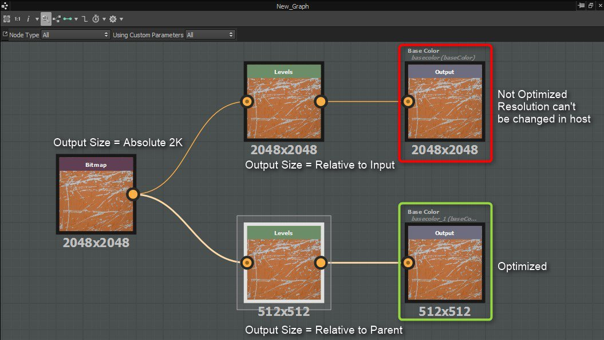

# Directrices de optimización del rendimiento

## Gráficos de Substance

Cuanto más complejos sean tus [gráficos de Substance](../../compositing-graphs/substance-compositing-graphs.md), más potencia de procesamiento necesitarás para procesarlos. Debes intentar <b>encontrar un equilibrio entre la complejidad y la velocidad de procesamiento</b>.\
Esto es *especialmente* importante si vas a usarlos en aplicaciones gráficas en tiempo real, como juegos.

En general, los nodos que exponen parámetros personalizados, que se pueden modificar en tiempo de ejecución, <b> deben colocarse lo más cerca posible del final del gráfico</b>.

Esto se debe a que el resultado de cada nodo se almacena en caché siempre que sea posible. Por lo tanto, cuanto más arriba esté el gráfico del nodo reajustable, más salidas deberán procesarse cada vez que se modifique uno de los parámetros expuestos. Si el nodo expuesto está cerca del final del gráfico, sólo será necesario volver a calcular los pocos nodos entre él y los nodos de salida.

Por ejemplo, si se retoca un color uniforme al principio del gráfico, se recalcularán todos los nodos siguientes. Si ajusta un nodo HSL situado justo antes de la salida, solo se volverá a calcular este nodo, lo que mejora en gran medida el rendimiento del gráfico.

Tenga en cuenta las siguientes directrices:

### CONFIGURACIÓN GENERAL RELACIONADA CON EL RENDIMIENTO

+++El motor de GPU es mucho más rápido que el motor de CPU
A menos que tenga una tarjeta gráfica no compatible (integrada), use el motor de Substance de GPU (cámbielo por la tecla de acceso rápido F9).

+++

+++El cambio de la resolución principal del gráfico es lento
Vuelve a calcular el gráfico, la caché y todas las miniaturas. Es mejor usar [la pestaña <b>Lote </b>del cuadro de diálogo de exportación](../../compositing-graphs/exporting-bitmaps/exporting-bitmaps.md), ya que evita cálculos extensos e innecesarios (por ejemplo, al exportar a una resolución 8192).

+++

+++En casos extremos, podría ser necesario aumentar la memoria caché
La aplicación [limita la cantidad de RAM que se puede usar](../../interface/preferences-window/preferences-window.md) para la caché de imágenes, pero puedes anularla e incrementarla (con cuidado).

+++

### OPTIMIZACIÓN DE GRÁFICOS

+++¡Preste atención a las resoluciones de nodos y a la herencia en general!
Los valores altos afectarán seriamente al rendimiento, por lo que debe tener en cuenta la probabilidad de uso del material y si puede reducir el tamaño de los datos involucrados.

Le recomendamos que obtenga más información sobre la [resolución de nodos (tamaño de salida)](../../compositing-graphs/output-size/output-size.md) y la [herencia en los gráficos de Substance](../../compositing-graphs/inheritance-compositing/inheritance-in-substance-compositing-graphs.md).

+++

+++Usar escala de grises cuando no se necesite color
Las operaciones de color tardan cuatro veces más que las operaciones en escala de grises. Asimismo, intente minimizar las conversiones de texto entre color y escala de grises.

+++

+++Utilizar 8 bits cuando no se necesite 16 bits
La versión de CPU del Substance Engine (SSE2) *no* es compatible con color de 16 bits o escala de grises de 8 bits. El motor de GPU admite las 4 combinaciones de 8/16 bits y escala de grises/color. *Actualmente, solo se usa el motor de CPU en los complementos Unity y Unreal Engine*.

+++

+++Minimizar el tamaño de salida del nodo siempre que sea posible
En ocasiones, reducir el tamaño de algunos nodos no afecta al resultado final, pero sí al rendimiento. Por ejemplo, el uso de un nodo Color uniforme establecido en el mismo tamaño de salida que el documento no tiene sentido: El color uniforme debe establecerse en Absoluto [16px x 16px] y el nodo siguiente en Relativo al principal. En general, este truco funciona bien con imágenes de baja frecuencia, como el ruido de Perlin.

+++

+++No utilice imágenes menores de 16*16 píxeles
Esto ralentiza el rendimiento de renderizado.

+++

+++Cuando utilice el nodo Fusión, desactive la fusión de Alpha cuando no sea necesaria

+++

+++Los desenfoques y deformaciones son los nodos que requieren un uso más intensivo del procesador

+++

+++Algunos generadores de ruido se ven afectados por la cantidad de patrones dibujados
Por ejemplo, el nodo [Tile Generator](../../compositing-graphs/nodes-reference-for-com/node-library/texture-generators/patterns/tile-generator/tile-generator.md) tardará más en procesar cuantos más patrones añada.

+++

+++Algunos ruidos se ven afectados por un factor de escala
Este factor, de hecho, dibujará más patrones. Los nodos afectados incluyen ruidos, patrones de Celdas, etc. Si necesitas un patrón de ruido blanco, no uses un ruido con un valor de escala muy alto y usa los nodos [Ruido blanco](../../compositing-graphs/nodes-reference-for-com/node-library/texture-generators/noises/white-noise/white-noise.md) o [Ruido blanco rápido](../../compositing-graphs/nodes-reference-for-com/node-library/texture-generators/noises/white-noise-fast/white-noise-fast.md) en su lugar.

+++

+++Por el contrario, hay algunos generadores de ruido muy rápidos
Entre ellos se incluyen [White Noise Fast](../../compositing-graphs/nodes-reference-for-com/node-library/texture-generators/noises/white-noise-fast/white-noise-fast.md), [Base de Suma fractal](../../compositing-graphs/nodes-reference-for-com/node-library/texture-generators/noises/fractal-sum-base/fractal-sum-base.md) y [Anisotropic Noise](../../compositing-graphs/nodes-reference-for-com/node-library/texture-generators/noises/anisotropic-noise/anisotropic-noise.md).

+++

+++Tenga cuidado con las funciones de muestreo de imágenes pesadas en algunos casos
Las funciones se ejecutan en el motor de CPU, excepto en [procesadores de píxeles](../../compositing-graphs/nodes-reference-for-com/atomic-nodes/pixel-processor/pixel-processor.md). Si está realizando un muestreo de imágenes muy intenso (cambiando las coordenadas $pos) en [Value Processors](../../compositing-graphs/nodes-reference-for-com/atomic-nodes/value-processor/value-processor.md) o [FXmaps](../../function-graphs/fxmaps/fxmaps.md), habría muchos cambios entre VRAM y CPU RAM, lo que provocaría retrasos en el rendimiento.

+++

### OPTIMIZACIONES PARA USO MÓVIL

+++No se recomienda usar Deformaciones y FX-Maps
Son muy costosos de rendimiento.

+++

+++Evitar nodos de desenfoque
Use transformaciones de escala reducida en su lugar.

+++

+++Trabaja todo lo que puedas en escala de grises
Cambie al modo de color al final del gráfico.

+++

+++Comparta nodos en la medida de lo posible entre salidas

+++

### OPTIMIZACIONES DE TAMAÑO PARA MAPAS DE BITS INCRUSTADOS

[Los mapas de bits](../../resources/bitmap-resource/bitmap-resource.md) tienen su [tamaño de salida](../../compositing-graphs/output-size/output-size.md) establecido en [&#39;absoluto&#39;](../../compositing-graphs/inheritance-compositing/inheritance-in-substance-compositing-graphs.md) de forma predeterminada. Esto significa que si el mapa de bits se conecta a una salida a través de la cadena de nodos, se forzará que la salida final tenga el tamaño del mapa de bits incrustado.\
Un nodo que inserte después del mapa de bits tendrá su tamaño de salida establecido en [&#39;Relativo a la entrada&#39;](../../compositing-graphs/inheritance-compositing/inheritance-in-substance-compositing-graphs.md). Esto significa que el nodo también tendrá el tamaño inherente del mapa de bits y llevará este tamaño por la cadena de nodos hasta los resultados. Para corregir esto, debe establecer el nodo después del mapa de bits para que su tamaño de salida esté establecido en [&#39;Relativo al primario&#39;](../../compositing-graphs/inheritance-compositing/inheritance-in-substance-compositing-graphs.md).

Si el gráfico está configurado para tener una resolución dinámica, puede cambiar el tamaño de salida en el mapa de bits incrustado para que sea relativo al principal.\
De esta manera, el tamaño del mapa de bits cambiará en función del gráfico principal y no se producirá una situación en la que el gráfico procese una resolución en el mapa de bits mayor que la necesaria.

>[!WARNING]
>
> Si se establece un nodo [Bitmap](../../compositing-graphs/nodes-reference-for-com/atomic-nodes/bitmap/bitmap.md) en &quot;Relativo al principal&quot; y se [publica](../../compositing-graphs/publishing-asset-files/publishing-substance-3d-asset-files-sbsar.md) el gráfico en un recurso de Substance 3D (SBSAR), el mapa de bits se guardará con una resolución de **256x256** en lugar de su tamaño original. En su lugar, se recomienda mantener el [método de herencia](../../compositing-graphs/inheritance-compositing/inheritance-in-substance-compositing-graphs.md) de los nodos de mapa de bits&#39; [Tamaño de salida](../../compositing-graphs/output-size/output-size.md) como &#39;Absoluto&#39; y usar un nodo [Transformation 2D](../../compositing-graphs/nodes-reference-for-com/atomic-nodes/transformation-2d/transformation-2d.md) establecido en &#39;Relative to parent&#39; justo después del nodo de mapa de bits.

<table>
<tr style="border: 0;">
<td style="border: 0;" valign="top">

Además, se recomienda establecer el formato de los recursos de mapa de bits en JPEG para minimizar el tamaño de los recursos de Substance 3D publicados (SBSAR).

</td>
<td style="border: 0;" valign="top">

</td>
</tr>
</table>
