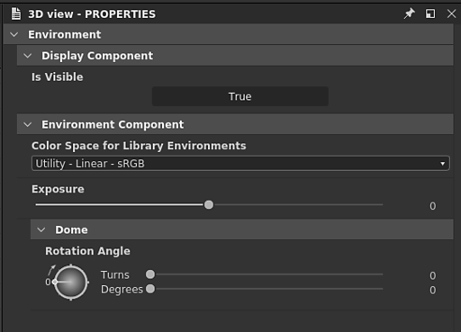

# Gestión de colores

En esta página se explican las funciones y la configuración de gestión de color de Substance 3D Designer.

Substance 3D Designer se puede configurar para usar [OpenColorIO](https://opencolorio.org/) (OCIO) o Adobe Color Engine (ACE) para la administración de color. Esto te permite tener *transformaciones de color coherentes* y visualización de imágenes en varias aplicaciones.

En este modo, Designer funcionará internamente con colores **RGB lineal**. Dado que la profundidad de bits 8 no suele ser suficiente para representar colores lineales, se recomienda usar la profundidad *al menos* de **16 bits** para las texturas de color en el [gráfico](../compositing-graphs/substance-compositing-graphs.md).

>[!WARNING]
>
> Un flujo de trabajo de gestión de color eficaz se basa en trabajar con una pantalla *calibrada* correctamente; existen soluciones de terceros para calibrar correctamente tu monitor para tu entorno de trabajo mediante hardware especializado.
> 
> Los usuarios de OpenColorIO deben usar espacios de color OpenColorIO coincidentes para sus monitores.\
> Los usuarios de Adobe ACE deben asegurarse de que los perfiles ICC seleccionados *en el sistema operativo* coincidan con *sus* monitores.

## Configuración

La configuración de administración de color se puede configurar en la pestaña [Proyectos](../interface/preferences-window/project-settings/project-settings.md) del cuadro de diálogo [Preferencias](../interface/preferences-window/preferences-window.md). Puede definir los siguientes ajustes:

### Modo de gestión de color

|  |  |
| --- | --- |
| <b>Administración de color</b> | Esta configuración le permite seleccionar los modos [Heredado](../color-management/color-management.md), [OpenColorIO](#opencolorio) o [Adobe ACE](#adobe-ace) para la administración de color en Substance 3D Designer. *Valor predeterminado: Heredado* |

## OpenColorIO

### Configuración de OpenColorIO

Al utilizar el modo OpenColorIO para la gestión de color, Designer utilizará la información almacenada en un <b>archivo de configuración</b> (*\*.config*) para realizar transformaciones de color, identificar espacios de color y establecer valores predeterminados.

Substance 3D Designer se suministra con las siguientes configuraciones:

* Substance: una configuración sencilla que incluye espacios de color comunes
* [ACE 1.0.3](https://github.com/hpd/OpenColorIO-Configs/tree/master/aces_1.0.3): la configuración completa de [Academy Color Encoding System](https://www.oscars.org/science-technology/sci-tech-projects/aces) (ACE), un estándar del sector para los flujos de trabajo de gestión de color

Puede encontrar estos archivos de configuración en la carpeta <b>resources > ocio</b> de los archivos de instalación de Designer.

|  |  |
| --- | --- |
| <b>Configuración de OpenColorIO</b> | Esta opción le permite seleccionar el archivo de configuración de OpenColorIO que se utilizará en Designer. Como alternativa, puede definir el fichero de configuración de OpenColorIO mediante la variable de entorno OCIO.  Cuando exista, el archivo de configuración se *bloqueará* en Designer. Todavía es posible cambiar los espacios de color predeterminados y mostrar transformes (consulte los ajustes a continuación).  **Alerta:** Después de agregar la variable de entorno, se recomienda cerrar Designer, *cerrar sesión* de la sesión de usuario en el sistema operativo y luego volver a iniciar sesión. Esto garantiza que la variable de entorno esté en vigor al iniciar Designer. También puede usar la línea de comandos para crear una variable de entorno temporal e iniciar Designer desde el entorno de línea de comandos *same*.  *Valor predeterminado: Substance* |
| **Archivo de configuración personalizado** | Si la opción **Custom** está establecida en **OpenColorIO Configuration**, puede seleccionar el *archivo \*.config específico *para utilizarlo como archivo de configuración en este campo.* Valor predeterminado: establecido por OpenColorIO archivo de configuración o OCIO variable de entorno* |

### Valores predeterminados de espacio de color de mapa de bits

|  |  |
| --- | --- |
| <b>imágenes de 8 bits</b> | Establece el espacio de color predeterminado para los mapas de bits de 8 bits. *Valor predeterminado: Establecido por OpenColorIO archivo de configuración* |
| <b>imágenes de 16 bits</b> | Establece el espacio de color predeterminado para los mapas de bits de 16 bits. *Valor predeterminado: Establecido por OpenColorIO archivo de configuración* |
| <b>Imágenes de punto flotante</b> | Establece el espacio de color predeterminado para los mapas de bits de precisión de punto flotante, como las imágenes *HDR.* en los formatos *\*.exr *o*\*.hdr*. *Valor predeterminado: Establecido por OpenColorIO archivo de configuración* |
| <b>Usar nombre de archivo para detectar espacio de color</b> | Permite a Designer asignar un espacio de color automáticamente si el *sufijo* de un nombre de archivo de mapa de bits *coincide exactamente* con el nombre en minúscula de un espacio de color incluido en la OpenColorIO actual *configuración*. Ejemplo: un recurso de mapa de bits *mybitmap\_aces\_acescg.png* se establecerá automáticamente en el espacio de color *ACE - ACEScg* y se aplicará el transforme correspondiente al espacio de color de trabajo. *Valor predeterminado: Comprobado* |

### Visualización predeterminada de vistas 2D y 3D

|  |  |
| --- | --- |
| <b>Predeterminado de visualización de vistas 2D y 3D</b> | Establece el espacio de color *display* predeterminado para las ventanas gráficas [Vista 2D](../interface/2d-view/2d-view.md) y [3D view](../interface/3d-view/3d-view.md). *Valor predeterminado: Establecido por el archivo de configuración de E/S de OpenColor* |
| <b>Administrar color de miniaturas</b> | Permite a Designer transformar automáticamente el nodo *thumbnails* en el espacio de color *working* del gráfico. *Valor predeterminado: Comprobado* |

## Adobe ACE

### Configuración de color

Al utilizar el modo ACE de Adobe para la administración de color, Substance 3D Designer utilizará la información almacenada en <b>Perfiles ICC</b> (*\*.icc / \*.icm*) para realizar transformaciones de color e identificar espacios de color.

Designer se suministra con una serie de perfiles ICC. Puede encontrar los archivos de estos perfiles en la carpeta `resources > icc` de los archivos de instalación de Designer.\
Puede agregar *sus propios* perfiles ICC colocando estos archivos en la ubicación `Adobe/Adobe Substance 3D Designer/icc` de la carpeta *Documents* del usuario actual del sistema.

|  |  |
| --- | --- |
| <b>Espacio de trabajo</b> | Esta configuración le permite seleccionar el espacio de color de trabajo para *realizar operaciones de color* en Substance 3D Designer. *Valor predeterminado: sRGB IEC61966-2.1* |
| <b>Intento de renderizado</b> | Esta opción te permite controlar cómo se deben transformar los colores cuando están *fuera de la gama* del *espacio de color de trabajo*. *Valor predeterminado: Colorimétrica relativa* |

### Valores predeterminados de espacio de color de mapa de bits

|  |  |
| --- | --- |
| <b>imágenes de 8 bits</b> | Establece el perfil ICC predeterminado que se utilizará para los mapas de bits de 8 bits. *Valor predeterminado:* sRGB IEC61966-2.1 ** |
| <b>imágenes de 16 bits</b> | Establece el perfil ICC predeterminado para utilizar mapas de bits de 16 bits. **Valor predeterminado: *sRGB IEC61966-2.1*** |
| <b>Imágenes de punto flotante</b> | Establece el perfil ICC predeterminado que se utilizará para los mapas de bits de precisión de punto flotante, como las imágenes *HDR.* en los formatos *\*.exr *o*\*.hdr*. *Valor predeterminado: Sin formato (es decir, sin perfil aplicado)* |
| <b>Usar perfiles ICC incrustados cuando estén disponibles</b> | Permite a Designer utilizar el perfil ICC incrustado en un mapa de bits en lugar de los valores predeterminados mostrados anteriormente. *Valor predeterminado: Comprobado* |

### Espacio predeterminado de visualización de vistas 2D y 3D

|  |  |
| --- | --- |
| <b>Predeterminado de visualización de vistas 2D y 3D</b> | Establece el espacio de color *display* predeterminado para las ventanas gráficas [Vista 2D](../interface/2d-view/2d-view.md) y [3D view](../interface/3d-view/3d-view.md). *Valor predeterminado:*** Perfil ICC para la pantalla principal, recuperado del sistema operativo &#x200B;**&#x200B;** |

### Visualización de gráficos

|  |  |
| --- | --- |
| <b>Administrar color de miniaturas</b> | Cuando *se haya marcado*, Designer transformará las *miniaturas de nodo* en el *espacio de color de trabajo* actual. *Valor predeterminado:*** Desmarcado &#x200B;**&#x200B;** |

## Modo heredado

Al usar el modo <b>Heredado</b>, la administración de color está *deshabilitada* en Designer-

En este modo, los gráficos e imágenes se comportan exactamente de la misma manera que en las versiones anteriores. Esto significa que tu flujo de trabajo de versiones anteriores *no se verá afectado* si esta configuración no se modifica **. Sin embargo, hay algunas adiciones útiles:

Puede elegir usar <b>ACES sRGB</b> *tonemapping* en la <b>vista 3D</b> para que coincida con la salida de otro software, como *[Unreal Engine](https://docs.unrealengine.com/en-US/Engine/Rendering/PostProcessEffects/ColorGrading/index.html)*.

Puede establecer un espacio de color para *mapas de bits exportados*, como se describe en la sección [Exportación de salidas](#exporting-outputs) de esta página. Los espacios de color disponibles son los siguientes:

* sRGB
* Lineal
* Sin procesar

En el modo heredado, Designer utiliza el <b>espacio de color de trabajo sRGB</b>, que puede ser reproducido por la mayoría de las pantallas.

Si se tiene en cuenta la opción &quot;Raw&quot;, se escriben los datos de imagen *tal cual* del gráfico, es decir, utilizando el espacio de color de trabajo del gráfico, lo que significa que las opciones <b>Raw</b> y <b>sRGB</b> dan como resultado la *misma salida de color*.

De forma predeterminada, la opción &#39;sRGB&#39; se establecerá para las salidas que contengan *información de color* (por ejemplo, color base, emisivo), y la opción &#39;Raw&#39; se establecerá para las salidas que contengan *datos puros* (por ejemplo, rugosidad, metálico, Height, normal). Como se explicó anteriormente, estos valores predeterminados dan como resultado los mismos colores y se establecen solo para *diferenciar el uso final* de sus resultados.

La opción <b>Lineal</b> es la *única* que produce una *transformación de color* que se aplica a la imagen y solo se puede usar para imágenes de <b>Alto rango dinámico</b> (HDR), que suelen usar *precisión de punto flotante* (es decir, profundidad de bits 16F o 32F) en el espacio de color lineal. Esto permite utilizar estas imágenes en una amplia variedad de espacios de color y entornos de producción.

>[!NOTE]
>
> Para obtener más información sobre las exportaciones de imágenes, consulte la página [Exportación de mapas de bits](../compositing-graphs/exporting-bitmaps/exporting-bitmaps.md) de la documentación.

## Importación de mapas de bits

Puede asignar un <b>espacio de color</b> (OCIO) o un <b>perfil ICC</b> (Adobe ACE) a mapas de bits importados y vinculados.

Al importar o vincular mapas de bits, un espacio de color o un perfil ICC se establecerá *de forma predeterminada* en el recurso de mapa de bits mediante las opciones establecidas en la sección <b>Espacio de color predeterminado de mapa de bits</b> de la pestaña <b>Administración de color</b> en la [configuración del proyecto](../interface/preferences-window/project-settings/project-settings.md).

Puede cambiar el espacio de color de un mapa de bits en cualquier momento, la opción se encuentra en las <b>Propiedades</b> del recurso de mapa de bits.

>[!NOTE]
>
> **Solo OpenColorIO**
> 
> En particular, **nombre de archivo** se puede usar para establecer el espacio de color apropiado *automáticamente*. Tenga en cuenta que el nombre del espacio de color del nombre de archivo debe *coincidir con el nombre* del archivo de configuración OpenColorIO (p. ej. *myImage\_utility - linear -srgb.png* se establecerá en el espacio de color *Utility - Linear - sRGB*).

## Exportación de salidas

Al utilizar el cuadro de diálogo <b>Exportar salidas</b>, es posible asignar un <b>espacio de color</b> (OCIO) o adjuntar un <b>perfil ICC</b> (Adobe ACE) para *cada salida*.\
Designer *convertirá* imágenes en los espacios de color especificados antes de guardar los archivos de imagen.

{width="512px"}

También puedes asignar un espacio de color (OCIO) o adjuntar un perfil ICC (Adobe ACE) a las imágenes *guardadas* desde la [vista 2D](../interface/2d-view/2d-view.md).

## Vistas 2D y 3D

### Barra de herramientas Mostrar

Puede activar o desactivar *la gestión de color* y cambiar la *transformación de visualización* de la vista en cualquier momento mediante el menú desplegable de la barra de herramientas de visualización.

{width="512px"}

### Entornos de HDRI de biblioteca

Los entornos HDRI suministrados con Designer se encuentran en el espacio de color <b>Linear sRGB</b>.\
Cuando se usa una configuración OpenColorIO donde el espacio de color lineal de la escena es *no* sRGB lineal, como la configuración [ACES](https://acescentral.com/t/getting-started-with-aces/1372), el entorno mostrará *colores incorrectos*.

En ese caso, el espacio de color para los entornos HDRI de la biblioteca debe establecerse *manualmente* en las propiedades del entorno, disponibles en el menú <b>Entorno</b> del panel Vista 3D.

{width="512px"}

## Nodos de conversión de color

La [biblioteca](../interface/the-library/the-library.md) incluye los siguientes nodos para realizar <b>conversiones</b> desde y hacia el espacio de color ACEScg:

<table>
<tr style="border: 0;">
<td style="border: 0;" valign="top">

[Gráfico de Substance](../compositing-graphs/substance-compositing-graphs.md)

* ACEScg a sRGB lineal
* sRGB lineal a ACEScg
* ACEScg a sRGB
* sRGB a ACEScg

</td>
<td style="border: 0;" valign="top">

[Gráfico de función de Substance](../function-graphs/function-graphs.md)

* ACEScg a sRGB lineal
* sRGB lineal a ACEScg

</td>
</tr>
</table>

Son útiles cuando se trabaja con gráficos creados *sin* gestión de color o materiales de la biblioteca [Substance 3D Assets](https://substance3d.adobe.com/assets).

{width="512px"}

## Limitaciones conocidas

La implementación actual de la gestión de color en Substance 3D Designer tiene las siguientes limitaciones:

* La administración de color está *no* expuesta en la [API de Python](../scripting/scripting.md);
* [OpenColorIO](https://opencolorio.org/) *looks* *no* compatibles.
