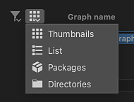
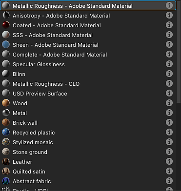
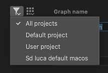

# Creación de un gráfico de Substance

La creación de texturas en Designer comienza por la creación de un gráfico de Substance, ya sea a partir de una plantilla prediseñada o de un gráfico vacío.

## Creación de un gráfico

Para iniciar el proceso de creación de un nuevo [gráfico de Substance](../../compositing-graphs/substance-compositing-graphs.md), puede usar uno de estos métodos:

* &#x200B;
  <table>
  <tr style="border: 0;">
  <td style="border: 0;" valign="top">

  En la pantalla Inicio, haga clic en el botón <b>Nuevo gráfico</b>.

  </td>
  <td style="border: 0;" valign="top">

  {zoomable="yes"}

  </td>
  </tr>
  </table>

* &#x200B;
  <table>
  <tr style="border: 0;">
  <td style="border: 0;" valign="top">

  En cualquier *elemento de paquete* existente en el [Explorador](https://helpx.adobe.com/es/substance-3d/unlisted/documentation/sddoc/the-explorer-129368147.html), haz clic en <b>RMB</b> y ve a <b>Nuevo > Gráfico del Substance</b> en el menú contextual.

  </td>
  <td style="border: 0;" valign="top">

  {zoomable="yes"}

  </td>
  </tr>
  </table>

* &#x200B;
  <table>
  <tr style="border: 0;">
  <td style="border: 0;" valign="top">

  En la barra de herramientas principal, haga clic en el botón  <b>Nuevo gráfico de Substance</b>.

  </td>
  <td style="border: 0;" valign="top">

  {zoomable="yes"}

  </td>
  </tr>
  </table>

* &#x200B;
  <table>
  <tr style="border: 0;">
  <td style="border: 0;" valign="top">

  En el [menú principal](https://helpx.adobe.com/es/substance-3d/unlisted/documentation/sddoc/the-main-menu-143720673.html), vaya a la gráfica de <b>Archivo > Nuevo > Substance...</b>

  </td>
  <td style="border: 0;" valign="top">

  

  </td>
  </tr>
  </table>

* Pulse la tecla <b>Ctrl+N</b> (Windows) / <b>Cmd+N</b> (macOS).

Independientemente del método que elijas, se te mostrará el cuadro de diálogo <b>Nuevo gráfico de Substance</b>.

## Plantillas de gráficos

Independientemente del método utilizado para crear un nuevo gráfico de Substance, siempre aparecerá el cuadro de diálogo <b>Nuevo gráfico de Substance</b>, que le permite configurar el nuevo gráfico.

{zoomable="yes"}

### Plantillas

Designer incluye plantillas de gráficos con nodos preconfigurados para que pueda empezar más rápido. Pueden incluir [nodos Output](../../compositing-graphs/nodes-reference-for-com/atomic-nodes/output/output.md), nodos simples para pasar valores a estos resultados, p. ej. [Color uniforme](../../compositing-graphs/nodes-reference-for-com/atomic-nodes/uniform-color/uniform-color.md), así como [nodos Input](../../compositing-graphs/nodes-reference-for-com/atomic-nodes/input/input.md).

Haz doble clic en una plantilla de la lista o selecciónala y haz clic en el botón <b>Crear</b> para crear un nuevo gráfico de Substance con esa plantilla. De forma predeterminada, el nuevo gráfico se coloca en un nuevo paquete no guardado.

>[!TIP]
>
> Empezar desde cero
> 
> Para comenzar desde un gráfico completamente vacío, seleccione la plantilla <b>Empty</b> en la categoría &#39;Empty&#39;.

>[!NOTE]
>
> Cambio de plantillas
> 
> Si seleccionas una plantilla incorrecta, *no puedes* cambiar a otra diferente después de crear el gráfico.
> 
> Para trasladar el gráfico existente a otra plantilla, puede crear un nuevo gráfico utilizando la plantilla adecuada y copiar y pegar el gráfico en el nuevo. Vuelva a conectar los nodos según corresponda y, en particular, los nodos de salida.

<table>
<tr style="border: 0;">
<td width="100.00%" style="border: 0;" valign="top">

Cada plantilla se muestra por su etiqueta y subtítulo.

El subtítulo proporciona más contexto sobre el *caso de uso* de la plantilla: el modelo de material en el que se basa, el software con el que se pretende integrar, etc.

En el modo <b>Miniaturas</b>, el subtítulo se coloca debajo de la etiqueta en un texto más oscuro y más pequeño.

En los modos de vista <b>Lista</b>, <b>Paquetes</b> y <b>Directorios</b>, el subtítulo se anexa a la etiqueta, por lo tanto: *Etiqueta - Subtítulo*.

</td>
<td width="25.00%" style="border: 0;" valign="top">

</td>
</tr>
</table>

### Muestras de material

La categoría <b>Muestras de material</b> incluye una [selección seleccionada de gráficos](../../compositing-graphs/creating-compositing-gra/material-samples/material-samples.md) con los que aprender y experimentar.

También puedes acceder a los ejemplos directamente desde la pantalla de inicio, usando el botón <b>Ir a los ejemplos</b>.

Todas las muestras se basan en el [modelo de material del OpenPBR](../../interface/3d-view/material-properties/material-properties.md#openpbr).

{zoomable="yes"}

<table>
<tr style="border: 0;">
<td style="border: 0;" valign="top">

### Información sobre herramientas

Al pasar el icono de información de cada elemento de plantilla, se muestra información adicional sobre la plantilla:

<b>Tipo:</b> Tipo de activo que la plantilla debe generar. Esto se puede editar en las [propiedades del gráfico](../../compositing-graphs/graph-parameters/graph-parameters.md).

<b>Descripción:</b> Detalles sobre la plantilla, como el flujo de trabajo en el que se integra, su caso de uso previsto y recomendaciones para su uso.

<b>Resultados:</b> Los [nodos Output](../../compositing-graphs/nodes-reference-for-com/atomic-nodes/output/output.md) de la plantilla, si los hay.

</td>
<td style="border: 0;" valign="top">

{zoomable="yes"}

</td>
</tr>
</table>

<table>
<tr style="border: 0;">
<td width="100.00%" style="border: 0;" valign="top">

### Modos de visualización

La lista de plantillas se puede mostrar en diferentes modos mediante el botón <b>Ver modos</b>.

El filtrado realizado por la categoría y el archivo de proyecto seleccionados se aplica en todas las vistas.

</td>
<td width="33.33%" style="border: 0;" valign="top">

{zoomable="yes"}

</td>
</tr>
</table>

+++Modos de visualización
{zoomable="yes"}

<b>Miniaturas</b>

Tarjetas con miniaturas que proporcionan una vista previa o un icono del tipo de plantilla.

{zoomable="yes"}

<b>Lista</b>

Las plantillas se muestran solo por su etiqueta.

{zoomable="yes"}

<b>Paquetes</b>

Las plantillas se enumeran por su etiqueta como elementos secundarios del archivo de paquete al que pertenecen.

Pase el ratón sobre un elemento de archivo de paquete para mostrar información sobre herramientas con su ruta completa.

{zoomable="yes"}

<b>Directorios</b>

Las plantillas se enumeran por su etiqueta como elementos secundarios del directorio que aloja el archivo de paquete al que pertenecen.

Pase el ratón por encima de un elemento de directorio para mostrar información sobre herramientas con su ruta completa.

+++

### Propiedades

Después de seleccionar la plantilla, puede configurar la información básica sobre el nuevo gráfico. Se puede cambiar en cualquier momento después de crear el gráfico.

<b>Nombre del gráfico</b>: el identificador del gráfico. Debe ser único para un paquete determinado y no puede incluir espacios ni algunos caracteres especiales.

<b>Tamaño</b>: la resolución principal del gráfico, que controlará la resolución de salida de la mayoría de los nodos; consulte la página [Tamaño de salida](../../compositing-graphs/output-size/output-size.md) para obtener más información. La anchura y el height están vinculados de forma predeterminada, y puede desvincularlos haciendo clic en el botón de vínculo entre los cuadros combinados de anchura y height.

<b>Crear gráfico en</b>: Puede usar este cuadro combinado para crear un *nuevo paquete* para el nuevo gráfico o agregar el nuevo gráfico a cualquier paquete *existente* ya cargado en el panel [Explorador](https://helpx.adobe.com/es/substance-3d/unlisted/documentation/sddoc/the-explorer-129368147.html).

### Información sobre herramientas de Ayuda

Pase el ratón sobre el icono del signo de interrogación para mostrar información sobre herramientas con un botón que enlaza directamente a esta página, de modo que pueda consultar esta documentación según sea necesario.

{zoomable="yes"}

## Administración de plantillas

<table>
<tr style="border: 0;">
<td width="100.00%" style="border: 0;" valign="top">

### Filtrar por categoría

Las categorías se utilizan para agrupar plantillas que están relacionadas entre sí por caso de uso o tipo de activo.

Use el cuadro combinado <b>Categoría</b> para seleccionar la categoría por la que desea filtrar las plantillas.

</td>
<td width="41.67%" style="border: 0;" valign="top">

{zoomable="yes"}

</td>
</tr>
</table>

<table>
<tr style="border: 0;">
<td width="100.00%" style="border: 0;" valign="top">

Las plantillas pueden tener una categoría configurada en sus <b>Datos de plantilla</b> [atributo de gráfico](../../compositing-graphs/graph-parameters/graph-parameters.md), que se utiliza como filtro para acotar la lista de plantillas:

&lt;category>;&lt;subtitle>

Las categorías personalizadas se pueden configurar en las plantillas proporcionadas por los archivos de proyecto (véase a continuación). A continuación, estas categorías se agregarán a la lista del cuadro combinado.

</td>
<td width="50.00%" style="border: 0;" valign="top">

{zoomable="yes"}

</td>
</tr>
</table>

<table>
<tr style="border: 0;">
<td width="100.00%" style="border: 0;" valign="top">

### Filtrar por archivo de proyecto

Si alguno de los [archivos de proyecto](../../interface/preferences-window/project-settings/project-settings.md) activos proporciona una o más rutas de acceso de plantilla, los gráficos de los archivos de paquete encontrados en estas rutas se agregarán a la lista de plantillas.

A continuación, usa el botón <b>Filtrar por archivo de proyecto</b> para reducir la lista de plantillas a las proporcionadas por un archivo de proyecto específico.

</td>
<td width="33.33%" style="border: 0;" valign="top">

{zoomable="yes"}

</td>
</tr>
</table>
