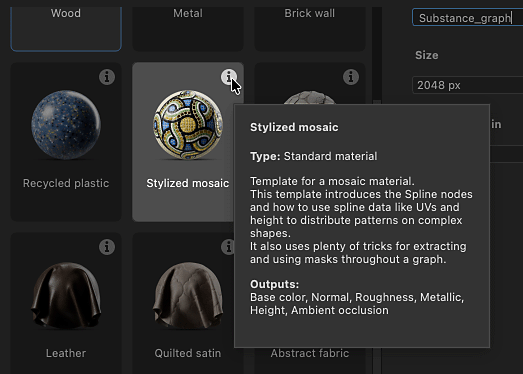

# Muestras de material

Designer ofrece una selección seleccionada de gráficos de muestra que abarcan varios tipos de materiales con los que aprender y con los que experimentar.

Los ejemplos están pensados para ser usados como una plantilla gráfica, lo que significa que <b>se accede creando un nuevo gráfico de Substance</b>.
El nuevo gráfico es una <b>copia totalmente editable</b> del ejemplo, que puedes editar, desmontar y ampliar como quieras.
Puede crear tantos gráficos nuevos como desee a partir de las muestras.

Todas las muestras se basan en el modelo de material **OpenPBR**, un nuevo estándar de la industria con creciente soporte.

Al crear un nuevo gráfico de Substance, encontrará los ejemplos en el [cuadro de diálogo Nuevo gráfico de Substance](../../../compositing-graphs/creating-compositing-gra/creating-a-substance-compositing-graph.md):

<table>
<tr style="border: 0;">
<td style="border: 0;" valign="top">

{zoomable="yes"}

Abra el cuadro combinado <b>Categoría</b> y seleccione <b>Ejemplos de materiales</b> para ver las plantillas disponibles.

</td>
<td style="border: 0;" valign="top">

{zoomable="yes"}

Puede ir directamente a la lista de muestras en el cuadro de diálogo, usando el botón <b>Ir a muestras</b> convenientemente colocado
en la <b>pantalla de inicio</b>.

</td>
</tr>
</table>

<table>
<tr style="border: 0;">
<td width="33.33%" style="border: 0;" valign="top">

En el cuadro de diálogo, pase el icono de información de un elemento de muestra para obtener más información sobre los conceptos y técnicas
explorados en la muestra.

</td>
<td width="100.00%" style="border: 0;" valign="top">

{zoomable="yes"}

</td>
</tr>
</table>

Haga doble clic en cualquier elemento para crear un nuevo gráfico a partir de esa muestra. También puede seleccionar la muestra y hacer clic en
el botón <b>Crear</b>.

Haga doble clic en cualquier elemento para crear un nuevo gráfico a partir de esa muestra. También puede seleccionar la muestra y hacer clic en
el botón <b>Crear</b>. Una vez seleccionada una muestra de material y validada la creación del gráfico, se cierra el cuadro de diálogo
y se carga una copia de la muestra como un nuevo gráfico en la vista de gráfico.

De forma predeterminada, el primer resultado del ejemplo se carga en la vista 2D y las texturas se aplican a la vista 3D.
De este modo, tu espacio de trabajo se configura automáticamente y ya estás listo para comenzar. (Esto se puede cambiar en las [preferencias](../../../interface/preferences-window/preferences-window.md) de Designer)

>[!NOTE]
> 
> Las muestras de materiales utilizan <code>OpenPBR v1.1</code> modelo de material y verlos en la vista 3D significa
> el material de la vista 3D cambiará automáticamente a la superficie de <code>OpenPBR</code> sombreador para poder
> vea el ejemplo con precisión.

{zoomable="yes"}
