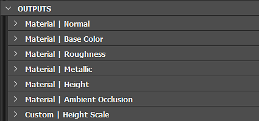

# Parámetros de gráficos

Esta página describe los parámetros estándar para el <b>gráfico de Substance</b>.

Un gráfico tiene varios parámetros que se pueden modificar. Puedes encontrarlos haciendo clic en *espacio vacío* en el gráfico o seleccionando el *elemento de gráfico* en el panel <b>Explorador</b>. Los parámetros se mostrarán en la vista Parámetros.

## Parámetros básicos

<table>
<tr style="border: 0;">
<td style="border: 0;" valign="top">

Esta sección incluye parámetros que afectan a *todos los nodos que contiene*.

De hecho, todos los nodos de este gráfico que tengan parámetros base establecidos en el [método de herencia](../../compositing-graphs/inheritance-compositing/inheritance-in-substance-compositing-graphs.md) &#39;Relativo al principal&#39; obtendrán sus valores de los parámetros base *graph&#39;s*.

A su vez, los valores de los parámetros base del gráfico dependerán del contexto en el que se utilice el gráfico.

</td>
<td style="border: 0;" valign="top">

{width="512px" zoomable="yes"}

</td>
</tr>
</table>

Por ejemplo, cuando el gráfico se utiliza en otro gráfico como nodo de instancia, sus parámetros base utilizan el método de herencia &#39;Relativo a entrada&#39; de forma predeterminada. Esto significa que obtendrán sus valores del nodo conectado a su entrada principal. (A menos que se hayan [reemplazado](#input-parameters))

En la mayoría de los casos, la herencia desempeña un papel importante en la definición de estos valores y en el modo en que cambian a lo largo del gráfico. Por lo tanto, se recomienda encarecidamente adquirir un buen conocimiento de la herencia [en los gráficos de Substance](../../compositing-graphs/inheritance-compositing/inheritance-in-substance-compositing-graphs.md) antes de utilizar estos parámetros.

|                      |                                                                                                                                                                                                                                                                                                                                                                                                                                     |
|:---------------------|:------------------------------------------------------------------------------------------------------------------------------------------------------------------------------------------------------------------------------------------------------------------------------------------------------------------------------------------------------------------------------------------------------------------------------------|
| <b>Tamaño de salida</b> | Este parámetro le permite elegir la *resolución base* de las imágenes en el gráfico.  Utilice la 

 Botón de bloqueo para que los valores de altura y anchura coincidan y mantener la imagen cuadrada al realizar ajustes de tamaño.  *Valor predeterminado: (0,0) - Relativo al primario* [Más información](../../compositing-graphs/output-size/output-size.md) |
| <b>Formato de salida</b> | Permite elegir *profundidad de bits base* en el gráfico, entre estas opciones:<ul data-preserve-html="true"><li data-preserve-html="true">8 bits</li><li data-preserve-html="true">16 bits</li><li data-preserve-html="true">HDR 16F de baja precisión (punto flotante de 16 bits)</li><li data-preserve-html="true">HDR High Precision 32F (punto flotante de 32 bits)</li></ul>*Valor predeterminado: 8 bits por canal - Relativo al primario* |
| <b>Tamaño de píxel</b> | Define el tamaño en píxeles. Se recomienda dejar los valores **Width** y **Height** establecidos en **1**.*Valor predeterminado: (1,1) - Relativo Al Padre* |
| <b>Modo de segmentación</b> | Define el *modo de mosaico* base en el gráfico a partir de estas opciones:<ul data-preserve-html="true"> <li data-preserve-html="true">Sin mosaico</li> <li data-preserve-html="true">Mosaico horizontal</li> <li data-preserve-html="true">Mosaico vertical</li> <li data-preserve-html="true">Mosaico H+V (horizontal y vertical)</li> </ul>*Valor predeterminado: Mosaico H y V - Relativo al primario* |
| <b>Raíz aleatoria</b> | Define la base *semilla aleatoria* para el gráfico.  Utilice la 

 para asignar un nuevo valor aleatorio a la semilla aleatoria.  *Valor predeterminado: 0 - Relativo Al Principal* |

<table>
<tr style="border: 0;">
<td width="100.00%" style="border: 0;" valign="top">

## Atributos

La sección <b>Atributos</b> contiene *metadatos* para el gráfico, que proporciona información para *identificar*, *categorizar* y *aplicar* el gráfico según lo diseñado por su autor.

</td>
<td width="33.33%" style="border: 0;" valign="top">

{zoomable="yes"}

</td>
</tr>
</table>

+++Lista de atributos

|                      |                                                                                                                                                                                                                                                                                                                                                                                                                                                                                                                                                                                                                                                                                                                                                                                                                                                                                                                                                                                                                                                                                                                                                                                                                                                                                                                                                                                                                                                                                             |
|:---------------------|:--------------------------------------------------------------------------------------------------------------------------------------------------------------------------------------------------------------------------------------------------------------------------------------------------------------------------------------------------------------------------------------------------------------------------------------------------------------------------------------------------------------------------------------------------------------------------------------------------------------------------------------------------------------------------------------------------------------------------------------------------------------------------------------------------------------------------------------------------------------------------------------------------------------------------------------------------------------------------------------------------------------------------------------------------------------------------------------------------------------------------------------------------------------------------------------------------------------------------------------------------------------------------------------------------------------------------------------------------------------------------------------------------------------------------------------------------------------------------------------------|
| **Identificador** | Este es el nombre del gráfico y debe ser *único*; no puede tener dos o más gráficos con el mismo <b>Identificador</b> en el mismo paquete. Se usa como *nombre* del gráfico en el panel [Explorador](../../interface/the-explorer-window/the-explorer-window.md).  *Nota:* El identificador *no puede ser una cadena vacía*. Las cadenas vacías se reemplazan automáticamente por `_` o `Substance_graph`. Puede usar *solo* los siguientes caracteres para este valor: *`A-Z, 1-9, @$%[{]}_-`.* Los caracteres no autorizados se reemplazan automáticamente por `_`.  *Valor predeterminado: Nuevo\_Gráfico o definido por el usuario al crear el gráfico* |
| **Etiqueta** | Se utiliza <b>Label</b> en lugar del <b>Identificador</b> para mostrar el *nombre* del gráfico para facilitar la lectura en escenarios de *cara al usuario*, p. ej. [Entrada de biblioteca](../../interface/the-library/the-library.md) o etiqueta de [nodo de instancia](../creating-compositing-gra/graph-instances-sub-gra/graph-instances-sub-graphs.md).  Una etiqueta puede ser *no única* y puede contener caracteres especiales.  *Sugerencia:* Si cambia el nombre de un gráfico (p. ej., en el [Explorador](../../interface/the-explorer-window/the-explorer-window.md)), es posible que también desee cambiar su etiqueta.  *Valor predeterminado: Vacío* |
| **Tipo** | El <b>Tipo</b> se usa para definir el propósito deseado de un [gráfico de Substance](../../compositing-graphs/substance-compositing-graphs.md). Está pensado principalmente para la característica de interoperabilidad [&#39;Enviar&#39;](../../interface/the-explorer-window/send-to-interoperability/send-to-interoperability.md)[.](https://helpx.adobe.com/substance-3d/unlisted/documentation/sddoc/send-to-215286290.html) |
| **Modelo de material** | Al establecer el modelo de material del gráfico, se garantiza que se utilice el sombreado apropiado en la vista 3D, si hay disponible un sombreado *que coincida con el modelo*. P. ej. al ver un gráfico con el modo de material `OpenPBR v1.1` en la vista 3D, se seleccionará el sombreador `OpenPBR Surface` en para el material de destino.  Si no se encuentra ningún sombreado coincidente o el modelo del gráfico está establecido en `Undefined`, el sombreado utilizado para el material de destino en la vista 3D es *inalterado*. |
| **Tamaño físico** | Este valor especifica la dimensión de la textura en el *mundo físico*, en X (longitud), Y (anchura) y Z (height). Por lo tanto, está intrínsecamente relacionado con el material que se produce en el gráfico. El tamaño físico se puede usar, por ejemplo, para mostrar la textura en su proporción correcta en la <b>Vista 2D</b> y la <b>Vista 3D</b>.  *Sugerencia:* El tamaño físico de un gráfico de Substance se puede recuperar como un valor Float3 en gráficos de funciones de Substance aplicados a cualquier nodo de ese gráfico, utilizando la variable [ integrada ](../../function-graphs/variables/system-variables/system-variables.md) $fisicsize *Nota:**El valor**Z  * no se tiene en cuenta *en el **Vista 3D**.* Por lo tanto, el valor **Escala de Height** del material debe establecerse mediante un nodo **Output** establecido en el uso de **heightscale** o directamente en **Propiedades de material**.  *Valor predeterminado: (0,0,0)* |
| **Icono** | Esta área le permite definir un *icono* que usará la <b>Biblioteca</b> para mostrar la entrada de este gráfico, tanto como <b>SBS</b> como <b>SBSAR</b>. El icono también se usa en otras situaciones, como <b>Shelf</b> de [Substance 3D Painter](https://www.adobe.com/products/substance3d-painter.html). El área ofrece las siguientes opciones:<ul data-preserve-html="true"> <li data-preserve-html="true"><b>Examinar</b>: Permite examinar los archivos del sistema en busca de la <i>imagen existente</i> que debe utilizarse como icono</li> <li data-preserve-html="true"><b>Generar</b>: Esto genera un icono usando un <i>ajuste preestablecido integrado</i> del nodo <b>Renderización PBR</b></li> <li data-preserve-html="true"><b>Pegar</b>: Permite pegar los datos de imagen actualmente en el <i>portapapeles</i> como un icono</li> <li data-preserve-html="true"><b>Quitar</b>: Esta opción <i>quita</i> el icono existente y deja la ranura del icono <i>vacía</i></li> </ul>*Nota:* La opción **Generate** usa el **Tamaño físico** para determinar la **escala de Height** de la **Renderización PBR** para su efecto de desplazamiento. Si en el gráfico existe un nodo **Output** con el uso **ficalsize**, se usa este resultado. Si no existe tal salida, se usa el valor de **Atributos** del gráfico *en su lugar*. Si el valor del atributo es (0,0,0), se usa el *valor preestablecido* de 0,1.  *Nota:* Cuando se ha definido *ningún icono*, se usa en su lugar la *primera salida de imagen* para el gráfico.  *Valor predeterminado: Vacío* |
| **Paquete** | El nombre de archivo *absolute* del **paquete** al que pertenece este gráfico.El botón **Carpeta** puede permitirte abrir una nueva *ventana del explorador de archivos* del sistema en esta ubicación.*Valor predeterminado: Nombre de paquete / Vacío si el paquete nunca se guardó* |
| **Expuesto en SBSAR** | Esto controla si el gráfico y sus resultados se pueden *ver* en el archivo **SBSAR** publicado desde el **Paquete** del gráfico. Esto es útil si algunos gráficos del paquete solo se usan como *subgráficos* para el gráfico principal del paquete y *no debe aparecer* en **SBSAR**.*Valor predeterminado: Sí* |
| **Mostrar en biblioteca** | Controla si el gráfico debe ser *visible* en la **biblioteca**, si el paquete está almacenado en una ubicación *vigilada* por la **biblioteca**.*Valor predeterminado: Establecer en la ficha Biblioteca de la configuración del proyecto* |
| **Descripción** | Este es el *texto de descripción* del gráfico.Está visible en *tooltip* para la entrada de gráfico en **Library**, cualquier nodo **Instance** para este gráfico y software con una **integración de Substance** existente.*Valor predeterminado: Vacío* |
| **Categoría** | Puede usar este campo para establecer una *categoría* para este elemento de gráfico en la **Biblioteca**.*Valor predeterminado: Vacío* |
| **Autor** | Puede usar este campo para poner el *nombre* del autor.*Valor predeterminado: Vacío* |
| **URL de autor** | Este campo le permite introducir una *URL*, por ejemplo, el sitio web del autor.*Valor predeterminado: Vacío* |
| **Etiquetas** | Puede usar este campo para agregar sus propias *etiquetas*, para mejorar la *capacidad de búsqueda* y la *capacidad de detección* del gráfico.*Valor predeterminado: Vacío* |
| **Grupo** | Habilita la agrupación de elementos en el menú Nodo. Los recursos como gráficos o mapas de bits que comparten un valor común de &#39;Grupo&#39; se agrupan en una sección con el nombre del grupo. *Valor predeterminado: Vacío* |
| **Datos de usuario** | Puede utilizar este campo para agregar sus propios datos adicionales. Esto resulta útil para las integraciones personalizadas en software de terceros. Substance 3D Painter y Sampler utilizan estos datos de usuario para establecer determinados comportamientos específicos.*Valor predeterminado: Vacío* |
| **Datos de plantilla** | Cuando se usa un gráfico de Substance como plantilla, estos atributos establecen la categoría y el subtítulo de la [plantilla](../../compositing-graphs/creating-compositing-gra/creating-a-substance-compositing-graph.md). Se separan así: &lt;category>;&lt;subtitle>   *Valor predeterminado: Vacío* |

+++

## Parámetros de entrada

<table>
<tr style="border: 0;">
<td style="border: 0;" valign="top">

Todos los parámetros específicos del gráfico, incluidos [parámetros expuestos](../../compositing-graphs/manage-parameters/exposing-a-parameter/exposing-a-parameter.md), se [administran](../../compositing-graphs/manage-parameters/manage-parameters.md), se editan y se ven aquí.

También se pueden crear [ajustes preestablecidos de parámetros](../../compositing-graphs/manage-parameters/parameter-presets/parameter-presets.md) para algunos o todos los parámetros.

</td>
<td style="border: 0;" valign="top">

{zoomable="yes"}

</td>
</tr>
</table>

+++Sustitución de parámetros base
Al utilizar un gráfico en otro gráfico como [nodo de instancia](../creating-compositing-gra/graph-instances-sub-gra/graph-instances-sub-graphs.md), puede controlar el valor predeterminado de cualquier parámetro base en ese nuevo nodo de instancia.

Abra el menú de hamburguesa situado en la parte superior de la sección &quot;Parámetros de entrada&quot; y vaya al submenú &quot;Sustituir parámetros base&quot; para seleccionar un parámetro base para el que desee definir un valor predeterminado arbitrario.

El editor del parámetro seleccionado aparecerá en la parte superior de la lista de parámetros de entrada de gráficos. A continuación, puede ajustar su valor y [método de herencia](../../compositing-graphs/inheritance-compositing/inheritance-in-substance-compositing-graphs.md) como desee.

+++

>[!IMPORTANT]
>
> Las pestañas <b>Vista previa</b> y <b>Ajustes preestablecidos</b> están deshabilitadas al usar [edición en contexto](../../interface/preferences-window/preferences-window.md).

## Entradas

<table>
<tr style="border: 0;">
<td style="border: 0;" valign="top">

En esta parte, se muestran todos los nodos [Input](../../compositing-graphs/nodes-reference-for-com/atomic-nodes/input/input.md) del gráfico.

Puede reordenarlos arrastrándolos y soltándolos en el controlador situado más a la izquierda de cada elemento.

</td>
<td style="border: 0;" valign="top">

{zoomable="yes"}

</td>
</tr>
</table>

## Salidas

<table>
<tr style="border: 0;">
<td style="border: 0;" valign="top">

En esta parte, todos los nodos [Output](../../compositing-graphs/nodes-reference-for-com/atomic-nodes/output/output.md) del gráfico.

Puede reordenarlos arrastrándolos y soltándolos en el controlador situado más a la izquierda de cada elemento.

</td>
<td style="border: 0;" valign="top">

{zoomable="yes"}

</td>
</tr>
</table>
