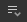
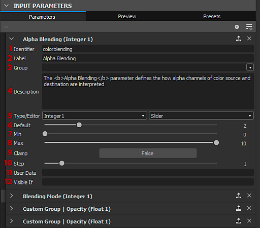
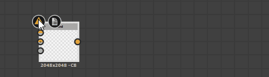
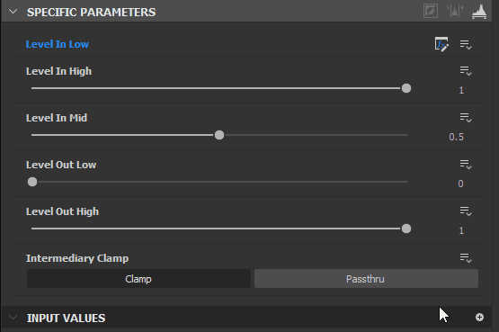

# Exposición de un parámetro

La exposición de parámetros es una de las herramientas más potentes y es clave para abrir los gráficos a otras aplicaciones como Substance 3D Painter, Substance 3D Sampler e integraciones de Substance para Maya y 3DS Max.

Esta página explica todos los conceptos necesarios para comenzar a exponer. Se recomienda [que primero conozca lo que es una instancia de gráfico](../../../compositing-graphs/creating-compositing-gra/graph-instances-sub-gra/graph-instances-sub-graphs.md) antes de continuar en esta página. También es bueno tener una idea de[ la diferencia entre Publish y exportar, así como los tipos de archivo involucrados.](../../../getting-started/overview/overview.md)

*\*Las líneas discontinuas y transparentes de arriba son una representación abstracta de la conexión\
de parámetros expuestos a parámetros de gráfico.*

## Comprensión de los parámetros y exposición

+++¿Qué es un parámetro?
*Un parámetro es un valor simple, con un elemento de interfaz de usuario, que controla el comportamiento de un gráfico.* Se utilizan constantemente en todo el software de Substance: para cambiar un color, definir el modo de fusión, elegir un valor de opacidad, etc... Sin parámetros, el software Substance no permitiría ninguna personalización.

Los parámetros pueden tener muchas formas diferentes: reguladores, diales, cuadros de texto, menús desplegables, etc... Los valores que representan pueden ser de muchos tipos diferentes: valores decimales, valores enteros (enteros), valores booleanos (verdaderos/falsos) e incluso fragmentos de texto.

+++

+++¿Qué es &#39;exponer&#39;?
***Exponer es el proceso de hacer que un parámetro esté disponible para su uso fuera de la vista gráfica actual.***  Al crear un gráfico, normalmente se selecciona un nodo para cambiar los parámetros de sus propiedades; cuando se expone, *habilita el acceso a este parámetro desde un panel de control externo*. Este &quot;panel de control externo&quot; puede significar diferentes cosas en función del contexto: cuando se utiliza como una instancia de gráfico dentro de Designer, simplemente actúa como otro nodo. Cuando se utilicen en Substance 3D Painter, Substance 3D Sampler o una integración, estos parámetros expuestos serán *el único control* que tengas sobre el gráfico.

+++

+++¿Por qué es útil exponer?
***Exponer parámetros es lo que lleva a Substance 3D Designer más allá de un simple editor de texturas, lo que te permite crear herramientas de generación de texturas dinámicas y personalizables*** **.** Sin la exposición, los materiales de Substance no serían muy diferentes de las texturas estáticas: no tendría forma de modificar sus resultados.

+++

+++¿Por qué no exponer todos los parámetros automáticamente, todo el tiempo?
<b> [Gráficos de Substance](../../../compositing-graphs/substance-compositing-graphs.md) pueden complicarse y contener cientos de parámetros a la vez. No tiene sentido mostrar siempre todos los parámetros a un usuario, especialmente si está creando gráficos con un objetivo simple, que no necesita muchos parámetros.</b> Al exponer parámetros, se trabaja como diseñador de interfaces de usuario o experiencias de usuario: crees que los controles tienen sentido, qué valores se requieren y cómo facilitar su uso, para otros usuarios online o para tus compañeros de trabajo.

+++

+++¿Tengo que saber matemáticas para exponer? ¿Debo entender las gráficas de funciones del Substance?
***No se requiere conocimiento matemático para hacer un buen uso de los parámetros de exposición, ni tampoco se requiere el uso de funciones.***  Como usuario principiante, puedes evitar casi por completo tener que realizar operaciones matemáticas en [Gráficos de funciones](../../../function-graphs/function-graphs.md). Lo único que se recomienda encarecidamente es tener un [conocimiento básico decente de los diferentes tipos de datos, como Integer, Float y Boolean.](../../../function-graphs/nodes-reference-for-fun/function-nodes-overview/function-nodes-overview.md)

+++

## Cómo exponer

Actualmente hay dos métodos principales para exponer parámetros. Un método es más adecuado para exponer rápidamente un solo parámetro; el segundo método es más adecuado para exponer varios parámetros en un barrido.

{width="512px"}

### MÉTODO DE EXPOSICIÓN ÚNICA

1. Busque el parámetro que desea exponer en el panel [Propiedades](../../../interface/properties/properties.md), en la ficha Parámetros específicos
1. Haga clic en el botón de opciones desplegables 
1. Elija  <b>Exponer como nueva entrada de gráfico</b> en la lista desplegable, la primera opción.
1. Aparece el cuadro de diálogo <b>Exponer parámetro</b>, establezca las propiedades de parámetro que desee.

   Se recomienda cambiar al menos <b>Identificador</b> y <b>Etiqueta</b>
1. Pulse <b>Aceptar</b> para confirmar
1. El nombre del parámetro se vuelve *azul* y \
   El botón <b> Editar función de parámetro</b> aparece junto a las opciones desplegables para confirmar que el parámetro está expuesto

>[!NOTE]
>
> La mayoría de los campos numéricos admiten *fórmulas matemáticas básicas* como entrada; por ejemplo, `17+3.5`, `7/3`, `(4+2)*3`. Presione *Intro* para validar la fórmula y el resultado se introducirá en el campo. Si la fórmula no es válida, el campo vuelve a su valor anterior.\
> Algunos campos numéricos de otras partes de la aplicación, como el conjunto acoplado [Properties](../../../interface/properties/properties.md), también admiten esta característica.

{width="512px"}

### Método de exposición por lotes

Al exponer un parámetro, este método será un poco más lento que el anterior. Al exponer varios parámetros, es mucho más rápido.

1. En lugar de encontrar un solo parámetro, busca el botón  <b>Exposición múltiple</b> en la parte superior derecha de la pestaña <b>Parámetros específicos</b>
1. Elija <b>Parámetros de exposición por lotes...</b> en el menú desplegable
1. Aparece el cuadro de diálogo <b>Exposición por lotes</b>, que le permite personalizar la exposición de todos los <b>parámetros específicos</b> de un nodo
1. Use <b>Todos</b>, <b>Ninguno</b> o casillas de verificación específicas para decidir qué parámetros exponer
1. Haga clic en un nombre de parámetro en la columna <b>Identificador de entrada de gráfico</b> de la lista para cambiar su nombre.
1. Haga clic en un <b>nombre de grupo</b> en la columna <b>Grupo de entrada de gráficos</b> de la lista para agregar un (sub)grupo para un parámetro específico
1. Use los cuadros de entrada de tipo <b>Graph input identifier</b> y <b>Graph input group</b> de la parte inferior para agregar prefijos, sufijos y grupos de entrada a todos los parámetros expuestos a la vez. Todos estos valores se aplican sobre la configuración por parámetro.
1. Haga clic en <b>Aceptar</b> para confirmar y mostrar todos los parámetros seleccionados. Los nombres de los parámetros ahora muestran *blue* para confirmar que se exponen los parámetros, así como un botón  <b>Editar función</b>.

## Limitaciones

Hay algunas limitaciones relacionadas con la exposición de parámetros, como se muestra en la tabla siguiente.

| Tipo de parámetro | Razón |
| --- | --- |
| [Gradación De Degradado](../../../compositing-graphs/nodes-reference-for-com/atomic-nodes/gradient-map/gradient-map.md), [Editor De Curvas](../../../compositing-graphs/nodes-reference-for-com/atomic-nodes/curve/curve.md), [Fuente](../../../compositing-graphs/nodes-reference-for-com/atomic-nodes/text/text.md), [Histograma De Niveles](../../../compositing-graphs/nodes-reference-for-com/atomic-nodes/levels/levels.md) | Requerir widgets que no estén disponibles para los parámetros creados por el usuario. |

Otra limitación importante está relacionada con [parámetros estáticos](../../../glossary/glossary.md). No se pueden cambiar en un [recurso de Substance 3D publicado (SBSAR)](../../publishing-asset-files/publishing-substance-3d-asset-files-sbsar.md).

Los parámetros estáticos, a diferencia de los parámetros dinámicos, *no se pueden editar sobre la marcha* después de que el gráfico se haya *preparado*, es decir, procesado para ejecutar su algoritmo de forma rápida y eficaz. La cocción se produce en Designer cada vez que el gráfico se *edita* o *publica*.

Como tal, los parámetros estáticos son visibles y editables en Designer, pero están *ocultos* en un recurso de Substance 3D publicado. Puede usar el modo de vista previa para ver estas limitaciones en vigor antes de publicar en un recurso de Substance 3D: Consulte &quot;Previsualización de parámetros&quot; a continuación.

Como solución alternativa, puedes usar un nodo [Switch](../../../compositing-graphs/nodes-reference-for-com/node-library/filters/blending/switch/switch.md) o [Multi Switch](../../../compositing-graphs/nodes-reference-for-com/node-library/filters/blending/multi-switch/multi-switch.md) y varios conjuntos de lógica para cambiar entre diferentes valores/estados para estos parámetros.

| Nodo | Parámetro |
| --- | --- |
| Todos los nodos | Modo Mosaico Proporción de píxeles |
| [Color uniforme](../../../compositing-graphs/nodes-reference-for-com/atomic-nodes/uniform-color/uniform-color.md) | Modo de color |
| [Procesador de píxeles](../../../compositing-graphs/nodes-reference-for-com/atomic-nodes/pixel-processor/pixel-processor.md) | Modo de color |
| [Fusionar](../../../compositing-graphs/nodes-reference-for-com/atomic-nodes/blend/blend.md) | Modo de fusión Fusión Alpha fusionar Área de recorte |
| [FX-Map](../../../compositing-graphs/nodes-reference-for-com/atomic-nodes/fx-map/fx-map.md) | Modo de fusión |
| [Cuadrante](../../../function-graphs/fxmaps/the-quadrant-node/the-quadrant-node.md) | Patrón de entrada imagen alfa Entrada imagen filtrado |

## Modificación de parámetros expuestos

Una vez expuesto, ya no es posible acceder a un parámetro como antes. El cambio de su valor, el cambio de nombre, la organización en la interfaz de usuario e incluso la eliminación del parámetro se producen en el nivel Propiedades de gráfico. En esta sección se explica cómo hacerlo.

Para cambiar las opciones de un parámetro expuesto:

1. Haga clic en el botón de opciones desplegables  junto al parámetro que ya se ha expuesto
1. Elija <b> Editar entrada de gráfico expuesta</b>. Esto le llevará directamente a la entrada correspondiente en las propiedades del gráfico
1. Haga doble clic en un área vacía del gráfico para obtener las propiedades del gráfico y, a continuación, busque el parámetro en la lista de <b>Parámetros de entrada</b>
1. Haga un solo clic en el gráfico en el <b>Explorador</b> y, a continuación, busque el parámetro en la lista de <b>Parámetros de entrada</b>

{width="512px"}

### PARÁMETROS DE ENTRADA

Todos los parámetros expuestos se muestran en la ficha Parámetros de entrada. Las siguientes propiedades están disponibles para la mayoría de los casos comunes, como flotantes e enteros con el tipo de editor predeterminado.

1. <b>Identificador</b>: Identificador único de este parámetro. No puede contener espacios ni caracteres especiales.
1. <b>Etiqueta</b>: Etiqueta de solo IU. Si no se ha definido ninguna etiqueta, el identificador se muestra en la interfaz de usuario. Puede contener espacios y caracteres especiales
1. <b>Grupo</b>: Agrupe los parámetros en una sección contraíble para mantener las largas listas de parámetros limpias y manejables. Los parámetros se agrupan si comparten el *mismo nombre de grupo* exacto. Utilice el carácter `/` para crear *subgrupos*, p. ej. `My Group/My Sub-group`
1. <b>Descripción</b>: Campo de texto para la descripción, que se utiliza como información sobre herramientas.
1. <b>Tipo/Editor</b>: Establezca el tipo de datos, así como el tipo de editor de interfaz de usuario. Determinados editores sólo están disponibles para determinados tipos de datos (por ejemplo, una lista desplegable sólo para Entero). *Cambiar el editor borrará en muchos casos los valores predeterminados, tenga cuidado.*
1. <b>Predeterminado</b>: Valor predeterminado en el que comienza el parámetro. Este es también el valor utilizado en el gráfico al previsualizar nodos. Trate de utilizar un valor fácil y utilizable aquí, evitar casos extremos.
1. <b>Mín.</b>: valor mínimo para la IU.
1. <b>Máx.</b>: valor máximo para la IU.
1. <b>Abrazadera</b>: Establezca si Mín y Máx son límites suaves o estrictos (permita al usuario superar los límites).
1. <b>Paso</b>:Set la precisión o granularidad del valor.
1. <b>Datos del usuario</b>: datos del usuario personalizados, disponibles para cualquier propósito.
1. <b>Visible si</b>: sistema de expresión especial para mostrar u ocultar parámetros en función de condiciones externas. Consulte [Visible si: controlar la visibilidad de entradas, salidas y parámetros](../../../compositing-graphs/visible-control-vis/visible-if-control-visibility-of-inputs-outputs-and-parameters.md)

{width="512px"}

#### Lista desplegable

Un caso especial es la <b>lista desplegable</b> para los tipos Integer. No hay valor predeterminado, mínimo o máximo, sólo un valor de valor único que permite definir una lista de elementos.

* Cada elemento corresponde a un elemento de la lista desplegable.
* El primer valor de Item es el entero interno real utilizado por el gráfico. Asegúrate de configurarlos correctamente para tu [conmutador múltiple](../../../compositing-graphs/nodes-reference-for-com/node-library/filters/blending/multi-switch/multi-switch.md), por ejemplo (comienzan en 1, no en 0).
* El segundo valor es la etiqueta de interfaz de usuario que se muestra al usuario.
* La tercera casilla de verificación le permite marcar un elemento como el seleccionado predeterminado.
* La X elimina un elemento, el signo + añade un elemento

{width="512px"}

#### Reordenar

La reordenación de los parámetros se puede realizar fácilmente arrastrando y soltando los controles de rayas oscuros a la izquierda del nombre de los parámetros de entrada en la lista. Tenga en cuenta que los parámetros de agrupación pueden afectar al orden.

{width="512px"}

### PREVISUALIZACIÓN DE PARÁMETROS

Como configurar parámetros puede resultar difícil sin ver el resultado final, se puede habilitar el <b>Modo de vista previa</b> para comprobar el aspecto y el comportamiento externos de la interfaz de usuario de los parámetros. Haga clic en la pestaña <b>Vista previa</b> en el centro superior del despliegue Parámetros de entrada.

Normalmente, los cambios realizados en <b>Modo de vista previa</b> se *descartan*. Sin embargo, puede usar el <b>botón Aplicar </b> situado junto al icono del ojo para establecer los valores actuales del <b> modo de vista previa</b> como los *nuevos valores predeterminados*.

[El modo de previsualización también le permite crear ajustes preestablecidos incrustados.](../../../compositing-graphs/manage-parameters/parameter-presets/parameter-presets.md)

>[!IMPORTANT]
>
> El modo de vista previa se deshabilita al usar [edición en contexto](../../../interface/preferences-window/preferences-window.md).

>[!WARNING]
>
> El modo de vista previa pretende representar la experiencia de un [recurso de Substance 3D publicado (SBSAR)](../../publishing-asset-files/publishing-substance-3d-asset-files-sbsar.md) con la mayor precisión posible. Por lo tanto, las limitaciones enumeradas en esta página se aplicarán en este modo, por ejemplo, *los parámetros estáticos están ausentes de la lista*.

{width="512px"}

### COPIAR Y PEGAR PARÁMETROS

Los parámetros se pueden copiar y pegar entre gráficos.

Se puede copiar un solo parámetro con el botón Copiar . Se pueden copiar varios parámetros a través del menú Parámetros . Seleccione Copiar entradas para copiar todas las entradas.

Elija Pegar entradas  en el menú Parámetros  para pegar uno o más parámetros.

Si desea transferir valores, y no el parámetro expuesto real en sí, [lea acerca de los valores preestablecidos de parámetros.](../../../compositing-graphs/manage-parameters/parameter-presets/parameter-presets.md)

## Eliminación y limpieza de parámetros expuestos

Debido a la naturaleza de los parámetros, en los que puede haber un parámetro de entrada que controle varios nodos, o en los que los parámetros de entrada pueden existir sin controlar un nodo, pueden surgir problemas con parámetros que faltan o que no se utilizan. A continuación se describen los problemas comunes y sus soluciones.

{width="512px"}

### SEGUIMIENTO DE PARÁMETROS ROTOS EN NODOS

Puede hacer un seguimiento del parámetro que utiliza cada nodo a través de la herramienta Buscador de nodos , que se encuentra en la barra superior de la vista de gráficos. Haga clic en él y le permitirá encontrar nodos utilizando parámetros específicos.

Si un nodo tiene un problema real, mostrará un distintivo de advertencia  en su esquina superior izquierda. Al pasar el ratón sobre la insignia, se mostrará información sobre herramientas con más información.

Para restablecer y quitar un problema, para el parámetro que desea corregir o restablecer, haga clic en el botón desplegable  situado junto al botón Editar función y seleccione  <b>Restablecer. </b>Esto devuelve un parámetro a su estado anterior, no expuesto, el nombre azul se volverá gris de nuevo para reflejarlo.

{width="512px"}

### LIMPIEZA DE PARÁMETROS DE ENTRADA NO UTILIZADOS

Si ha perdido la pista de los parámetros de entrada y ya no sabe cuáles se utilizan, se pueden limpiar con una pequeña herramienta. Haga clic en el botón de menú Parámetro de entrada  y seleccione <b>Limpiar entradas.</b>

Aparece un nuevo cuadro de diálogo que muestra todos los parámetros no utilizados. Marque o desmarque los parámetros que desee quitar o mantener y haga clic en Aceptar. Si no aparece ningún cuadro de diálogo, no hay parámetros no utilizados que limpiar.

{width="512px"}

### QUITAR PARÁMETROS

Para quitar realmente un parámetro que está en uso, se requieren dos pasos distintos.

1. En el nodo con el parámetro expuesto, haga clic en la flecha del menú desplegable situada a la derecha del botón Exposición de función que aparece en color azul: . A continuación, elige &quot;Restablecer el valor predeterminado&quot;. Esto elimina el uso del parámetro en este nodo. repita para cualquier otro nodo que utilice el mismo parámetro. &quot;Restablecer a valor predeterminado&quot; también restablece el intervalo del widget de parámetro a su *intervalo flexible*.
1. En la lista Parámetros de entrada del gráfico, haga clic en la X situada a la derecha de la entrada del parámetro. Esto elimina el parámetro por completo. Si algún nodo intenta utilizar este parámetro, aparecerá un distintivo de advertencia (véase más arriba).
