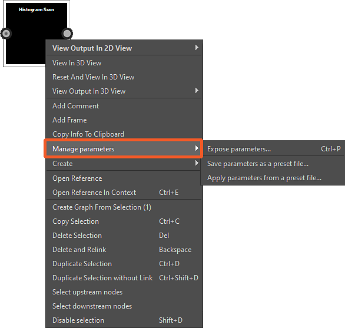

# Gestionar parámetros

Cuando necesita controlar los parámetros de cualquier forma que no sea ajustándolos directamente, Designer ofrece varias acciones útiles para:

* [Copiar y pegar](#copy-paste-parameters) los valores de todos los parámetros de un nodo
* Guarde los valores de todos los parámetros de un nodo en un [archivo de ajuste preestablecido](../../compositing-graphs/manage-parameters/parameter-presets/parameter-presets.md), que se reutilizará más adelante
* [Exponga los parámetros](../../compositing-graphs/manage-parameters/exposing-a-parameter/exposing-a-parameter.md) de los nodos para que sean accesibles y los vincule entre sí
* [Ocultar o mostrar parámetros](../../compositing-graphs/visible-control-vis/visible-if-control-visibility-of-inputs-outputs-and-parameters.md) según los valores de otros parámetros
* Utilice un [gráfico de funciones de Substance](../../function-graphs/function-graphs.md) para calcular el valor de un parámetro

## Acciones de parámetros

Las herramientas disponibles para la gestión de parámetros se encuentran en las siguientes ubicaciones:

### Acciones globales

<table>
<tr style="border: 0;">
<td width="100.00%" style="border: 0;" valign="top">

Cuando las propiedades de un nodo se muestran en el conjunto acoplado de propiedades, los parámetros del nodo se pueden administrar globalmente mediante el menú &#39;<b>Administrar parámetros</b>&#39; del siguiente encabezado de sección:

* Para [nodos atómicos](../../compositing-graphs/nodes-reference-for-com/atomic-nodes/atomic-nodes.md): Parámetros específicos
* Para [nodos de instancia](../../compositing-graphs/creating-compositing-gra/graph-instances-sub-gra/graph-instances-sub-graphs.md): Parámetros de instancia

</td>
<td width="33.33%" style="border: 0;" valign="top">

{zoomable="yes"}

</td>
</tr>
</table>

Las acciones de este menú afectarán a *todos* los parámetros enumerados en esa sección:

* <b>Exponer parámetros:</b> Abre el cuadro de diálogo &#39;Parámetros de exposición por lotes&#39;. Para cada parámetro expuesto, la acción crea una nueva entrada de gráfico y define automáticamente una función utilizando dicha entrada de gráfico. Obtenga más información sobre la exposición de parámetros en [esta página dedicada](../../compositing-graphs/manage-parameters/exposing-a-parameter/exposing-a-parameter.md).
* <b>Copiar parámetros:</b> Consulte la sección [Copiar y pegar parámetros](#copy-paste-parameters) a continuación.
* <b>Pegar parámetros:</b> Consulte la sección [Copiar y pegar parámetros](../../compositing-graphs/manage-parameters/manage-parameters.md) a continuación.
* <b>Guardar parámetros como un archivo de ajuste preestablecido:</b> Más información sobre los ajustes preestablecidos de parámetros en [esta página dedicada](../../compositing-graphs/manage-parameters/parameter-presets/parameter-presets.md).
* <b>Aplicar parámetros de un archivo de ajustes preestablecidos:</b> Obtenga más información sobre los ajustes preestablecidos de parámetros en [esta página dedicada](../../compositing-graphs/manage-parameters/parameter-presets/parameter-presets.md).
* <b>Restablecer todo:</b> Restablece todos los parámetros a sus valores e intervalos predeterminados. Si se aplicó una función a algún parámetro, se descartan.

>[!NOTE]
>
> Algunas acciones no están disponibles para algunos nodos atómicos. Consulte [Limitaciones de nodos atómicos](#atomic-nodes-limitations) a continuación.

### Acciones de un solo parámetro

<table>
<tr style="border: 0;">
<td width="100.00%" style="border: 0;" valign="top">

Si desea administrar un parámetro *single*, use el menú &#39;<b>Manage function</b>&#39; frente a la etiqueta del parámetro.

</td>
<td width="33.33%" style="border: 0;" valign="top">

{zoomable="yes"}

</td>
</tr>
</table>

Puede aplicar un [gráfico de funciones de Substance](../../function-graphs/the-function-graph/the-function-graph.md) a ese parámetro de tres maneras:

* <b>Exponer como nueva entrada de gráfico:</b> Que crea una nueva entrada de gráfico y automáticamente establece una función usando esa entrada de gráfico. Obtenga más información sobre la exposición de parámetros en [esta página dedicada](../../compositing-graphs/manage-parameters/exposing-a-parameter/exposing-a-parameter.md).
* <b>Función vacía:</b> Crea una función desde cero.
* <b>Valor constante:</b> Edite una función que comienza desde un [nodo de valor constante](../../function-graphs/nodes-reference-for-fun/atomic-function-nodes/constant-nodes/constant-nodes.md) establecido en el valor actual del parámetro.
* <b>Restablecer:</b> Restablece el parámetro a su valor predeterminado y a su intervalo. Si se aplicó una función al parámetro, se descarta.

>[!NOTE]
>
> Las acciones de copiar/pegar y archivo preestablecido son globales para todos los parámetros y, por lo tanto, no están disponibles para parámetros individuales.

### Menú contextual del nodo

<table>
<tr style="border: 0;">
<td width="100.00%" style="border: 0;" valign="top">

Algunas acciones de parámetro del menú *global* que se muestra arriba están disponibles en el menú contextual del nodo. Haga clic en RMB en un nodo y vaya a &quot;Administrar parámetros&quot; para acceder a ellos.

Tenga en cuenta que las acciones de copiar y pegar no están disponibles en este menú. Puede encontrarlas en las propiedades del nodo, como se ha explicado anteriormente.

Las mismas limitaciones que se enumeran a continuación para los nodos atómicos se aplican a este menú.

</td>
<td width="50.00%" style="border: 0;" valign="top">

Menú {zoomable="yes"}

</td>
</tr>
</table>

<table>
<tr style="border: 0;">
<td style="border: 0;" valign="top">

## Copiar y pegar parámetros

Es posible copiar todos los valores de parámetros de un nodo de origen y pegarlos en un nodo de destino. Los parámetros de los nodos de origen y destino <b>coinciden en función de sus identificadores y tipos</b>.

Por ejemplo, un parámetro &#39;Escala&#39; cuyo identificador es &#39;escala&#39; y el tipo es &#39;Flotante&#39; se puede copiar y pegar en otro parámetro &#39;Escala de forma&#39; cuando su identificador también es &#39;escala&#39; y su tipo es también &#39;Flotante&#39;.

Esta característica funciona de la misma manera que el uso de un [archivo de parámetros preestablecidos](../../compositing-graphs/manage-parameters/parameter-presets/parameter-presets.md). De hecho, los datos copiados en el portapapeles son los mismos que los datos almacenados en los archivos de ajustes preestablecidos de SBSPRS, y se pueden pegar en cualquier editor de texto para revisarlos y editarlos.

</td>
<td style="border: 0;" valign="top">

{zoomable="yes"}

</td>
</tr>
</table>

## Limitaciones de nodos atómicos

Algunas características no están disponibles para algunos [nodos atómicos](../../compositing-graphs/nodes-reference-for-com/atomic-nodes/atomic-nodes.md) debido a su implementación y controles específicos.

Estas acciones...

* [Copiar/Pegar parámetros](#copy-paste-parameters)
* [Guardar/Aplicar archivo de ajustes preestablecidos](../../compositing-graphs/manage-parameters/parameter-presets/parameter-presets.md)

...no están disponibles para estos nodos atómicos:

<table>
<tr style="border: 0;">
<td style="border: 0;" valign="top">

[Mapa de bits](../../compositing-graphs/nodes-reference-for-com/atomic-nodes/bitmap/bitmap.md)

[Curva](../../compositing-graphs/nodes-reference-for-com/atomic-nodes/curve/curve.md)

[Distancia](../../compositing-graphs/nodes-reference-for-com/atomic-nodes/distance/distance.md)

[FX-Map](../../compositing-graphs/nodes-reference-for-com/atomic-nodes/fx-map/fx-map.md)

[Degradado (dinámico)](../../compositing-graphs/nodes-reference-for-com/atomic-nodes/gradient-dynamic/gradient-dynamic.md)

</td>
<td style="border: 0;" valign="top">

[Mapa de degradado](../../compositing-graphs/nodes-reference-for-com/atomic-nodes/gradient-map/gradient-map.md)

[Color de entrada](../../compositing-graphs/nodes-reference-for-com/atomic-nodes/input-color/input-color.md)

[Escala de grises de entrada](../../compositing-graphs/nodes-reference-for-com/atomic-nodes/input-grayscale/input-grayscale.md)

[Valor de entrada](../../compositing-graphs/nodes-reference-for-com/atomic-nodes/input-value/input-value.md)

[Salida](../../compositing-graphs/nodes-reference-for-com/atomic-nodes/output/output.md)

</td>
<td style="border: 0;" valign="top">

[Procesador de píxeles](../../compositing-graphs/nodes-reference-for-com/atomic-nodes/pixel-processor/pixel-processor.md)

[SVG](../../compositing-graphs/nodes-reference-for-com/atomic-nodes/svg/svg.md)

[Texto](../../compositing-graphs/nodes-reference-for-com/atomic-nodes/text/text.md)

[Color uniforme](../../compositing-graphs/nodes-reference-for-com/atomic-nodes/uniform-color/uniform-color.md)

[Procesador de valor](../../compositing-graphs/nodes-reference-for-com/atomic-nodes/value-processor/value-processor.md)

</td>
<td style="border: 0;" valign="top">

</td>
</tr>
</table>
