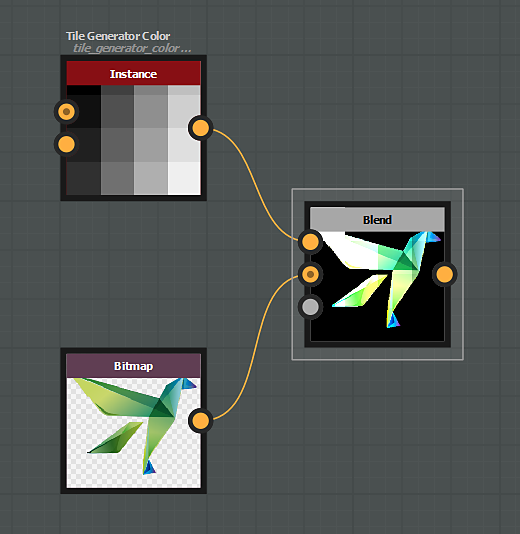

# Modos de fusión

El nodo [Blend](../../../../../compositing-graphs/nodes-reference-for-com/atomic-nodes/blend/blend.md) ofrece los siguientes modos de fusión:

## Copiar

El modo de fusión *Copiar* solo colocará el primer plano sobre el fondo.

{zoomable="yes"}

Para las imágenes en color, el canal alfa se tiene en cuenta de forma predeterminada en la opacidad.

Esto se puede cambiar mediante el parámetro &quot;Fusión de Alpha&quot;.

"){zoomable="yes"}

## Añadir (Sobreexposición lineal)

El modo de fusión *Agregar* agregará el valor de entrada de primer plano a cada píxel correspondiente del fondo.

"){zoomable="yes"}

## Restar

El modo de fusión *Substract* restará el valor de entrada de primer plano de cada píxel correspondiente del fondo.

Si el resultado de la sustracción es menor que 0, el valor se limita a 0, lo que produce un negro puro.

{zoomable="yes"}

## Multiplicar

El modo de fusión *Multiply* multiplicará el valor de entrada de fondo por cada píxel correspondiente en primer plano.

Como el valor de cada píxel está comprendido entre 0 y 1, el resultado siempre es igual o inferior (más oscuro) en comparación con el original.

{zoomable="yes"}

## Añadir/Restar

El modo de fusión *Agregar Sub* funciona de la siguiente manera:

* Los píxeles de primer plano con un valor superior a 0,5 se añaden a sus respectivos píxeles de fondo.
* Los píxeles de primer plano con un valor inferior a 0,5 se restan de sus respectivos píxeles de fondo.

{zoomable="yes"}

## Máx. (Aclarar)

El modo de fusión *Max* elegirá el valor más alto entre el fondo y el primer plano.

"){zoomable="yes"}

## Mín. (Oscurecer)

El modo de fusión *Min* elegirá el valor más bajo entre el fondo y el primer plano.

"){zoomable="yes"}

## Cambiar

El modo de fusión *Cambiar* es similar al modo Copiar, con una diferencia *crucial*:

* Opacidad establecida en 0: No se calculará la secuencia de nodos conectada a la entrada &quot;frontal&quot; **.
* Opacidad establecida en 1: No se calculará la secuencia de nodos conectada a la entrada en segundo plano **.

Por lo tanto, este modo se puede utilizar para mejorar el rendimiento del gráfico.

Los nodos [Switch](../../../../../compositing-graphs/nodes-reference-for-com/node-library/filters/blending/switch/switch.md) y [Switch grayscale](../../../../../compositing-graphs/nodes-reference-for-com/node-library/filters/blending/switch/switch.md) están configurados para usar los nodos de mezcla en estas configuraciones específicas.

{zoomable="yes"}

## Dividir

El modo de fusión *Dividir* dividirá el valor de los píxeles de entrada de fondo por cada píxel correspondiente del primer plano.

{zoomable="yes"}

## Superponer

El modo de fusión *Superposición* combina los modos de fusión Multiplicar y Trama:

* &#x200B;
  * Si el valor del píxel de la capa inferior es inferior a 0,5, se aplica una fusión de tipo *Multiply*
  * Si el valor del píxel de la capa inferior es superior a 0,5, se aplica una fusión de tipo *Screen*

{zoomable="yes"}

## Pantalla

Con el modo de fusión de pantalla, los valores de los píxeles de las dos entradas se invierten, se multiplican y, a continuación, se vuelven a invertir.

El resultado es el efecto contrario al multiplicar y siempre es igual o superior (más brillante) en comparación con el original.

{zoomable="yes"}

## Luz suave

El modo de fusión Luz suave crea un resultado sutil más claro u oscuro en función del brillo del color frontal.

Los colores de fusión con un brillo superior al 50 % aclararán los píxeles de fondo y los colores con un brillo inferior al 50 % oscurecerán los píxeles de fondo.

{zoomable="yes"}
