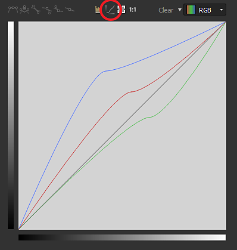
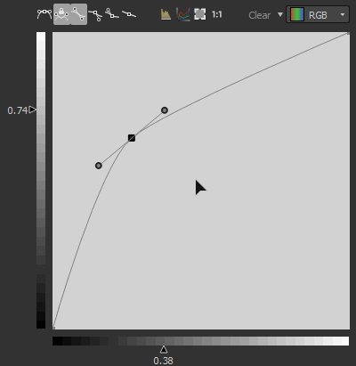

# Curva

<table>
<tr style="border: 0;">
<td width="33.33%" style="border: 0;" valign="top">

{width="20%"}

</td>
<td width="100.00%" style="border: 0;" valign="top">

Reasigna los valores de una imagen utilizando una curva personalizada.

El nodo proporciona una interfaz para la reasignación de tonalidad de imágenes, similar a otras aplicaciones de edición de imágenes 2D. El usuario puede colocar puntos y ajustar curvas Bézier para reasignar la entrada, que puede ser de escala de grises o de color.Es especialmente útil cuando se utiliza con transiciones de degradado para reasignarlas a un perfil de height específico, ya que permite modelar de forma muy precisa los perfiles de bisel y similares.

</td>
</tr>
</table>

A diferencia de la mayoría de los demás nodos, el nodo Curva no tiene una interfaz estándar típica con reguladores y parámetros, sino que presenta un editor de curvas completo. Consulte la siguiente sección ampliable sobre cómo usarla.

[Sin embargo, esto significa que ninguno de los parámetros de un nodo Curve se puede exponer a un subgráfico](../../../../compositing-graphs/manage-parameters/exposing-a-parameter/exposing-a-parameter.md). La única opción es usar un [conmutador múltiple](../../../../compositing-graphs/nodes-reference-for-com/node-library/filters/blending/multi-switch/multi-switch.md) para cambiar entre diferentes perfiles de curva.

## Parámetros

|  |  |
| --- | --- |
| <b>Aplicar/exponer curva</b> *Booleano* | Permite copiar la curva del usuario en la salida en lugar de aplicarla a la imagen de entrada |
| <b>Direccionamiento de curvas</b> *Booleano* | Este parámetro determina cómo se gestionan los píxeles HDR fuera del rango [0, 1] en la entrada: sujetado o plegado hasta [0, 1]. |
| <b>Curva</b> *Matriz de claves de curva* | Curva personalizada utilizada para asignar los valores de escala de grises de entrada.   Se puede editar con el [editor de curvas](#curve-editor). |

## Editor de curvas

### Creación y desplazamiento de un punto

Para crear un punto, simplemente haga doble clic en cualquier parte de la vista Curva:

{width="20%"}

### Control de la influencia de puntos

<table>
<tr style="border: 0;">
<td width="100.00%" style="border: 0;" valign="top">

Para obtener resultados precisos, los nodos de curva ofrecen diferentes modos para cada punto:

</td>
<td width="33.33%" style="border: 0;" valign="top">

</td>
</tr>
</table>

 Restablezca el modo de punto al valor predeterminado.

 Bloquear/Desbloquear los 2 controladores Bezier para que el usuario pueda moverlos juntos o de forma independiente.

 Ambos lados del punto están controlados por un controlador Bézier.

 El lado derecho del punto está controlado por un controlador Bézier, mientras que el lado izquierdo permanece plano.

 El lado izquierdo del punto está controlado por un controlador Bézier, mientras que el lado derecho permanece plano.

 Los lados del punto permanecen planos

### Mostrar histograma de entrada

Puede mostrar u ocultar el histograma de su entrada simplemente haciendo clic en 

### Control individual de cada canal (entrada de color)

<table>
<tr style="border: 0;">
<td width="100.00%" style="border: 0;" valign="top">

Cuando la entrada es un nodo de color, tiene la capacidad de ajustar la curva para cada canal:

Solo tiene que seleccionar la curva que desea ajustar en la lista desplegable situada en la parte superior derecha:

</td>
<td width="33.33%" style="border: 0;" valign="top">

</td>
</tr>
</table>

En el modo Curva de RGB, puede ocultar o mostrar las curvas de canal individuales presionando o despresionando :

### Alineación, reflejo y volteo

<table>
<tr style="border: 0;">
<td width="100.00%" style="border: 0;" valign="top">

Si hace clic con el botón derecho en la vista de curva, obtendrá algunas opciones más.

<b>Alinear arriba:</b> Alinea los puntos seleccionados horizontalmente con el más alto.

<b>Alinear al medio:</b> Alinea los puntos seleccionados horizontalmente con el height promedio de la selección.

<b>Alinear abajo:</b> Alinea los puntos seleccionados horizontalmente con el más bajo.

</td>
<td width="50.00%" style="border: 0;" valign="top">

</td>
</tr>
</table>

<b>Distribuir horizontal/verticalmente:</b> Distribuir los puntos en el eje seleccionado

<b>Voltear horizontal/verticalmente:</b> Voltear los puntos seleccionados según el eje seleccionado.

<b>Reflejar horizontal/verticalmente:</b> Refleja toda la curva, según el eje seleccionado

### Métodos abreviados de teclado

<table>
<tr style="border: 0;">
<td style="border: 0;" valign="top">

<b>LMB + Arrastrar</b>

Dibuje un cuadro de selección.

</td>
<td style="border: 0;" valign="top">

</td>
</tr>
</table>

<table>
<tr style="border: 0;">
<td style="border: 0;" valign="top">

<b>Mayús + Arrastrar</b>

Restrinja el movimiento en el eje X o Y.

</td>
<td style="border: 0;" valign="top">

</td>
</tr>
</table>

<table>
<tr style="border: 0;">
<td style="border: 0;" valign="top">

<b>Alt + LMB + Arrastrar</b>

Rompa temporalmente los controles para moverlos de forma independiente.

</td>
<td style="border: 0;" valign="top">

</td>
</tr>
</table>

### Ajustar el encuadre de la curva

Mientras se ajustan los controladores, puede darse el caso de que uno de ellos se desplace por la vista de curva.

En ese caso, puede usar el botón  para ajustar el tamaño al contenido.

El botón  restablece el nivel de zoom a 1

## Conectores de entrada

|  |  |
| --- | --- |
| <b>Entrada</b> *Escala de grises/Color* PRINCIPAL | Imagen que se va a procesar. |

## Ejemplos

*Próximamente.*
