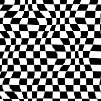
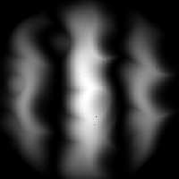
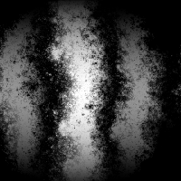

# Deformación direccional

<table>
<tr style="border: 0;">
<td width="33.33%" style="border: 0;" valign="top">

{width="200px"}

</td>
<td width="100.00%" style="border: 0;" valign="top">

Desplaza los píxeles en una dirección especificada según un mapa de intensidad, lo que puede provocar una deformación.

Deforma una entrada en una dirección definida por el usuario, multiplicada por un mapa de intensidad definido por el usuario. Funciona de forma similar a Deformar, pero solo en una dirección específica.

</td>
</tr>
</table>

El nodo Deformar es un nodo bastante sencillo pero útil que sirve como base para otros efectos más avanzados. Hay alternativas más avanzadas, como otros nodos de interés relacionados, como [Desenfoque de Pendiente](../../../../compositing-graphs/nodes-reference-for-com/node-library/filters/blurs/slope-blur/slope-blur.md) y [Deformación vectorial](../../../../compositing-graphs/nodes-reference-for-com/node-library/filters/effects/vector-warp/vector-warp.md).

<table>
<tr style="border: 0;">
<td width="100.00%" style="border: 0;" valign="top">

</td>
<td width="83.33%" style="border: 0;" valign="top">

</td>
<td width="100.00%" style="border: 0;" valign="top">

</td>
</tr>
</table>

<table>
<tr style="border: 0;">
<td style="border: 0;" valign="top">

## Conectores de salida

</td>
<td style="border: 0;" valign="top">

### Ejemplos

</td>
</tr>
</table>

## Parámetros

|  |  |
| --- | --- |
| <b>Intensidad</b> *Flotador* | Define la intensidad de la deformación. |
| <b>Ángulo de deformación</b> *Flotador* | Define el ángulo del efecto de deformación, en número de vueltas. |
| <b>Modo de filtrado de entrada</b> *Booleano* | Controla si se usa el filtrado más cercano o bilineal para muestrear <b>Input</b>. |
| <b>Desplazamiento del mapa de intensidad</b> *Flotador* | Este valor se resta de los valores de imagen <b>Intensity input</b>. |

## Conectores de entrada

|  |  |
| --- | --- |
| <b>Entrada</b> *Escala de grises/Color* PRINCIPAL | Imagen de entrada de color o escala de grises en la que se debe aplicar el efecto de deformación. |
| <b>Entrada de intensidad</b> *Escala de grises* | Imagen en escala de grises que define la cantidad de deformación que se debe aplicar a la imagen <b>Input</b>. |

## Conectores de salida

|  |  |
| --- | --- |
| <b>Salida</b> *Escala de grises/Color* |  |

## Ejemplos

<table>
<tr style="border: 0;">
<td style="border: 0;" valign="top">

{zoomable="yes"}

</td>
<td style="border: 0;" valign="top">

{zoomable="yes"}

</td>
<td style="border: 0;" valign="top">

{zoomable="yes"}

</td>
</tr>
</table>
