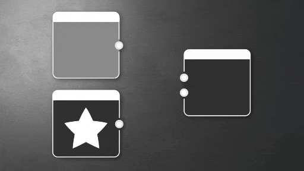

# Relieve

<table>
<tr style="border: 0;">
<td width="33.33%" style="border: 0;" valign="top">

{width="20%"}

</td>
<td width="100.00%" style="border: 0;" valign="top">

Aplica un efecto de relieve iluminando los lados de las formas de una imagen según la dirección de una fuente de luz especificada.

Es decir, el nodo realiza un sombreado 2D simple basado en 2 entradas, simulando la luz que cae sobre una superficie con variación de height y profundidad.

</td>
</tr>
</table>

Este nodo no se usa con frecuencia para proyectos similares a la PBR, pero puede servir en ciertos casos en los que deseas una iluminación simple y horneada en tu textura. Como alternativa, [Relieve con brillo](../../../../compositing-graphs/nodes-reference-for-com/node-library/filters/effects/emboss-with-gloss/emboss-with-gloss.md) y [Relieve de Uber](../../../../compositing-graphs/nodes-reference-for-com/node-library/filters/effects/uber-emboss/uber-emboss.md) proporcionan una funcionalidad similar, pero más extensa.

## Parámetros

|  |  |
| --- | --- |
| <b>Intensidad</b> *Flotador* | Ajusta la intensidad global del efecto de iluminación.   Define la intensidad de la iluminación del mapa de &quot;height&quot; y, por lo tanto, la intensidad del efecto de iluminación |
| <b>Ángulo de luz</b> *Flotador* | Define el ángulo en el que se simula la luz.   Define el ángulo de iluminación del resaltado de la imagen en relieve |
| <b>Resaltar color</b> *Float/Float4* | Define el color de las áreas orientadas hacia el ángulo de luz.   Establece el color del resaltado si la imagen de entrada es de color. |
| <b>Color de sombra</b> *Float/Float4* | Define el color de las áreas que miran lejos del ángulo de luz.   Define el color de las regiones sombreadas de la imagen en relieve. |

## Conectores de entrada

|  |  |
| --- | --- |
| <b>Entrada</b> *Escala de grises/Color* PRINCIPAL | Proporciona los colores base sin sombreado. Véalo como una especie de textura difusa o de color base. |
| <b>Entrada de intensidad</b> *Escala de grises* | Representa el mapa de alturas utilizado para calcular la iluminación en la superficie. El negro es bajo y el blanco es alto. |

## Ejemplos

*Próximamente.*
