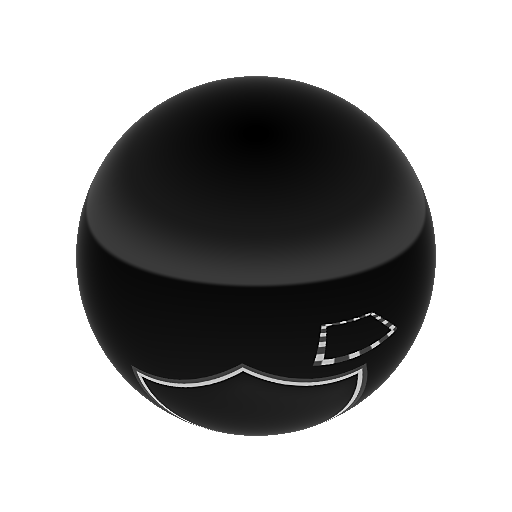

# Nadir patch

<table>
<tr style="border: 0;">
<td width="33.33%" style="border: 0;" valign="top">

{width="200px"}

<b>En:</b> Vista 3D > Herramientas HDRI

</td>
<td width="100.00%" style="border: 0;" valign="top">

## Descripción

Este nodo proporciona la funcionalidad de aplicar parches sobre el punto central del suelo (nadir) de una imagen asignada esféricamente. Se puede utilizar para ocultar o &quot;clonar&quot; un nadir feo, o cámara visible o trípode. Funciona como un [parche de Clonar](../../../../../../compositing-graphs/nodes-reference-for-com/node-library/material-filters/scan-processing/clone-patch/clone-patch.md), pero con ajustes para imágenes asignadas esféricamente. El usuario selecciona un punto en otra parte de la imagen, es decir, el punto clonado y mezclado en el nadir. No se requieren otras entradas externas que no sean un único HDRI para procesar, pero se puede utilizar una máscara externa como alfa para el efecto de parche.

se puede comprobar y validar rápidamente con [Nadir extract](../../../../../../compositing-graphs/nodes-reference-for-com/node-library/3d-view-library/hdri-tools/nadir-extract/nadir-extract.md).

</td>
</tr>
</table>

## Entradas

|  |  |
|:---|:---|
| <b>Entrada</b> <i>Entrada de color</i> |  |
| <b>Entrada de máscara</b> <i>Entrada en escala de grises</i> | Ranura de máscara opcional utilizada para enmascarar el parche. Funciona como un alfa. |

## Parámetros

|  |  |
|:---|:---|
| <b>Habilitar</b> <i>Falso/Verdadero</i> | Activar o desactivar el efecto de aplicación de parches. |
| <b>Mostrar Ayudante de Marcos</b> <i>Falso/Verdadero</i> | Mostrar u ocultar las líneas auxiliares, con fines de depuración. |
| <b>Thickness de Marco</b> <i>0.0 - 1.0</i> | Thickness de líneas auxiliares. |
| <b>Escala del parche</b> <i>0.0 - 1.0</i> | Escala de parche global y uniforme. Afecta tanto al origen como al destino. |
| <b>Tamaño de parche</b> <i>0.0 - 1.0</i> | Tamaño no uniforme del parche. |
| <b>Rotación de parche</b> <i>0.0 - 1.0</i> | Rotación del parche. Afecta al origen y al destino. |
| <b>Alpha de parches</b> <i>Cuadrado suave, gaussiano, entrada de máscara</i> | Defina qué alfa se utiliza para fusionar el parche con el fondo. |
| <b>Dureza del parche</b> <i>0.0 - 1.0</i> | Definir dureza/contraste de alfa. |
| <b>Desplazamiento de rotación de origen</b> <i>0.0 - 1.0</i> | Rotación sólo para el origen del parche. |
| <b>Coordenadas de posición</b> |  |
| <b>Posición de origen</b> | Posición del origen. Tiene control en vista 2D. |
| <b>Posición del parche</b> | Posición del objetivo. Tiene control en vista 2D. |

## Ejemplos

<table style="margin-top: 32px; margin-bottom: 32px">
    <tr style="border: 0">
        <td style="border: 0; background: transparent">
            
        </td>
    </tr>
</table>
