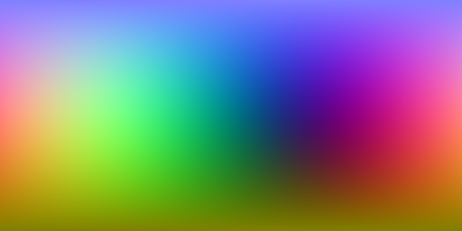

# Posición 3D del panorama

<table>
<tr style="border: 0;">
<td style="border: 0;" valign="top">

{width="200px"}

## Posición 3D del panorama

**En:** *Herramientas HDRI/vistas 3D*

**Simple**

</td>
<td style="border: 0;" valign="top">

## Descripción

Nodo auxiliar que representa un mapa de posición del espacio mundial para una imagen panorámica proyectada específicamente. Se puede utilizar para realizar sus propias transformaciones y búsquedas esféricas.

## Parámetros

* **Vector Arriba**: *Arriba Z, Arriba Y*

## Imágenes de ejemplo

</td>
</tr>
</table>
