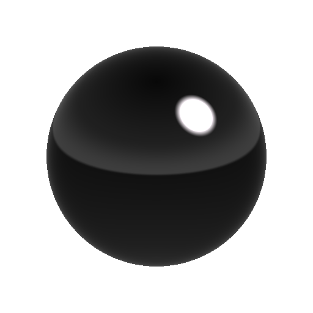

# Luz de esfera

<table>
<tr style="border: 0;">
<td width="33.33%" style="border: 0;" valign="top">

{width="200px"}

<b>En:</b> Vista 3D > Herramientas HDRI

</td>
<td width="100.00%" style="border: 0;" valign="top">

## Descripción

Genera una forma de esfera proyectada esféricamente. La transformación de la esfera se controla mediante un gizmo de transformación.

La Sphere Light es bastante versátil y tiene opciones que le permiten no solo generar luces redondas simples, sino también planetas u otros cuerpos celestes. Si no necesitas las opciones más avanzadas de iluminación y rotación, echa un vistazo a [Luz de forma](../../../../../../compositing-graphs/nodes-reference-for-com/node-library/3d-view-library/hdri-tools/shape-light/shape-light.md).

</td>
</tr>
</table>

## Entradas

|  |  |
|:---|:---|
| <b>Entrada de imagen de fondo</b> <i>Entrada de color</i> | Fondo opcional sobre el que componer la luz generada. |
| <b>Entrada de imagen de forma</b> <i>Entrada de color</i> | Imagen opcional para asignar a la luz Esfera. Solo se usa cuando el modo Color de forma está establecido en Entrada de imagen. |

## Parámetros

|  |  |
|:---|:---|
| <b>Modo de posición</b> <i>Distancia desde origen, posición mundial</i> | Elige entre dos modos de colocación. La distancia desde origen es similar a las coordenadas polares, la esfera se establece en relación con el centro del panorama, la posición del mundo funciona como coordenadas estándar 3D. |
| <b>Coordenadas de posición</b> |  |
| <b>Vector Arriba</b> <i>Z Arriba, Y Arriba</i> | Solo con el modo Posición mundial, determine la orientación del sistema de coordenadas. |
| <b>Posición de mundo de esfera</b> <i>-2.0 - 2.0</i> | Solo con el modo Posición mundial, establece la posición de la esfera en el espacio mundial. |
| <b>Posición</b> | Solo con el modo de Distancia desde origen. Establece la posición en relación con el centro. Se puede manipular en vista 2D. |
| <b>Distancia desde origen</b> <i>0.0 - 20.0</i> | Solo con el modo de Distancia desde origen. Establece la distancia al origen y afecta al tamaño visible de la esfera. |
| <b>Modo de color de forma</b> <i>RGB, Temperatura (Kelvin), Entrada De Imagen</i> | Elija el método que desee utilizar para definir el color de la forma. La entrada de imagen permite utilizar la segunda ranura de entrada. |
| <b>Color</b> <i>(Valor de color)</i> | Solo con el modo Color de forma establecido en RGB. Selecciona el color de la forma. |
| <b>Temperatura de forma</b> <i>800.0 - 20000.0</i> | Solo con el modo Color de forma establecido en Temperatura. Establece el valor Kelvin para el color de la forma. |
| Gamma de entrada de imagen de esfera <b>Sphere</b> <i>sRGB, lineal</i> | Solo con el modo Color de forma establecido en Entrada de imagen. Determine cómo interpretar la entrada de imágenes de formas. |
| <b>Rotación de esfera</b> <i>0.0 - 1.0</i> | Solo con el modo Color de forma establecido en Entrada de imagen. Gira la esfera alrededor de su centro para orientar la imagen asignada. |
| <b>Exposición (VE)</b> <i>0.0 - 10.0</i> | Defina el valor de exposición para la forma generada, que se corresponde perfectamente con el valor de exposición de la imagen de fondo. |
| <b>Radio de esfera</b> <i>0.0 - 1.0</i> | Define el radio/tamaño de la esfera. |
| <b>Dureza de esfera</b> <i>0.0 - 1.0</i> | Define la dureza o la difuminación de la esfera. |
| <b>Sombreado</b> <i>Ninguno, Oscurecimiento de las extremidades, Luz de Sombreado</i> | Defina si se debe aplicar algún sombreado a la esfera. Permite que la esfera no aparezca como objeto sólido y sin iluminar. El oscurecimiento de las extremidades significa que aparece un ligero oscurecimiento en los bordes, la luz del Sombreado significa que la esfera está iluminada por una luz de Sombreado opcional. |
| <b>Posición del mundo de la luz del Sombreado</b> <i>-1.0 - 1.0</i> | Si el Sombreado se ajusta en Luz de Sombreado, la posición de la luz en la esfera se controla aquí. |
| <b>Transparencia Penombra</b> <i>0.0 - 1.0</i> | Si el Sombreado se define en Luz de Sombreado, controla la difuminación del sombreado. |
| <b>Habilitar entrada de fondo</b> <i>Falso/Verdadero</i> | Cambia el uso de la imagen de fondo opcional. Las composiciones generan luz sobre el fondo. |
| <b>Color de fondo</b> <i>(Valor de color)</i> | Si no se utiliza Entrada de fondo, defina aquí un valor de fondo de color sólido. |
| <b>Gama de fondo</b> <i>sRGB, lineal</i> | Si se utiliza Entrada en segundo plano, defina cómo interpretar la entrada en segundo plano. |

## Ejemplos

<table style="margin-top: 32px; margin-bottom: 32px">
    <tr style="border: 0">
        <td style="border: 0; background: transparent">
            
        </td>
        <td style="border: 0; background: transparent">
            
        </td>
    </tr>
</table>
