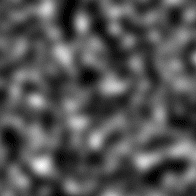

# Contraste/luminosidad

<table>
<tr style="border: 0;">
<td style="border: 0;" valign="top">

{width="128px"}

{width="128px"}

## Contraste/luminosidad (escala de grises)

**En:** *Filtros/Ajustes*

**Simple**

</td>
<td style="border: 0;" valign="top">

## Descripción

Un sencillo ajuste de contraste y luminosidad (brillo).

## Parámetros

* **Contraste**: *-1.0 - 1.0*\
  Ajusta el contraste del resultado.
* **Luminosidad**: *-1.0 - 1.0*\
  Ajusta la luminosidad (brillo) del resultado.

## Imágenes de ejemplo

</td>
</tr>
</table>
