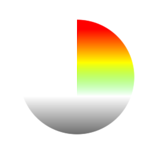

# HDR. Visor de rango

<table>
<tr style="border: 0;">
<td width="33.33%" style="border: 0;" valign="top">

{width="128px"}

{width="128px"}

<b>En:</b> Filtros > Ajustes

</td>
<td width="100.00%" style="border: 0;" valign="top">

## Descripción

Herramienta de depuración para comprobar las áreas exactas con Alto rango dinámico. Existen las versiones Color y Escala de grises.

</td>
</tr>
</table>

## Parámetros

|  |  |
|:---|:---|
| <b>Rango Mínimo</b> <i>-2.0 - 0.0</i> | Rango mínimo para comenzar a resaltar. |
| <b>Rango máximo</b> <i>1.0 - 3.0</i> | Rango máximo para resaltar hasta. |

## Ejemplos

<table style="margin-top: 32px; margin-bottom: 32px">
    <tr style="border: 0">
        <td style="border: 0; background: transparent">
            
        </td>
    </tr>
</table>
