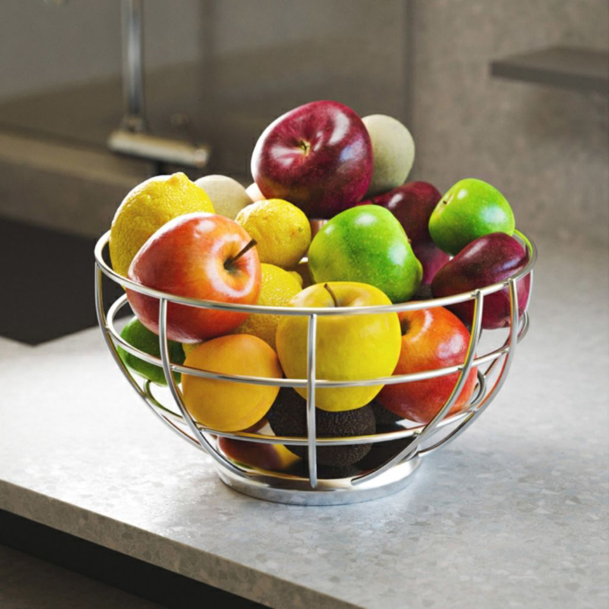

# Ecualización del histograma

<table>
<tr style="border: 0;">
<td width="33.33%" style="border: 0;" valign="top">

{width="200px"}

<b>En:</b> Filtros > Ajustes

</td>
<td width="100.00%" style="border: 0;" valign="top">

## Descripción

Ecualiza el histograma de una imagen de escala de grises, ajustando eficazmente los valores de escala de grises con el fin de lograr una distribución igual.

</td>
</tr>
</table>

## Entradas

|  |  |
|:---|:---|
| <b>Entrada</b> <i>Escala de grises</i> PRINCIPAL | Imagen para la que se debe igualar el histograma. |

## Salidas

|  |  |
|:---|:---|
| <b>Salida</b> <i>Escala de grises</i> | Imagen resultante con ecualización de histograma aplicada. |

## Parámetros

|  |  |
|:---|:---|
| <b>Resolución del histograma</b> *Entero* | Anchura del histograma. Un valor más alto permite una distribución de valor más fina.   Las resoluciones disponibles son, en píxeles:  256, 512, 1024, 2048, 4096 |
| <b>Suavizado de histograma</b> *Flotador* | El histograma se puede suavizar redistribuyendo los valores de escala de grises de la imagen para igualar la *diferencia* entre cada valor.   Este parámetro ajusta la intensidad de ese suavizado. |

## Ejemplos

<table>
  <tr>
    <td>
      
       <i>Antes</i>
    </td>
    <td>
      
       <i>Después De</i>
    </td>
  </tr>
</table>

{zoomable="yes"}

<table>
  <tr>
    <td>
      
       <i>Antes</i>
    </td>
    <td>
      
       <i>Después De</i>
    </td>
  </tr>
</table>

{zoomable="yes"}

<table>
  <tr>
    <td>
      
       <i>Antes</i>
    </td>
    <td>
      
       <i>Después De</i>
    </td>
  </tr>
</table>

{zoomable="yes"}
