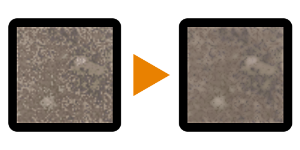

# Iluminación Cancelar altas frecuencias

<table>
<tr style="border: 0;">
<td width="33.33%" style="border: 0;" valign="top">

{width="128px"}

<b>En:</b> Filtros > Ajustes

</td>
<td width="100.00%" style="border: 0;" valign="top">

## Descripción

Similar a [Highpass](../../../../../../compositing-graphs/nodes-reference-for-com/node-library/filters/adjustments/highpass/highpass.md), pero más adecuado para imágenes a todo color (no desatura tanto el resultado), este nodo intenta cancelar los detalles de iluminación pequeños y alta frecuencia.

Consulte también [Cancelación de iluminación con frecuencias bajas](../../../../../../compositing-graphs/nodes-reference-for-com/node-library/filters/adjustments/lighting-cancel-low-fre/lighting-cancel-low-frequencies.md) y la opción más avanzada recomendada: [Paso alto de luminancia](../../../../../../compositing-graphs/nodes-reference-for-com/node-library/filters/adjustments/luminance-highpass/luminance-highpass.md).

</td>
</tr>
</table>

## Parámetros

|  |  |
|:---|:---|
| <b>Intensidad</b> <i>0.0 - 1.0</i> | Intensidad del efecto de cancelación de iluminación. |
| <b>Radio</b> <i>0.0 - 10.0</i> | Radio o tamaño de los detalles de iluminación que se van a cancelar. |

## Ejemplos

<table style="margin-top: 32px; margin-bottom: 32px">
    <tr style="border: 0">
        <td style="border: 0; background: transparent">
            
        </td>
    </tr>
</table>
