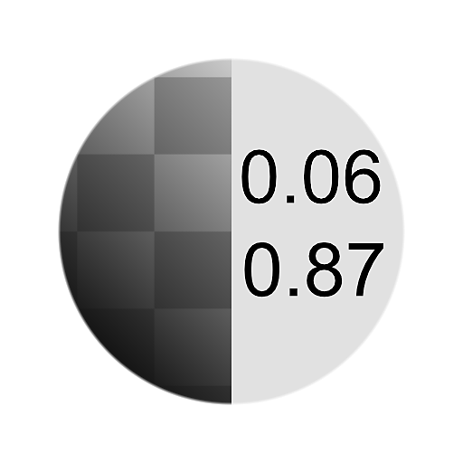

# Mín. máx

<table>
<tr style="border: 0;">
<td width="33.33%" style="border: 0;" valign="top">

{width="200px"}

<b>En:</b> Filtros > Ajustes

</td>
<td width="100.00%" style="border: 0;" valign="top">

## Descripción

Mín. máx. encuentra los valores más brillantes y más oscuros de una entrada de escala de grises y los devuelve como [valores](../../../../../values-compositing-graphs/values-in-substance-compositing-graphs.md). Está pensado como una alternativa manual más granular para [Niveles automáticos](../../../../../../compositing-graphs/nodes-reference-for-com/node-library/filters/adjustments/auto-levels/auto-levels.md), donde se exponen los valores de entrada de un nodo [Niveles](../../../../../../compositing-graphs/nodes-reference-for-com/atomic-nodes/levels/levels.md) y se conectan los valores de Min Max en él.

Para usar este nodo con niveles, al menos deberías saber cómo usar el menú desplegable [Exponer parámetro](../../../../../../compositing-graphs/manage-parameters/exposing-a-parameter/exposing-a-parameter.md), así como la [pestaña de entrada Valor](../../../../../values-compositing-graphs/values-in-substance-compositing-graphs.md).

</td>
</tr>
</table>

## Ejemplos

<table style="margin-top: 32px; margin-bottom: 32px">
    <tr style="border: 0">
        <td style="border: 0; background: transparent">
            
        </td>
    </tr>
</table>
