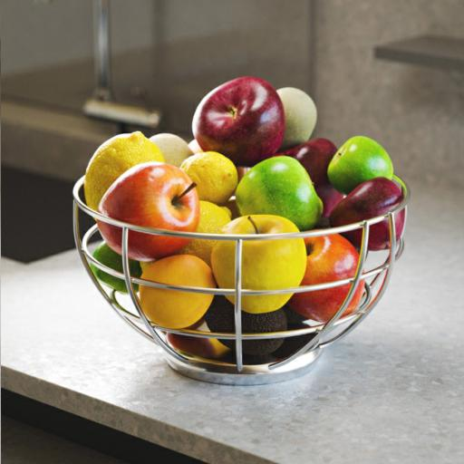

# Cuantificar color

<table>
<tr style="border: 0;">
<td width="33.33%" style="border: 0;" valign="top">

{width="200px"}

<b>En:</b> Filtros > Ajustes

</td>
<td width="100.00%" style="border: 0;" valign="top">

## Descripción

Reduce la cantidad de colores de una imagen de color y acopla los degradados de forma efectiva.

Además de la imagen procesada, el nodo también extrae lo siguiente:

* Una <b>paleta</b> de los colores restantes, que se puede usar para colorear otras imágenes
* Un <b>mapa de ID</b> de las áreas cuantificadas, que se puede usar para volver a colorear la imagen procesada usando una paleta diferente
* La <b>cantidad</b> de colores restantes como un valor entero sin formato

</td>
</tr>
</table>

Si el parámetro &quot;Ignorar alfa&quot; se establece en &quot;Falso&quot;, el canal alfa de la imagen original se utiliza para seleccionar las áreas de la imagen de las que se deben extraer los colores para el proceso de cuantificación, mientras que los colores de las áreas transparentes se omiten.

Esto proporciona un control efectivo sobre los colores extraídos.

Este nodo se puede utilizar en combinación con los siguientes nodos: [Crear Paleta De Color](../../../../../../compositing-graphs/nodes-reference-for-com/node-library/filters/adjustments/create-color-palette-16/create-color-palette-16.md), [Aplicar Paleta De Color](../../../../../../compositing-graphs/nodes-reference-for-com/node-library/filters/adjustments/apply-color-palette/apply-color-palette.md), [Modificar Paleta De Color](../../../../../../compositing-graphs/nodes-reference-for-com/node-library/filters/adjustments/modify-color-palette/modify-color-palette.md), [Ver Paleta De Color](../../../../../../compositing-graphs/nodes-reference-for-com/node-library/filters/adjustments/view-color-palette/view-color-palette.md).

## Entradas

|  |  |
|:---|:---|
| <b>Entrada</b> <i>Color</i> PRINCIPAL | La imagen en color que debe cuantificarse. |

## Salidas

|  |  |
|:---|:---|
| <b>Salida</b> <i>Color</i> | La imagen en color cuantificada. |
| <b>ID</b> <i>Escala de grises</i> | Un mapa donde a cada color cuantificado se le asigna un identificador entero único.   Esto se puede utilizar para:<ul data-preserve-html="true"> <li data-preserve-html="true"><b>Extrae una máscara</b> de algunas áreas cuantificadas con el nodo [ID a Mask](../../../../../../compositing-graphs/nodes-reference-for-com/node-library/filters/adjustments/id-to-mask/id-to-mask.md)</li> <li data-preserve-html="true"><b>Volver a colorear</b> la imagen cuantificada con los nodos [Aplicar paleta de colores](../../../../../../compositing-graphs/nodes-reference-for-com/node-library/filters/adjustments/apply-color-palette/apply-color-palette.md) o [Modificar paleta de colores](../../../../../../compositing-graphs/nodes-reference-for-com/node-library/filters/adjustments/modify-color-palette/modify-color-palette.md)</li> </ul> |
| <b>Paleta</b> <i>Color</i> | La paleta extraída de la imagen, manteniendo los colores restantes después de la cuantificación.   La imagen es una lista ordenada de colores RGB codificados como una fila de píxeles y puede contener un máximo de 256 colores.   La paleta se puede visualizar con el nodo [View Color Palette](../../../../../../compositing-graphs/nodes-reference-for-com/node-library/filters/adjustments/view-color-palette/view-color-palette.md). |
| <b>Cantidad de color de la paleta</b> <i>Entero</i> | Cantidad de colores almacenados en la paleta. |

## Parámetros

|  |  |
|:---|:---|
| <b>Máx. cantidad de color</b> *Entero* | Cantidad máxima de colores que se deben utilizar en la imagen cuantificada.   Esta cantidad es la misma utilizada en la paleta extraída de la imagen.   &quot;Máximo&quot; significa que esta cantidad puede no cumplirse debido a la técnica de cuantificación utilizada. Compruebe la salida &quot;Cantidad de color de la paleta&quot; para ver la cantidad real de colores extraídos. |
| <b>Suavizado de contorno</b> *Flotante* | Controla el radio de un efecto de suavizado aplicado a la imagen de entrada, que se utiliza para simplificar la imagen cuantificada en formas más sólidas y cohesivas.   Nota: Este suavizado requiere cálculos intensivos, por lo que aumentar este valor aumenta notablemente el tiempo de cálculo del nodo. |
| <b>Tramado</b> *Flotante* | Aplica un patrón de tramado para recrear los degradados y las fusiones de color en la imagen original, mientras que sigue utilizando solo los colores restantes después de la cuantificación.   Asegúrese de utilizar el valor &quot;Suavizado de contorno&quot; de 0 para producir el efecto de tramado esperado. |
| <b>Trama de tramado</b> *Entero* | Patrón de tramado utilizado para recrear los degradados y las fusiones de color en la imagen original:<ul data-preserve-html="true"> <li data-preserve-html="true">Ruido azul</li> <li data-preserve-html="true">Bayer</li> </ul> |
| <b>Omitir alfa</b> *Booleano* | De forma predeterminada, el canal alfa de la imagen original se utiliza para seleccionar las áreas de la imagen de las que se deben extraer los colores para el proceso de cuantificación, mientras que los colores de las áreas transparentes se omiten. Esto proporciona un control efectivo sobre los colores extraídos.   De hecho, es posible que solo desee utilizar los colores de las partes visibles de la imagen para el proceso de cuantificación.   Este botón deslizante le permite deshabilitar esta máscara y usar la imagen *full* independientemente de la transparencia. |
| <b>Espacio de color de distancia</b> *Entero* | Los colores se organizan en un *cubo* cuyo ancho, height y profundidad son un degradado en el que cada componente de un color aumenta de 0 a 1 (p. ej. rojo, verde y azul en RGB).   El proceso de cuantificación implica seleccionar los *colores de definición* de una imagen y, a continuación, buscar los colores más cercanos a ellos en el cubo y reemplazarlos por ese color de definición.   Este parámetro le permite seleccionar el espacio de color utilizado para distribuir colores en el cubo, lo que cambia el resultado de la cuantificación cambiando los criterios para detectar un color de definición y reorganizar los colores contiguos.   Puede seleccionar el espacio de color que se ajuste a su caso de uso:<ul data-preserve-html="true"> <li data-preserve-html="true"><b>Laboratorio (color):</b> Un espacio de color perceptual estandarizado, que distribuye los colores de tal manera que los colores que &#39;parecen&#39; cercanos están realmente cerca en el cubo. Esto es adecuado para imágenes que se pueden visualizar en pantallas</li> <li data-preserve-html="true"><b>RGB (Datos):</b> El color se divide en rojo, verde y azul y se distribuye directamente a lo largo de esos ejes, sin tener en cuenta la percepción humana. Esto es adecuado para imágenes que contienen datos sin procesar, como mapas normales</li> </ul> |
| <b>Modo de ordenación de Id.</b> *Entero* | Los colores se organizan en un *cubo* donde la anchura, el height y la profundidad son un degradado donde cada componente de un color aumenta de 0 a 1 (p. ej. rojo, verde y azul en RGB).   Este parámetro selecciona el método utilizado para ordenar la lista de colores de la paleta extraída y los índices de las áreas del mapa de ID extraído:<ul data-preserve-html="true"> <li data-preserve-html="true">Curva Z <b>Z:</b> colores se ordenan según se encuentra a continuación en el cubo de color usando una curva Z, de blanco a negro</li> <li data-preserve-html="true"><b>Tono:</b> colores se ordenan por el tono más cercano</li> <li data-preserve-html="true"><b>Representatividad:</b> colores se ordenan de los más a los menos utilizados en la imagen cuantificada</li> </ul> |
| <b>Filtrado de escala reducida</b> *Entero* | El proceso de cuantificación del color consiste en calcular un histograma de una imagen a tamaño reducido (es decir, a escala reducida), con el fin de ordenar sus colores por importancia. Este parámetro controla el método de filtrado de la imagen a una escala inferior antes de calcular su histograma:<ul data-preserve-html="true"> <li data-preserve-html="true"><b>Bilineal:</b> aplica filtros bilineales a la imagen, lo que da como resultado un histograma con colores interpolados que pueden no ser parte de la imagen original, diluyendo algunos de los colores originales. Esto ayuda con imágenes que utilizan muchos colores.</li> <li data-preserve-html="true"><b>Más cercano:</b> toma muestras del color del píxel más cercano sin ningún filtro, lo que da como resultado un histograma utilizando exclusivamente colores de la imagen original. Esto es adecuado para imágenes que utilizan pocos colores.</li> </ul> |

## Ejemplos

<table>
  <tr>
    <td>
      
       <i>Antes</i>
    </td>
    <td>
      
       <i>Después De</i>
    </td>
  </tr>
</table>

<table>
  <tr>
    <td>
      
       <i>Antes</i>
    </td>
    <td>
      
       <i>Después De</i>
    </td>
  </tr>
</table>

<table>
  <tr>
    <td>
      
       <i>Antes</i>
    </td>
    <td>
      
       <i>Después De</i>
    </td>
  </tr>
</table>

<table>
  <tr>
    <td>
      
       <i>Antes</i>
    </td>
    <td>
      
       <i>Después De</i>
    </td>
  </tr>
</table>

<table>
  <tr>
    <td>
      
       <i>Antes</i>
    </td>
    <td>
      
       <i>Después De</i>
    </td>
  </tr>
</table>
