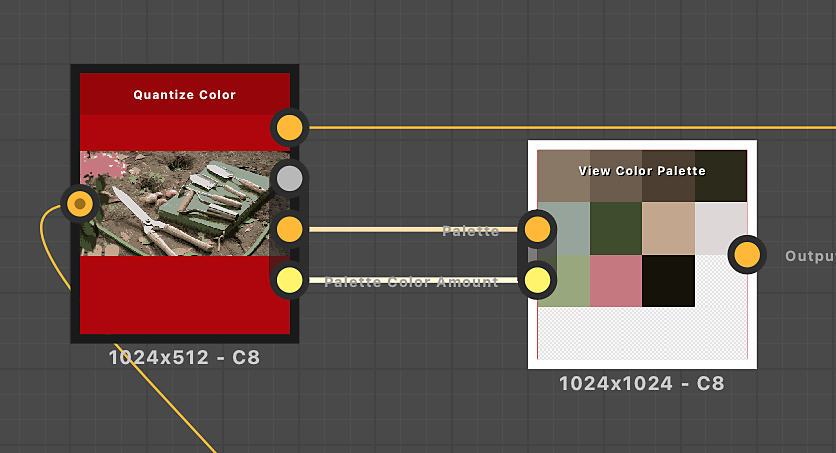

# Ver paleta de colores

<table>
<tr style="border: 0;">
<td width="33.33%" style="border: 0;" valign="top">

{width="200px"}

<b>En:</b> Filtros > Ajustes

</td>
<td width="100.00%" style="border: 0;" valign="top">

## Descripción

Empaqueta una paleta de colores en un cuadrado o rectángulo para visualizarla más fácilmente en la vista de gráficos o la vista 2D.\
El empaquetado tiene por objeto dejar el menor número posible de espacios vacíos.

</td>
</tr>
</table>

Se mantiene el orden de los colores en la paleta, con los colores que fluyen de izquierda a derecha y de arriba abajo de forma similar al ajuste de texto.

Este nodo se puede utilizar para visualizar las paletas producidas por los siguientes nodos: [Cuantificar color](../../../../../../compositing-graphs/nodes-reference-for-com/node-library/filters/adjustments/quantize-color/quantize-color.md), [Crear paleta de colores](../../../../../../compositing-graphs/nodes-reference-for-com/node-library/filters/adjustments/create-color-palette-16/create-color-palette-16.md), [Modificar paleta de colores](../../../../../../compositing-graphs/nodes-reference-for-com/node-library/filters/adjustments/modify-color-palette/modify-color-palette.md).

## Entradas

|  |  |
|:---|:---|
| <b>Paleta</b> <i>Color</i> PRINCIPAL | Una lista ordenada de colores de RGB codificados como una fila de píxeles. La paleta puede contener un máximo de 256 colores.   Esta es la paleta que el nodo empaqueta y procesa. |
| <b>Cantidad de color de paleta</b> <i>Entero</i> | Cantidad de colores almacenados en la paleta.   Si ese número no coincide con la cantidad real de colores en la entrada de imagen de la &#39;Paleta&#39;, la visualización puede estar incompleta o tener más espacios en blanco de los absolutamente necesarios. |

## Salidas

|  |  |
|:---|:---|
| <b>Salida</b> <i>Color</i> | La visualización de la paleta empaquetada. |

## Ejemplos

<table>
<tr style="border: 0;">
<td style="border: 0;" valign="top">

{zoomable="yes"}

</td>
<td style="border: 0;" valign="top">

{zoomable="yes"}

</td>
</tr>
</table>

<table>
<tr style="border: 0;">
<td style="border: 0;" valign="top">

{zoomable="yes"}

</td>
<td style="border: 0;" valign="top">

{zoomable="yes"}

</td>
</tr>
</table>
