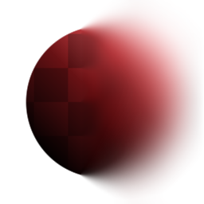

# Desenfoque no uniforme

<table>
<tr style="border: 0;">
<td width="33.33%" style="border: 0;" valign="top">

{width="128px"}

{width="128px"}

<b>En:</b> Filtros > Desenfoques

</td>
<td width="100.00%" style="border: 0;" valign="top">

## Descripción

Realiza un desenfoque de alta calidad, en el que la intensidad se controla mediante una máscara de entrada. Las opciones permiten añadir Anisotropía y asimetría.

</td>
</tr>
</table>

## Entradas

|  |  |
|:---|:---|
| <b>Mapa de desenfoque</b> <i>Entrada en escala de grises</i> | Mapa de máscara para aumentar la intensidad del efecto. |

## Parámetros

|  |  |
|:---|:---|
| <b>Intensidad</b> <i>0.0 - 50.0</i> | Intensidad máxima con la que aplicar el desenfoque. Enmascarado por el mapa de desenfoque, por lo que este ajuste no tendrá efecto en las áreas negras de ese mapa. |
| <b>Anisotropía</b> <i>0.0 - 1.0</i> | De forma opcional, añade direccionalidad al efecto de desenfoque. Se controla mediante el parámetro Ángulo. |
| <b>Asimetría</b> <i>0.0 - 1.0</i> | Si lo desea, añade un sesgo al muestreo. Se controla mediante el parámetro Ángulo. |
| <b>Ángulo</b> <i>0.0 - 1.0</i> | Ángulo para definir la direccionalidad y el sesgo de muestreo. |
| <b>Ejemplos</b> <i>1 - 16</i> | Cantidad de muestras, determina la calidad. Multiplicado por la cantidad de blades. |
| <b>Blades</b> <i>1 - 9</i> | Cantidad de sectores de muestreo, determina la calidad. Multiplicado por la cantidad de muestras. |

## Ejemplos

<table style="margin-top: 32px; margin-bottom: 32px">
    <tr style="border: 0">
        <td style="border: 0; background: transparent">
             <i>El siguiente ejemplo está gobernado por una pendiente de degradado (a 90 grados) en la ranura Mapa de desenfoque.</i>
        </td>
    </tr>
</table>
