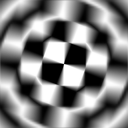

# Desenfoque radial

<table>
<tr style="border: 0;">
<td width="33.33%" style="border: 0;" valign="top">

<b>En:</b> Filtros > Desenfoques

</td>
<td width="100.00%" style="border: 0;" valign="top">

## Descripción

Genera un desenfoque de tipo de movimiento que gira en una entrada.

</td>
</tr>
</table>

## Parámetros

|  |  |
|:---|:---|
| <b>Ejemplos</b> <i>1 - 128</i> | Establezca la calidad del efecto de desenfoque. |
| <b>Ángulo</b> <i>0.0 - 0.5</i> | Establezca la cantidad de &quot;giro&quot; del efecto. |
| <b>Posición central</b> | Establezca el punto central del efecto. |

## Ejemplos

<table style="margin-top: 32px; margin-bottom: 32px">
    <tr style="border: 0">
        <td style="border: 0; background: transparent">
            
        </td>
    </tr>
</table>
