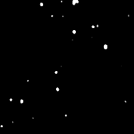

# Desenfoque de pendiente

<table>
<tr style="border: 0;">
<td width="33.33%" style="border: 0;" valign="top">

{width="128px"}

{width="128px"}

<b>En:</b> Filtros > Desenfoques

</td>
<td width="100.00%" style="border: 0;" valign="top">

## Descripción

Realiza un desenfoque avanzado de alta calidad en el que la Anisotropía/dirección se controla mediante un &quot;mapa de Pendiente&quot; en escala de grises. Imagínatelo como el efecto Desenfoque de Pendiente siguiendo las pendientes del Mapa de Pendiente como si fuera un Mapa de altura, similar a [Deformación direccional](../../../../../../compositing-graphs/nodes-reference-for-com/atomic-nodes/directional-warp/directional-warp.md) (en el que se basa internamente).

Este es uno de los desenfoques más interesantes y potentes de Designer. Se puede utilizar para lograr algunos efectos muy interesantes e inesperados, como desconchar y desgastar los bordes o manchas y fugas de dirt o óxido.

Importante: asegúrese de utilizar la versión adecuada para su entrada! Utiliza &quot;Desenfoque de Pendiente&quot; para las entradas de color o &quot;Desenfoque de Pendiente en escala de grises&quot; para las entradas de escala de grises.

</td>
</tr>
</table>

## Entradas

|  |  |
|:---|:---|
| <b>Pendiente</b> <i>Entrada en escala de grises</i> | Mapa de pendiente para controlar el ángulo de la anisotropía. Debe contener idealmente degradados inclinados; las transiciones duras y nítidas no funcionarán bien. |

## Parámetros

|  |  |
|:---|:---|
| <b>Ejemplos</b> <i>0 - 32</i> | Cantidad de muestras, afecta a la calidad a expensas de la velocidad. |
| <b>Intensidad</b> <i>0.0 - 16.0</i> | Cantidad o intensidad del desenfoque. |
| <b>Modo</b> <i>Desenfocar, Mín., Máx.</i> | Modo de fusión para las pasadas de desenfoque consiguientes. &quot;Desenfocar&quot; se comporta más como un [Desenfoque Anisotrópico](../../../../../../compositing-graphs/nodes-reference-for-com/node-library/filters/blurs/anisotropic-blur/anisotropic-blur.md) estándar, mientras que Min &quot;comerá&quot; las áreas existentes y Max &quot;manchará&quot; las áreas blancas. |

## Ejemplos

<table style="margin-top: 32px; margin-bottom: 32px">
    <tr style="border: 0">
        <td style="border: 0; background: transparent">
            
        </td>
        <td style="border: 0; background: transparent">
            
        </td>
    </tr>
</table>
