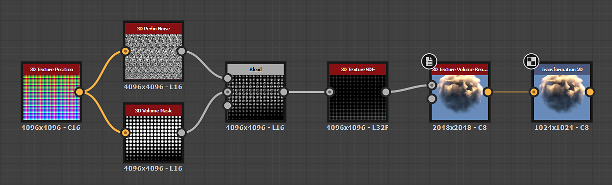

# Renderizado de volumen de textura 3D

<table>
<tr style="border: 0;">
<td width="41.60%" style="border: 0;" valign="top">

{width="200px"}

**En:** *Filtro/Efecto*

**Simple**

</td>
<td width="58.30%" style="border: 0;" valign="top">

## Descripción

El nodo **3D Texture Volume Render** representa el volumen de una forma descrita por una *textura 3D*, utilizando su correspondiente *campo de distancia firmada* de la entrada de imagen **3D Campo de distancia con signo**.

El volumen se representa dentro de los límites de un *cubo de unidades*. La iluminación se calcula usando *luz direccional* y un *tragaluz hemisférico*.

>[!NOTE]
>
> Se espera que el campo de distancia firmado sea una textura **4096x4096** que describa la forma con una cuadrícula **16x16** de 256 sectores.\
> Puede utilizar el nodo [3D Texture SDF](../../../../../../compositing-graphs/nodes-reference-for-com/node-library/filters/effects/3d-texture-sdf/3d-texture-sdf.md) para calcular el campo de distancia firmado para una textura 3D de 256 sectores.

</td>
</tr>
</table>

## Parámetros

### Entradas

* **Campo de distancia con signo 3D** *Escala de grises*\
  Imagen de 4096x4096 que representa los 256 *sectores* del *campo de distancia firmado* de una forma, organizados en una cuadrícula de 16x16.\
  Puede utilizar el nodo [3D Texture SDF](../../../../../../compositing-graphs/nodes-reference-for-com/node-library/filters/effects/3d-texture-sdf/3d-texture-sdf.md) para calcular el campo de distancia firmado para una textura 3D de 256 sectores.
* **Densidad** *Escala de grises*\
  Imagen de 4096x4096 que representa los 256 *sectores* de la *densidad* de una forma, organizados en una cuadrícula de 16x16. La densidad se asigna utilizando valores de escala de grises de 0 (completamente transparente) a 1 (completamente opaco).\
  Puede usar [Máscara de volumen 3D](../../../../../../compositing-graphs/nodes-reference-for-com/node-library/texture-generators/patterns/3d-volume-mask/3d-volume-mask.md) o nodos de ruido 3D ([Ruido de Perlin 3D](../../../../../../compositing-graphs/nodes-reference-for-com/node-library/texture-generators/noises/3d-perlin-noise/3d-perlin-noise.md), [Voronoi 3D](../../../../../../compositing-graphs/nodes-reference-for-com/node-library/texture-generators/noises/3d-voronoi/3d-voronoi.md), [Fractal de ruido de reborde 3D](../../../../../../compositing-graphs/nodes-reference-for-com/node-library/texture-generators/noises/3d-ridged-noise-fractal/3d-ridged-noise-fractal.md), etc.), combinados con un nodo [Posición de textura 3D](../../../../../../compositing-graphs/nodes-reference-for-com/node-library/filters/effects/3d-texture-position/3d-texture-position.md) como entrada de posición, para generar una máscara de volumen como una textura 3D de 256 sectores.

### Parámetros

* **Resolución de salida** *Integer2*\
  La resolución de la imagen de salida en **X** e **Y**, expresada como una *potencia de dos*.
* **Posición de la cámara** *Float2*\
  Posición de la cámara alrededor de la forma.\
  Cuando el nodo esté seleccionado, puedes usar el gizmo de posición en la **Vista en 2D** para *orbitar* la cámara.
* **Posición de la luz** *Float2*\
  Posición de la *luz direccional* alrededor de la forma.\
  Cuando el nodo esté seleccionado, puedes usar el gizmo de posición en la **Vista en 2D** para *orbitar* la fuente de luz.
* **Distancia de cámara** *Flotante*\
  La distancia desde la cámara a la forma.
* **Fov de cámara** *Float*\
  Campo de visión de la cámara en *grados*.
* **Absorción** *Flotante*\
  Ajusta la cantidad de luz que se absorbe al pasar *a través* del volumen.
* **Pluma** *Flotante*\
  Multiplica el valor proporcionado por la entrada **Density** por el valor del campo de distancia *inner*.\
  Esto ajusta efectivamente la anchura del *degradado* desde el límite exterior del volumen hacia adentro.
* **Modo Color claro** *Entero*\
  Define el método para adquirir el color de la luz direccional:
  * *Temperatura (Kelvin)*: El color es el resultado de la temperatura de la luz, donde un valor *inferior* da como resultado un color *más cálido*
  * *Color de RGB*: Definir el color mediante valores de RGB
* **Temperatura de la luz (Kelvin)** *Flotador*\
  La temperatura de la luz direccional, que afecta a su *color*. Un valor *inferior* produce un color *más cálido*.\
  Valores útiles:\
  1800 K - Luz de vela\
  2800 K - Bombilla incandescente\
  5500 K - Luz de día\
  6200 K - Blanco natural\
  7000 K - Cielo nublado\
  *Nota*: Este parámetro solo está disponible cuando el parámetro **Modo de color claro** está establecido en *Temperatura (Kelvin)*.
* **Color claro** *Float3*\
  El color de la luz direccional.\
  *Nota*: Este parámetro solo está disponible cuando el parámetro **Modo de color claro** está establecido en *Color RGB*.
* **Intensidad de luz** *Flotante*\
  Intensidad de la luz direccional.
* **Color ambiente** *Float3*\
  El color del tragaluz ambiente.
* **Intensidad ambiente** *Flotante*\
  La intensidad del tragaluz ambiente.
* **Albedo** *Float3*\
  Color de albedo del volumen.
* **Modo en segundo plano** *Entero*\
  Método de sombreado del fondo de la escena procesada, basado en el **color de fondo**:
  * *Sombreado*: El color se ve afectado por el *color* y la *intensidad*- *color constante* de la luz direccional: El color se aplica uniformemente *independientemente* de la luz direccional
* **Color de fondo** *Float4*\
  El color utilizado para rellenar el fondo de la escena procesada.
* **Tramado** *Flotante*\
  Ajusta la intensidad del *tramado de ruido azul* que se usa para suavizar el sombreado.
* **Habilitar plano de tierra** *Boolean*\
  Cuando *True*, representa un plano de tierra *infinito*. El *cubo de unidades* que encierra la forma descansa en este plano.
* **Plano infinito** *Booleano*\
  Establece el plano de tierra para *extender infinitamente* hasta el horizonte.\
  *Nota*: Este parámetro solo está disponible cuando el parámetro **Habilitar plano de tierra** está establecido en *True*.
* **Tamaño de plano de tierra** *Float2* Ajusta el tamaño del plano de tierra.\
  *Nota*: Este parámetro solo está disponible cuando el parámetro **Habilitar plano de tierra** está establecido en *True* y el parámetro **Plano infinito** está establecido en *False*.

## Imágenes de ejemplo

<table>
<tr style="border: 0;">
<td style="border: 0;" valign="top">

{width="256px"}

</td>
<td style="border: 0;" valign="top">

{width="256px"}

</td>
<td style="border: 0;" valign="top">

{width="256px"}

</td>
<td style="border: 0;" valign="top">

{width="256px"}

</td>
<td style="border: 0;" valign="top">

{width="256px"}

</td>
<td style="border: 0;" valign="top">

{width="512px"}

</td>
</tr>
</table>
