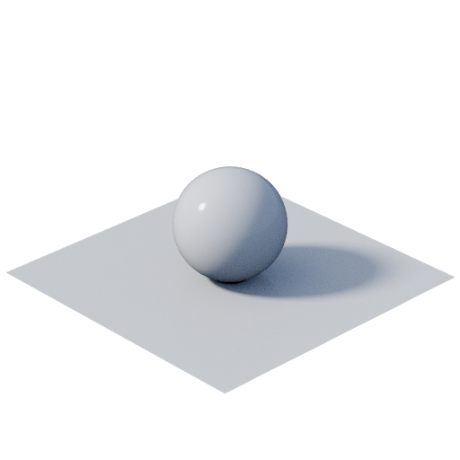

# Visor 3D

<table>
<tr style="border: 0;">
<td width="33.33%" style="border: 0;" valign="top">

<b>En:</b> Filtro > Efecto

</td>
<td width="100.00%" style="border: 0;" valign="top">

## Descripción

Calcula un procesamiento 3D para una escena SDF o de intersección especificada definida por un gráfico de funciones, con una cámara y una luz ambiental personalizadas.  Este nodo es útil para crear y visualizar [Funciones SDF](../../../../../../function-graphs/nodes-reference-for-fun/function-node-library/function-node-library.md#sdf-functions) que se usarán en el nodo [Shape splatter v2](../../../texture-generators/patterns/shape-splatter-v2/shape-splatter-v2.md).  Hay disponibles ayudantes para visualizar atributos clave de formas en el espacio.  Para usuarios avanzados, se pueden crear funciones personalizadas para configurar la cámara o el procesamiento 3D por píxel.

</td>
</tr>
</table>

>[!INFO]
> 
> Para obtener más información sobre conceptos y flujos de trabajo que implican Funciones SDF, vaya a la página dedicada: [Trabajando con Funciones SDF](../../../../../../function-graphs/nodes-reference-for-fun/function-node-library/function-nodes-sdf-functions/working-with-sdf-functions.md)

## Entradas

|                            |                                                                                                                                                                                                                                                                                                                                                                                                                                                        |
|:---------------------------|:-------------------------------------------------------------------------------------------------------------------------------------------------------------------------------------------------------------------------------------------------------------------------------------------------------------------------------------------------------------------------------------------------------------------------------------------------------|
| <b>Entorno</b> *Color* | La imagen que debe proyectarse en la esfera infinita se utiliza como entorno de la escena y para la iluminación del entorno.  La proyección es <i>equirectangular</i>, la misma que usan los mapas de entorno predeterminados de Designer disponibles en la categoría <b>Entornos de Vista 3D > HDRI</b> de la biblioteca.  Cuando no está conectado, se usa un entorno predeterminado.  <i>Sugerencia:</i> Utilice una imagen HDR. (32 bits) para obtener una iluminación precisa. |
| <b>Entrada 1</b> *Color* | Una imagen que se puede muestrear en el gráfico de funciones <b>Salida personalizada</b> cuando el parámetro <b>Salida</b> esté establecido en &#39;Personalizada&#39;.  Use un nodo [Color de muestra](../../../../../../function-graphs/nodes-reference-for-fun/atomic-function-nodes/sampler-nodes/sampler-nodes.md) establecido en &#39;Entrada de imagen 0&#39; para muestrear a partir de esta imagen. |
| <b>Entrada 2</b> *Color* | Una imagen que se puede muestrear en el gráfico de funciones <b>Salida personalizada</b> cuando el parámetro <b>Salida</b> esté establecido en &#39;Personalizada&#39;.  Use un nodo [Color de muestra](../../../../../../function-graphs/nodes-reference-for-fun/atomic-function-nodes/sampler-nodes/sampler-nodes.md) establecido en &#39;Entrada de imagen 1&#39; para muestrear a partir de esta imagen. |

## Salidas

|               |                                                                                                                                                                                                                                    |
|:--------------|:-----------------------------------------------------------------------------------------------------------------------------------------------------------------------------------------------------------------------------------|
| <b>Salida</b> | La escena representada, usando el AOV seleccionado en el parámetro <b>Output</b>.  <i>Nota:</i> Para obtener lecturas precisas en algunos AOV, asegúrese de que la vista 2D usa un espacio de color lineal y el nodo usa un formato de salida HDR. de 32 bits. |

## Parámetros

|                                               |                                                                                                                                                                                                                                                                                                                                                                                                                                                                                                                                                                                                                                                                                                                                                                                                                                                                                                                                                                                                                                                                                                                                                                                                                                                                                                                                                                                                                             |
|:----------------------------------------------|:----------------------------------------------------------------------------------------------------------------------------------------------------------------------------------------------------------------------------------------------------------------------------------------------------------------------------------------------------------------------------------------------------------------------------------------------------------------------------------------------------------------------------------------------------------------------------------------------------------------------------------------------------------------------------------------------------------------------------------------------------------------------------------------------------------------------------------------------------------------------------------------------------------------------------------------------------------------------------------------------------------------------------------------------------------------------------------------------------------------------------------------------------------------------------------------------------------------------------------------------------------------------------------------------------------------------------------------------------------------------------------------------------------------------------|
| <b>Tipo de escena</b> *Entero* | Tipo de función utilizada para describir las superficies y formas que se van a representar: - <b>SDF:</b> Utilice una función de campo de distancia firmado (SDF), que puede describir formas complejas. - <b>Intersección:</b> Utilice funciones de intersección, que son más rápidas cuando solo se necesitan formas simples simples y simples. |
| <b>Escena de SDF</b> *Flotador* | Función de campo de distancia firmada (SDF) que describe las superficies y formas de la escena.  Use los nodos de la categoría [Funciones SDF](../../../../../../function-graphs/nodes-reference-for-fun/function-node-library/function-node-library.md#sdf-functions) de la biblioteca para crear la función. |
| <b>Intersecar escena</b> *Flotador* | La función de intersección describe las superficies y formas de la escena.  Las funciones de intersección para simples primitivos y operadores están disponibles en las carpetas <b>3d_intersection</b> del paquete de biblioteca <b>3d_functions.sbs</b>.  <i>Sugerencia:</i> Puede acceder al paquete colocando cualquier nodo SDF de la biblioteca en el Explorador. |
| <b>Salida</b> *Entero* | El tipo de renderizado 3D que debe generar el nodo, normalmente denominado AOV (Variables de salida arbitrarias).  Los AOV disponibles son: - <b>Belleza:</b> El resultado final del renderizado 3D, con colores y efectos dirigidos por arte. - <b>Normal WS:</b> Las normales de espacio de mundo de las formas de la escena. - <b>Normal TS:</b> Las normales de espacio tangente de las formas de la escena. - <b>Posición:</b> Posición del espacio de entorno de las superficies de las formas en la escena. - <b>Distancia:</b> Distancia aproximada entre la cámara y las formas de la escena - <b>Profundidad:</b> Distancia firmada entre las formas y el plano de destino de la cámara, donde el plano siempre mira a la cámara. - <b>Color:</b> Color base de las formas (use el nodo &#39;Establecer color&#39; para asignar colores a las formas en la función de escena) -<b>Id. Material: 24&rbrace; Los identificadores de material aplicados a las superficies de formas (utilice el nodo &#39;Establecer id. de material&#39; para asignar identificadores de material a formas en la función de escena) - <b>Pasos de seguimiento de esfera:</b> Una visualización de la cantidad de pasos necesarios para definir la superficie de una forma. </b>Los valores más brillantes significan que se requieren más pasos. - <b>Personalizado:</b> Crea una función personalizada para calcular el color del procesamiento por píxel.  <i>Nota:</i> Para obtener lecturas precisas en algunos archivos AOV, asegúrese de que la vista 2D usa un espacio de color lineal y el nodo usa un formato de salida HDR de 32 bits. |
| <b>Salida personalizada</b> *Float4* | Gráfico de funciones que define los colores RGBA por píxel de la escena procesada como un valor Float4.  Variables disponibles: - <code>scene.position</code> (Float3) Posición del espacio de entorno de las superficies de la escena. - <code>scene.normal</code> (Float3) Las normales del espacio mundial de las superficies de la escena. - <code>scene.hit</code> (Booleano) Devuelve &#39;True&#39; cuando una superficie es golpeada por un rayo de cámara. - <code>view.source</code> (Float3) Posición del espacio de entorno por píxel de la vista de cámara. - <code>view.direction</code> (Float3) Vector de avance por píxel de la vista de cámara, según el modo de proyección. (E.g. perspectiva u ortográfico) - <code>material.color</code> (Float3) Color base de las superficies de la escena. - <code>material.metalness</code> (Flotante) Metalidad de las superficies de la escena. - <code>material.roughness</code> (Float) Rugosidad de las superficies de la escena. - <code>material.id</code> (Entero) Identificadores de material de las superficies de la escena.  Las entradas de imagen del nodo se pueden muestrear seleccionando las siguientes ranuras de nodo [Sample color](../../../../../../function-graphs/nodes-reference-for-fun/atomic-function-nodes/sampler-nodes/sampler-nodes.md): - <b>Image input 0</b> samples Input 1. - <b>Image input 1</b> samples Input 2. |
| <b>Rotación de entorno</b> *Flotador* | La rotación del <b>Entorno</b>, en número de vueltas. |
| <b>Modo de fondo</b> *Entero* | Especifica el origen del fondo de la escena, dibujado donde no hay superficies de formas visibles.  - <b>Color:</b> El &#39;color de fondo&#39; plano. - <b>Entorno:</b> La imagen proporcionada a la entrada &#39;Entorno&#39;, aplicada a una esfera infinita mediante proyección equirrectangular.  (Cuando la entrada no está conectada, se utiliza un entorno predeterminado). |
| <b>Color de fondo</b> *Float4* | El color plano utilizado como fondo de la escena. |
| <b>Muestras de IBL</b> *Entero* | La cantidad de muestras de luz realizadas por muestra de cámara.  Un valor más alto produce una iluminación más suave y precisa a costa del rendimiento. |
| <b>Muestras de cámara</b> *Entero* | Cantidad de muestras de cámara realizadas por píxel.  Este parámetro afecta a la calidad del suavizado y a la profundidad del efecto de campo.  Un valor más alto produce una imagen más clara y menos ruidosa a costa del rendimiento. |
| <b>Pasos de marcha de rayos</b> *Entero* | La cantidad de pasos realizados en el proceso de seguimiento de la esfera, la técnica de marcado de rayos utilizada para detectar y dibujar las superficies de las formas.  Un valor más alto produce superficies precisas y coherentes (especialmente para formas complejas), a costa del rendimiento.  <i>Sugerencia:</i> Establezca el parámetro <b>Output</b> en el valor AOV &#39;Pasos de seguimiento de la esfera&#39; para visualizar las áreas de las formas que requieren más pasos. Estas áreas se verán afectadas en primer lugar por la reducción de la cantidad de pasos. |
| <b>Pasos secundarios de rayo</b> *Entero* | Cantidad de pasos realizados en el proceso de seguimiento de la esfera para calcular la difusión y la oclusión del specular con el fin de dibujar sombras proyectadas.  Un valor más alto produce sombras más precisas a costa del rendimiento. |
| <b>Modo de cámara</b> *Entero* | Método para proyectar la escena en la imagen de procesamiento:  - <b>Perspectiva:</b> Esta proyección transmite profundidad y habilita efectos de lente como la profundidad de campo. - <b>Ortográfica:</b> Esta proyección acopla la escena y anula la profundidad. - <b>Función personalizada:</b> Crea un gráfico de funciones para configurar una cámara personalizada. |
| <b>Función de cámara</b> *Float3* | El gráfico de funciones que define el transforme de la cámara. Esto se puede utilizar para configurar una cámara personalizada.  La función debe <b>establecer</b> estas variables: - <code>view.source</code> (Float3) Posición del espacio de entorno por píxel de la vista de cámara. - <code>view.direction</code> (Float3) Vector de avance por píxel de la vista de cámara, según el modo de proyección. (E.g. Perspectiva o ortográfica)  Las siguientes variables están disponibles para <b>get</b>: - <code>camera.source</code> (Flotante 3) La posición espacial mundial de la cámara. (camera.direction * camera_distance + camera.target) - <code>camera.direction</code> (Flotante3) La dirección del espacio mundial de la cámara, es decir, el vector Y-forward de la cámara. - <code>camera.right</code> (Flotante3) El vector X-right de la cámara. - <code>camera.up</code> (Flotante3) El vector Z-up de la cámara. - <code>camera.target</code> (Flotante 3) La posición espacial mundial del objetivo de la cámara. |
| <b>Posición UV</b> *Float2* | Posición en el espacio de imagen 2D que se usa para inferir la posición y dirección de la cámara en órbita sobre la <b>posición de destino</b>.  <i>Sugerencia:</i> Este parámetro se puede ajustar intuitivamente mediante el gizmo de <i>posición</i> disponible en la vista 2D cuando se selecciona el nodo. |
| <b>FOV</b> *Flotador* | Campo de visión (FOV) de la cámara ortográfica, que afecta al factor de zoom. |
| <b>Distancia focal</b> *Flotador* | La distancia focal de la cámara, que afecta al factor de zoom y a la profundidad del efecto de campo. |
| <b>Distancia desde el destino</b> *Flotador* | Distancia que la cámara debe reposar desde la <b>posición de destino</b>.  Al ajustar esto, la cámara se mueve en la dirección de la cámara al objetivo. |
| <b>Posición de destino</b> *Float3* | La posición del objetivo de la cámara, hacia la que la cámara siempre está orientada. |
| <b>Tónemapper</b> *Entero* | Algoritmo de asignación de tonos que se debe aplicar al procesamiento de la escena.  - <b>Ninguno (sin procesar) - <b>sRGB</b> - <b>AgX</b> - <b>ACE</b> |
| <b>Habilitar profundidad de campo</b> *Booleano* | Simula el efecto de lente de cámara de profundidad de campo para la cámara de Perspectiva.  Usa los parámetros <b>Número F</b> y <b>Distancia de enfoque</b> para ajustar la apertura y el punto focal del efecto respectivamente.  El resultado también se ve afectado por la <b>Distancia focal</b>. |
| <b>Número-F</b> *Flotador* | La <i>apertura</i> de la cámara.  Un valor más bajo tiene como resultado una <i>profundidad de campo</i> más corta, es decir, un rango de distancia más corto para los objetos que son nítidos y un efecto de desenfoque más fuerte a medida que aumenta la distancia desde ese rango. |
| <b>Distancia de enfoque</b> *Flotador* | Define la distancia del punto focal como una distancia desde la cámara a lo largo de su vector delantero.  Las superficies dentro del rango de esa distancia aparecerán nítidas, ese rango —la <i>profundidad del campo </i>— está definido por el <b>número F</b>. |
| <b>Exposición (VE)</b> *Flotador* | La cantidad de luz que llega al sensor de la cámara, es decir, la intensidad de la iluminación en el renderizado.  Un valor más bajo da como resultado una escena renderizada más oscura.  El valor de exposición (EV) se refiere específicamente a la cantidad de luz a la que está <i>expuesto</i> el sensor de la cámara. |
| <b>Color base</b> *Float3* | Color base por defecto para superficies en las que el color no está definido por su función SDF o de intersección. |
| <b>Rugosidad</b> *Flotador* | Valor de rugosidad por defecto para superficies en las que el valor no está definido por su función SDF o de intersección. |
| <b>Metalness</b> *Flotador* | Valor de metalidad por defecto para superficies en las que el valor no está definido por su función SDF o de intersección. |
| Opacidad de <b>Helpers</b> *Flotador* | Opacidad de los ayudantes 3D, donde un valor más bajo da como resultado ayudantes más débiles. |
| <b>Marco delimitador</b> *Booleano* | Visualización de una jaula de seis lados que define los límites de toda la escena. Idealmente debe ser el tamaño más pequeño posible que incluya completamente la escena.  Use el parámetro <b>Tamaño de fotograma delimitador</b> para ajustar el tamaño de la jaula.  El parámetro <b>Colorear fuera del marco</b> te permite visualizar fácilmente las superficies fuera de esa jaula, lo que afecta al resultado de usar esa escena en el nodo [Shape splatter v2](../../../texture-generators/patterns/shape-splatter-v2/shape-splatter-v2.md) . (Consulte Información sobre herramientas &quot;Tamaño de fotograma delimitador&quot;) |
| <b>Tamaño de fotograma delimitador</b> *Float3* | Define el tamaño XYZ del marco delimitador.  Ajusta el fotograma a la escena y luego aplica esos mismos valores al parámetro <b>tamaño de fotograma dependiente de SDF</b> del nodo [Shape splatter v2](../../../texture-generators/patterns/shape-splatter-v2/shape-splatter-v2.md) para garantizar que ese nodo incluya y dibuje correctamente todas las formas de la escena. |
| <b>Colorear fuera de marco</b> *Booleano* | Aplica un color rojo a las superficies fuera del marco delimitador.  Esto ayuda a comprobar que la escena está totalmente incluida en su marco delimitador. |
| <b>Eje</b> *Booleano* | Una visualización de los ejes XYZ de la escena como líneas de color que comienzan en el origen de la escena. |
| <b>Cuadrícula</b> *Booleano* | Visualización de una cuadrícula colocada en los ejes XY, donde el tamaño de una celda en X e Y es una unidad de escena. |
| <b>Transformar ayudantes</b> *Booleano* | Una visualización de la última rotación aplicada.  La visualización incluye - <b>Una flecha</b> que representa el vector de dirección del eje de rotación y se colorea después de los grosores de cada eje espacial mundial. - <b>Un arco</b> que representa el ángulo de rotación, ortogonal a la flecha que coincide con su color. |
| <b>Aislamientos de SDF</b> *Booleano* | Visualización en color de las isolíneas de funciones de campo de distancia firmado (SDF).  Las isolíneas repiten con regularidad líneas que representan el <i>campo de distancia</i> de la forma en el plano XY en un height determinado.  Son útiles para comprobar la <i>uniformidad del espacio</i> definido por la Función SDF.  Use los parámetros <b>SDF isolines frequency</b> y <b>SDF isolines position</b> para ajustar la densidad y el height de las isolíneas. |
| <b>Frecuencia de aislamientos de SDF</b> *Flotador* | Cantidad de repeticiones de isolíneas dentro de una distancia determinada.  Un valor más alto genera líneas más densas y delgadas. |
| <b>Posición de las isolíneas de SDF</b> *Flotador* | El height espacial mundial del plano XY utilizado para dibujar las isolíneas.  Úselo para comprobar el campo de distancia de la forma en varias elevaciones. |
| <b>Mín. distancia de acceso </b> *Flotador* | Define la distancia mínima que se traduce en un éxito para el proceso de marcado de rayos SDF.  Un valor bajo aumentará el número de pasos de desplazamiento de rayos. |

## Ejemplos

<table style="border: none;">
    <tr style="width: 50%;">
        <td style="text-align: center">
            
        </td>
        <td style="width: 50%;">
            <table style="border: none;">
                <tr style="vertical-align: top;">
                    <td style="text-align: center">
                        
                    </td>
                    <td style="text-align: center">
                        
                    </td>
                </tr>
                <tr style="vertical-align: top;">
                    <td style="text-align: center">
                        
                    </td>
                    <td style="text-align: center">
                        
                    </td>
                </tr>
            </table>
    </tr>
</table>
