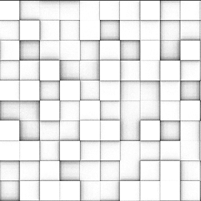

# Oclusión ambiente (RATO)

<table>
<tr style="border: 0;">
<td width="33.33%" style="border: 0;" valign="top">

<b>En:</b> Filtros > Efectos

</td>
<td width="100.00%" style="border: 0;" valign="top">

## Descripción

Genera un mapa de Oclusión ambiental basado en una entrada de mapa de height.

Este filtro proporciona resultados más precisos en comparación con el HBAO, pero no debe utilizarse en combinación con el motor de CPU (SSE) debido al tiempo de cálculo.

Consulte [Oclusión ambiental (HBAO) (nodo de filtro)](../../../../../../compositing-graphs/nodes-reference-for-com/node-library/filters/effects/ambient-occlusion-hbao/ambient-occlusion-hbao-filter-node.md) para obtener una alternativa más rápida y sencilla.

</td>
</tr>
</table>

## Parámetros

|  |  |
|:---|:---|
| <b>Usar Tamaño físico</b> <i>Booleano</i> | Active esta opción para usar la configuración de Tamaño físico para determinar la escala de height. |
| <b>Tamaño físico</b> <i>Float3</i> <i>(Disponible cuando <b>Usar Tamaño físico</b> está establecido en <i>Verdadero</i>)</i> | Ajusta la escala de height en función del tamaño físico real de la superficie |
| <b>Ejemplos</b> <i>Entero</i> | Número de rayos utilizados para calcular la oclusión ambiental. Un valor más alto proporciona un resultado más suave y preciso a costa del rendimiento. |
| <b>Escala de Height</b> <i>Flotador</i> <i>(Disponible cuando <b>Usar Tamaño físico</b> está establecido en <i>Falso</i>)</i> | Multiplicador de la intensidad de la entrada del mapa de height. |
| <b>Distribución</b> <i>Entero</i> | Establece el método de distribución. Afecta a la caída hacia zonas sombreadas, |
| <b>Distancia máxima</b> <i>Flotador</i> | Define la distancia máxima que los rayos pueden recorrer para ser ocluidos. |
| <b>Ángulo de pliego</b> <i>Flotador</i> | Define el ángulo de propagación de los rayos a los que se disparará. Un valor de 1 es un hemisferio completo. |

## Ejemplos

<table style="margin-top: 32px; margin-bottom: 32px">
    <tr style="border: 0">
        <td style="border: 0; background: transparent">
            
        </td>
        <td style="border: 0; background: transparent">
            
        </td>
    </tr>
</table>
