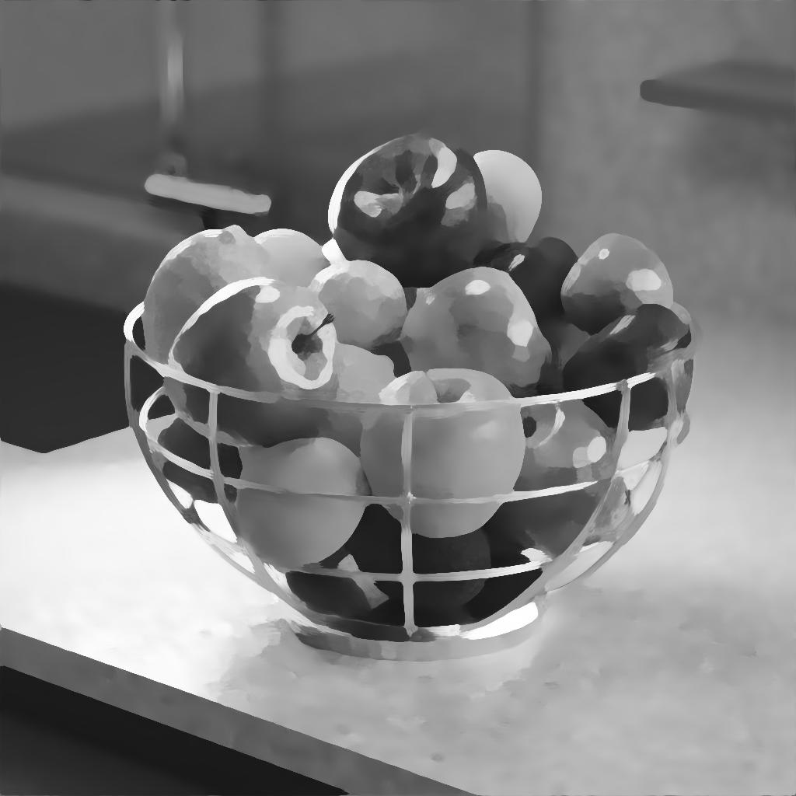
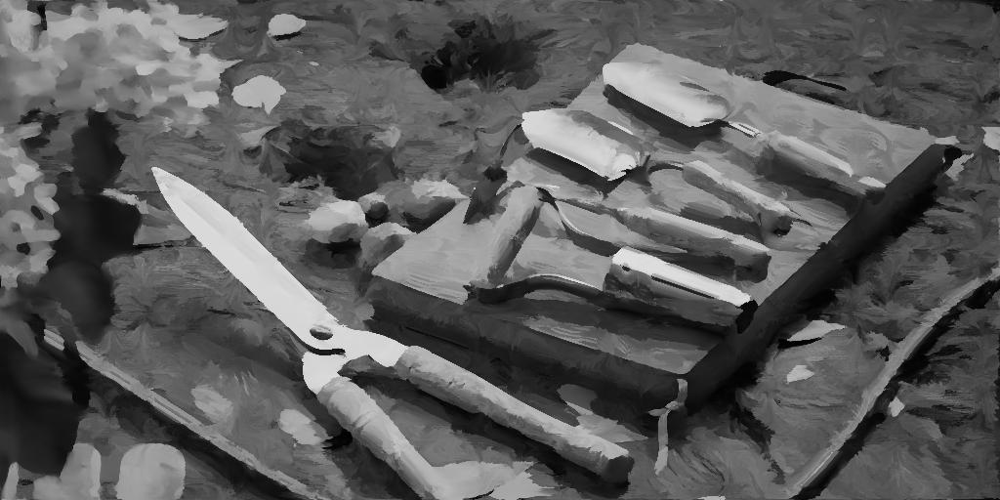

# Escala de grises de Kuwahara anisotrópico

<table>
<tr style="border: 0;">
<td width="33.33%" style="border: 0;" valign="top">

{width="200px"}

<b>En:</b> Filtros > Efectos

</td>
<td width="100.00%" style="border: 0;" valign="top">

## Descripción

Aplica un desenfoque direccional anisotrópico que se ajusta a los detalles de la imagen. El resultado es una imagen que aparece en *flow* en la dirección de las formas que contiene.

Este desenfoque ajustable calcula o recibe un *mapa de dirección* para determinar ese flujo, que se puede enfocar en áreas más planas y definidas con mayor claridad.

Consulte también: [Color Kuwahara anisotrópico](../anisotropic-kuwahara/anisotropic-kuwahara.md)

</td>
</tr>
</table>

El flujo también puede romperse rotando la dirección en la que se aplica el desenfoque. Del mismo modo, se puede utilizar un mapa de dirección personalizado para anular el calculado a partir de la imagen.

Este filtro puede producir un efecto pictórico y es útil para la estilización.

+++ Anisotropía

La intensidad del flujo se controla principalmente mediante el parámetro [Anisotropía](#parameters), como se muestra en la imagen siguiente.

Izquierda: Anisotropía 0.0 / Derecha: Anisotropía 1.0

<table>
<tr style="border: 0;">
<td style="border: 0;" valign="top">

{zoomable="yes"}

</td>
<td style="border: 0;" valign="top">

{zoomable="yes"}

</td>
</tr>
</table>

+++

## Entradas

|                                                       |                                                                                                                                                                                                                                                                                                                         |
|-------------------------------------------------------|-------------------------------------------------------------------------------------------------------------------------------------------------------------------------------------------------------------------------------------------------------------------------------------------------------------------------|
| <b>Entrada</b> <i>Escala de grises</i> <code>PRINCIPAL</code> | La imagen en escala de grises que debe procesarse. |
| <b>mapa de Ángulo de anisotropía</b> <i>Escala de grises</i> | Imagen de escala de grises que describe la rotación adicional aplicada a la dirección calculada, donde el valor de escala de grises es un número de vueltas.   El mapa todavía tiene un efecto cuando el parámetro &#39;Anisotropía&#39; se establece en 0, ya que afecta a la rotación del núcleo utilizado por el filtro Kuwahara. |
| <b>mapa de Pendiente</b> <i>Escala de grises</i> | El mapa que representa las pendientes con las que se conforma el mapa de dirección, según el valor del parámetro &#39;Multiplicador de entrada de mapa de Pendiente&#39;. |
| <b>Mapa de radio (opcional)</b> <i>Escala de grises</i> | Cuando está conectado, el &#39;Radio&#39; de desenfoque se multiplica frente a la imagen de entrada. |
| <b>Mapa de dirección</b> <i>Color</i> | Mapa que describe la dirección utilizada por el núcleo del filtro anisotrópico.   El mapa todavía tiene un efecto cuando el parámetro &#39;Anisotropía&#39; se establece en 0, ya que afecta a la rotación del núcleo utilizado por el filtro Kuwahara.   Nota: Esta entrada sólo se utiliza cuando el parámetro &#39;Usar Mapa de dirección de entrada&#39; está establecido en &#39;True&#39;. |

## Salidas

|                                   |                                                                                                                                                                                                                                      |
|-----------------------------------|--------------------------------------------------------------------------------------------------------------------------------------------------------------------------------------------------------------------------------------|
| <b>Salida</b> <i>Escala de grises</i> | Resultado del desenfoque anisotrópico aplicado por el nodo en la imagen de entrada. |
| <b>Mapa de dirección</b> <i>Color</i> | Mapa de dirección calculado a partir de la imagen de entrada y utilizado para provocar el desenfoque anisotrópico.   Si el parámetro &quot;Usar Mapa de dirección de entrada&quot; se establece en &quot;True&quot;, se utiliza la imagen proporcionada a la entrada &quot;Mapa de dirección&quot; y la salida se genera tal cual. |

## Parámetros

|                                                                                                                              |                                                                                                                                                                                                                                                                               |
|------------------------------------------------------------------------------------------------------------------------------|-------------------------------------------------------------------------------------------------------------------------------------------------------------------------------------------------------------------------------------------------------------------------------|
| <b>Radio</b> <i>Flotador</i> | El radio de desenfoque, donde un valor más alto produce un efecto de desenfoque más fuerte.   El valor máximo es 32. |
| <b>Smoothness</b> <i>Flotador</i> | Ajusta la cantidad de fusión de colores en la dirección calculada.   Cuando este valor es 0, los colores se desplazan principalmente en esa dirección y se produce muy poca fusión. |
| <b>Enfoque</b> <i>Flotador</i> | Aumenta el contraste en las áreas desenfocadas, lo que hace que parezcan más planas y definidas con mayor claridad. |
| <b>Anisotropía</b> <i>Flotador</i> | Ajusta la contribución del mapa de dirección en el desenfoque.   El mapa de dirección y todos sus modificadores (tanto parámetros como mapas de entrada) todavía tienen efecto cuando este valor de parámetro es 0, ya que el mapa de dirección se usa en el núcleo del filtro Kuwahara. |
| <b>Usar mapa de dirección de entrada</b> <i>Booleano</i> | Cuando es &quot;True&quot;, no se calcula ningún mapa de dirección a partir de la imagen de entrada y la imagen conectada a la entrada &quot;Mapa de dirección&quot; se utiliza para provocar el desenfoque anisotrópico. |
| <b>smoothness del tensor</b> <i>Flotante</i>  <i>Disponible cuando &#39;Usar mapa de dirección de entrada&#39; está establecido en &#39;Falso&#39;</i> | Ajusta la intensidad del desenfoque aplicado a las direcciones calculadas a partir de la imagen y almacenadas en el mapa de dirección.   Si se aumenta este valor, se garantiza un resultado más suave cuando la imagen tiene muchos detalles de alta frecuencia. |
| <b>ángulo de Anisotropía</b> <i>Flotante</i>  <i>Disponible cuando &#39;Usar mapa de dirección de entrada&#39; está establecido en &#39;Falso&#39;</i> | Agrega una rotación al mapa de dirección, en número de vueltas.   Esta rotación adicional es *cumulativa* con la especificada por la entrada &#39;Mapa de ángulo de Anisotropía&#39;. |
| <b>Multiplicador de mapa de ángulo de Anisotropía</b> <i>Flotante</i>  <i>Disponible cuando &#39;Usar mapa de dirección de entrada&#39; está establecido en &#39;Falso&#39;</i> | Ajusta la intensidad de los valores de la entrada &quot;Mapa de ángulo de Anisotropía&quot;, que se añaden a continuación en la parte superior de la rotación aplicada al mapa de dirección, en número de vueltas.   Esta rotación adicional es *cumulativa* con la especificada por el parámetro &#39;Ángulo de Anisotropía&#39;. |
| <b>Multiplicador de entrada de mapa de Pendiente</b> <i>Flotante</i>  <i>Disponible cuando &#39;Usar mapa de dirección de entrada&#39; está establecido en &#39;Falso&#39;</i> | Ajusta la intensidad con la que el mapa de dirección se ajusta a las pendientes proporcionadas por la entrada &quot;Mapa de Pendiente&quot;. |

## Ejemplos

<table>
  <tr>
    <td>
      
       <i>Antes</i>
    </td>
    <td>
      
       <i>Después De</i>
    </td>
  </tr>
</table>

<table>
  <tr>
    <td>
      
       <i>Antes</i>
    </td>
    <td>
      
       <i>Después De</i>
    </td>
  </tr>
</table>

<table>
  <tr>
    <td>
      
       <i>Antes</i>
    </td>
    <td>
      
       <i>Después De</i>
    </td>
  </tr>
</table>
