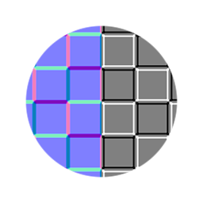

# Sobel de curvatura

<table>
<tr style="border: 0;">
<td style="border: 0;" valign="top">

{width="128px"}

## Sobel de curvatura

**En:** *Filtros/Efectos*

**Simple**

</td>
<td style="border: 0;" valign="top">

## Descripción

Realiza una conversión de curvatura de un solo paso simple y estricta para introducir [Normalmap](../../../../../../compositing-graphs/nodes-reference-for-com/atomic-nodes/normal/normal.md). El mapa resultante tiene matices blancos para áreas convexas y negros para cóncavas. La curvatura siempre produce líneas más gruesas y transiciones nítidas.

Este nodo es útil para resaltar u oscurecer rápidamente determinados bordes. Es ligeramente diferente de [Curvature](../../../../../../compositing-graphs/nodes-reference-for-com/node-library/filters/effects/curvature-filter-node/curvature-filter-node.md), ya que produce resultados de mejor calidad, pero sigue siendo nítido y duro.

## Parámetros

* **Intensidad**: *0.0 - 1.0* Intensidad del efecto, ajusta el contraste.
* **Tipo normal**: *DirectX, OpenGL*

## Imágenes de ejemplo

| 

 |
| --- |
|  |

</td>
</tr>
</table>
