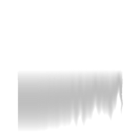
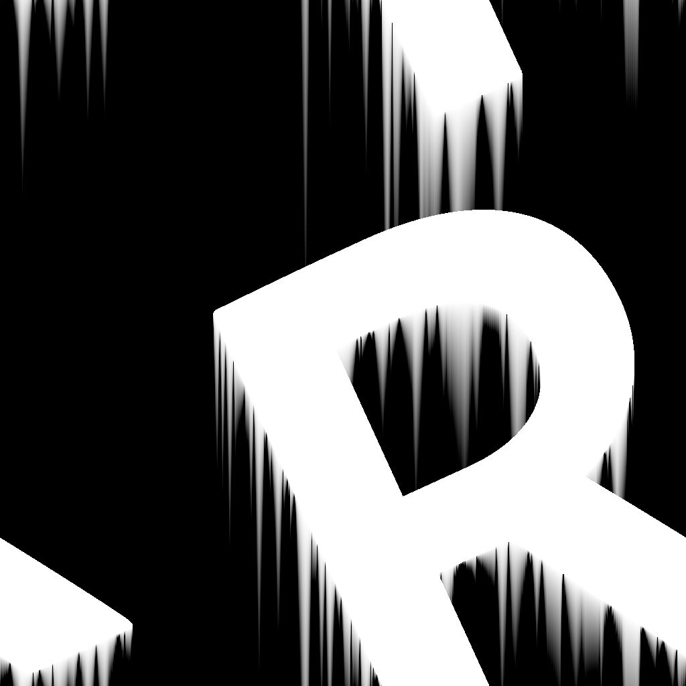

# Distancia direccional

<table>
<tr style="border: 0;">
<td width="33.33%" style="border: 0;" valign="top">

{width="200px"}

<b>En:</b> Filtros > Efectos

</td>
<td width="100.00%" style="border: 0;" valign="top">

## Descripción

Dibuja un degradado de distancia desde los bordes de una máscara en una dirección especificada.

Los degradados superpuestos se ordenan por distancia normalizada invertida, de modo que se dibuje la distancia hasta el borde más cercano.

La distancia del degradado se puede ajustar dinámicamente a lo largo del borde mediante un mapa de distancia.

</td>
</tr>
</table>

>[!TIP]
>
> El nodo [Suavizado de bisel](../../../../../../compositing-graphs/nodes-reference-for-com/node-library/filters/effects/bevel-smooth/bevel-smooth.md) ofrece capacidades similares, donde la dilatación se realiza en todas las direcciones.

## Entradas

|  |  |
|:---|:---|
| <b>Entrada</b> <i>Escala de grises</i> PRINCIPAL | Imagen de la que se debe extraer la máscara.   Todos los valores por encima de 0,5 son blancos en esa máscara. |
| <b>Mapa de distancia</b> <i>Escala de grises</i> | Entrada opcional utilizada cuando el valor del parámetro &#39;Multiplicador de Mapa de distancia&#39; es superior a 0.   Se utiliza para ajustar la distancia de biselado/dilatación a lo largo de los bordes de la máscara, donde un valor más oscuro produce una distancia más corta. |
| <b>Mapa angular</b> <i>Escala de grises</i> | Entrada opcional utilizada cuando el valor del parámetro &#39;Angle Map Multiplier&#39; es superior a 0.   Se utiliza para ajustar la dirección del degradado de distancia añadiendo su valor al ángulo de dirección, en número de vueltas.   El parámetro &#39;Desplazamiento de mapa de ángulo&#39; permite reasignar los valores especificando el valor 0. |

## Salidas

|  |  |
|:---|:---|
| <b>Salida</b> <i>Escala de grises</i> | La imagen resultante según el &#39;Modo de salida&#39; seleccionado. |
| <b>UV</b> <i>Color</i> | Un mapa UV en el que las coordenadas UV se dilatan a partir de los bordes de la máscara en la dirección especificada.   Se puede conectar a un nodo [UV Mapper](../../../../../../compositing-graphs/nodes-reference-for-com/node-library/spline-paths-tools/spline-tools/uv-mapper-color/uv-mapper-color.md) para asignar cualquier otra imagen con estas UV dilatadas. |

## Parámetros

|  |  |
|:---|:---|
| <b>Modo de salida</b> *Entero* | El método para dibujar el degradado de distancia desde los bordes de la máscara:<ul data-preserve-html="true"> <li data-preserve-html="true"><b>Distancia normalizada invertida:</b> Un degradado de 1 a 0 donde se alcanza 0 en la &#39;Distancia máxima&#39;, multiplicado por el &#39;Mapa de distancia&#39; si está conectado</li> <li data-preserve-html="true"><b>Distancia:</b> Degradado de valores de distancia sin formato desde el borde de la máscara, donde 1 es la longitud del lado más corto de la imagen de entrada</li> </ul> |
| <b>Distancia máxima</b> *Flotante* | La distancia recorrida por el degradado de distancia, en el espacio de imagen normalizado, donde 1 es la longitud del lado más corto de la imagen de entrada. |
| <b>Ángulo</b> *Flotante* | La dirección del degradado de distancia en número de vueltas, donde 0 es horizontal y a la derecha, es decir, un vector (1,0). |
| <b>Multiplicador de Mapa de distancia</b> *Flotante* | Ajusta el impacto del Mapa de distancia sobre la distancia máxima.   Nota: Este parámetro no tiene efecto cuando la entrada &quot;Mapa de distancia&quot; no está conectada. |
| <b>Multiplicador de mapa de ángulo</b> *Flotante* | Ajusta el impacto del &#39;Mapa de ángulo&#39; sobre el &#39;Ángulo&#39;. |
| <b>Desplazamiento de mapa de ángulo</b> *Flotante* | Reasigna los valores del &#39;Mapa de ángulos&#39; especificando qué valor de ese mapa debe ser 0.   Por ejemplo, un desplazamiento de 0,5 significa que un valor de 0,75 es 0,25 vueltas y un valor de 0,3 es -0,2 vueltas. |

## Ejemplos

<table>
<tr style="border: 0;">
<td style="border: 0;" valign="top">

<table>
  <tr>
    <td>
      
       <i>Antes</i>
    </td>
    <td>
      
       <i>Después De</i>
    </td>
  </tr>
</table>

</td>
<td style="border: 0;" valign="top">

<table>
  <tr>
    <td>
      
       <i>Antes</i>
    </td>
    <td>
      
       <i>Después De</i>
    </td>
  </tr>
</table>

</td>
</tr>
</table>

<table>
<tr style="border: 0;">
<td style="border: 0;" valign="top">

<table>
  <tr>
    <td>
      
       <i>Antes</i>
    </td>
    <td>
      
       <i>Después De</i>
    </td>
  </tr>
</table>

</td>
<td style="border: 0;" valign="top">

<table>
  <tr>
    <td>
      
       <i>Antes</i>
    </td>
    <td>
      
       <i>Después De</i>
    </td>
  </tr>
</table>

</td>
</tr>
</table>

<table>
  <tr>
    <td>
      
       <i>Antes</i>
    </td>
    <td>
      
       <i>Después De</i>
    </td>
  </tr>
</table>
