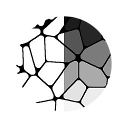

# Flood Fill a índice

<table>
<tr style="border: 0;">
<td width="33.33%" style="border: 0;" valign="top">

{width="200px"}

<b>En:</b> Filtros > Efectos

</td>
<td width="100.00%" style="border: 0;" valign="top">

## Descripción

Flood Fill a índice convierte cada celda de Flood Fill en un valor según su número de índice, comenzando por 0 en la esquina superior izquierda. Se puede utilizar para devolver matices de escala de grises en una forma normalizada (de 0,0 a 1,0, divididos por tantas celdas como encuentre el Flood Fill) o como un valor HDR., sin fijar (de 0 a n donde n es el número de celdas).

Además, el Flood Fill a Index utiliza [valores](../../../../../values-compositing-graphs/values-in-substance-compositing-graphs.md), lo que devuelve la cantidad de formas encontradas y la tabla de datos interna opcional.

</td>
</tr>
</table>

## Entradas

|  |  |
|:---|:---|
| <b>Flood Fill Box</b> <i>Entrada de color</i> | Mapa de entrada de Flood Fill estándar. Requerido. |
| <b>Información de forma especial</b> <i>Entrada de color</i> | La asignación de Flood Fill adicional debe habilitarse explícitamente en el nodo de Flood Fill anterior y es necesario que esté conectada. |

## Parámetros

|  |  |
|:---|:---|
| <b>Salida</b> <i>Normalizado, entero</i> | Determine si la salida está en el rango LDR 0-1 o en el rango HDR 0-n. |
| <b>Omitir forma menor que</b> <i>0.0 - 1.0</i> | Valor de tolerancia para omitir formas pequeñas. |
| <b>Mostrar tabla de datos del Flood Fill</b> <i>Falso/Verdadero</i> | Devuelve datos adicionales (de depuración) para un uso avanzado. |

## Ejemplos

<table style="margin-top: 32px; margin-bottom: 32px">
    <tr style="border: 0">
        <td style="border: 0; background: transparent">
            
        </td>
    </tr>
</table>
