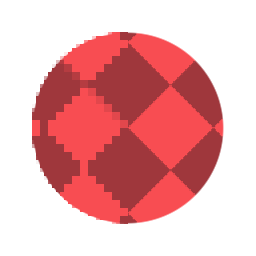

# FXAA

<table>
<tr style="border: 0;">
<td width="33.33%" style="border: 0;" valign="top">

<b>En:</b> Filtros > Efectos

</td>
<td width="100.00%" style="border: 0;" valign="top">

## Descripción

Aplica un filtro de suavizado basado en el algoritmo FXAA. Puede utilizar esta opción para corregir bordes dentados y pixelados en las formas. Resulta especialmente útil para algo como una [Forma de disco](../../../../../../compositing-graphs/nodes-reference-for-com/node-library/texture-generators/patterns/shape/shape.md) con bordes pixelados, ya que proporciona una solución sencilla de un nodo para los bordes de suavizado.

</td>
</tr>
</table>

## Ejemplos

<table style="margin-top: 32px; margin-bottom: 32px">
    <tr style="border: 0">
        <td style="border: 0; background: transparent">
            
        </td>
    </tr>
</table>
