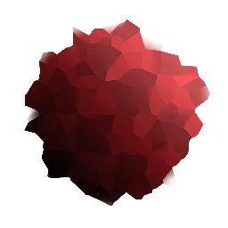

# Mosaico

<table>
<tr style="border: 0;">
<td width="33.33%" style="border: 0;" valign="top">

{width="128px"}

{width="128px"}

<b>En:</b> Filtros > Efectos

</td>
<td width="100.00%" style="border: 0;" valign="top">

## Descripción

&quot;Faceties&quot; crea un mapa de degradado existente, suave y con pendiente mediante un efecto de pasada múltiple [Deformar](../../../../../../compositing-graphs/nodes-reference-for-com/atomic-nodes/warp/warp.md). Cuando se utiliza el mismo mapa para ambas entradas, esencialmente crece y acentúa las áreas más brillantes.

Esto resulta útil para añadir más definición a los mapas de escala de grises, como el mapa de altura, ya que puede introducir más definición en las formas.

</td>
</tr>
</table>

## Entradas

|  |  |
|:---|:---|
| <b>Color</b> <i>Entrada en color/escala de grises</i> |  |
| <b>Mapa de mosaico</b> <i>Entrada en escala de grises</i> | Mapa del controlador de deformación. Puede ser igual que la primera entrada. |

## Parámetros

|  |  |
|:---|:---|
| <b>Ejemplos</b> <i>0 - 16</i> | Determina la calidad de la muestra múltiple. |
| <b>Intensidad</b> <i>0.0 - 1.0</i> | Intensidad del efecto. |

## Ejemplos

<table style="margin-top: 32px; margin-bottom: 32px">
    <tr style="border: 0">
        <td style="border: 0; background: transparent">
            
        </td>
    </tr>
</table>
