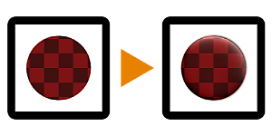

# Relieve de Uber

<table>
<tr style="border: 0;">
<td style="border: 0;" valign="top">

{width="128px"}

## Relieve de Uber

**En:** *Filtros/Efectos*

**Intermedio**

</td>
<td style="border: 0;" valign="top">

## Descripción

Versión avanzada con muchas características de [Relieve](../../../../../../compositing-graphs/nodes-reference-for-com/atomic-nodes/emboss/emboss.md). Realiza un elaborado efecto de iluminación falso en 2D basado en un mapa de altura.

Resulta útil a la hora de crear iluminación integrada para determinados estilos de texturizado cuando se necesita mucho control.

## Parámetros

### Entradas

* **Color**: *Entrada de color*\
  Imagen base para modificar.
* **Height**: *Entrada en escala de grises*\
  Se utiliza el mapa de altura como controlador del efecto.

### Parámetros

* **Color de ambiente**: *(Valor de color)*Color utilizado en áreas sombreadas.
* **Color de difusión**: *(Valor de color)*Color utilizado en áreas iluminadas.
* **Color de Specular**: *(Valor de color)*Color utilizado para los reflejos del specular
* **Intensidad de luz**: *0.0 - 1.0*\
  Intensidad de la luz (fingida).
* **Ángulo de luz**: *0.0 - 1.0*\
  Ángulo de incidencia de la luz (falsificada)
* **Intensidad del Specular**: *0.0 - 1.0* Intensidad de los reflejos del specular.
* **Brillo del Specular**: *0.0 - 1.0* Tamaño del resaltado del specular.
* **Rugosidad de difusión**: *0.0 - 1.0* Rugosidad usada en el cálculo de la iluminación difusa.
* **Opacidad de sombras**: *0.0 - 1.0* Opacidad de fusión de las áreas sombreadas.

## Imágenes de ejemplo

| 

 |
| --- |
|  |

</td>
</tr>
</table>
