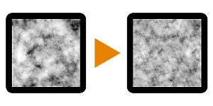

# Ampliación de ruido 2

<table>
<tr style="border: 0;">
<td width="33.33%" style="border: 0;" valign="top">

{width="128px"}

<b>En:</b> Filtros > Transforma

</td>
<td width="100.00%" style="border: 0;" valign="top">

## Descripción

Realiza un procedimiento de ruido de entrada y lo escala a doble resolución, manteniendo el detalle pero sin introducir demasiadas baldosas. Utiliza un tipo de máscara &quot;X&quot; y se fusiona con menos contraste que la entrada original (los modos de fusión internos son Máx y Mín).

Este nodo está destinado principalmente a optimizar gráficos lentos que utilizan ruidos grandes y pesados. Permite utilizar resoluciones más altas sin introducir demasiado tiempo de cálculo adicional.

Consulta [Noise Upscale 1](../../../../../../compositing-graphs/nodes-reference-for-com/node-library/filters/transforms/noise-upscale-1/noise-upscale-1.md) y [Noise Upscale 3](../../../../../../compositing-graphs/nodes-reference-for-com/node-library/filters/transforms/noise-upscale-3/noise-upscale-3.md) para obtener diferentes variaciones de este proceso.

</td>
</tr>
</table>

## Parámetros

|  |  |
|:---|:---|
| <b>Desplazamiento1X</b> <i>0.0 - 1.0</i> | Desliza las partes superior e inferior sobre el eje X. |
| <b>Desplazamiento1Y</b> <i>0.0 - 1.0</i> | Desliza las partes superior e inferior sobre el eje Y. |
| <b>Desplazamiento2X</b> <i>0.0 - 1.0</i> | Desliza las partes izquierda y derecha sobre el eje X. |
| <b>Desplazamiento2Y</b> <i>0.0 - 1.0</i> | Desliza las partes izquierda y derecha sobre el eje Y. |

## Ejemplos

<table style="margin-top: 32px; margin-bottom: 32px">
    <tr style="border: 0">
        <td style="border: 0; background: transparent">
            
        </td>
    </tr>
</table>
