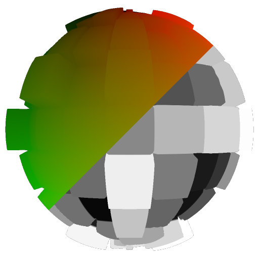

# Asignación de renderizaciones PBR

<table>
<tr style="border: 0;">
<td style="border: 0;" valign="top">

## Asignación de renderizaciones PBR (color/escala de grises)

**En:** *Utilidades de filtros de materiales/PBR*

**Simple**

</td>
<td style="border: 0;" valign="top">

## Descripción

Este es un nodo de extensión para el [nodo Renderización PBR](../../../../../../compositing-graphs/nodes-reference-for-com/node-library/material-filters/pbr-utilities/pbr-render/pbr-render.md), que te permite asignar una textura independiente a la forma de una [Renderización PBR](../../../../../../compositing-graphs/nodes-reference-for-com/node-library/material-filters/pbr-utilities/pbr-render/pbr-render.md) anterior. Su objetivo principal es permitirte reasignar cada canal independiente de tu [Renderización PBR](../../../../../../compositing-graphs/nodes-reference-for-com/node-library/material-filters/pbr-utilities/pbr-render/pbr-render.md), de vuelta a la forma, para crear desgloses compuestos de canales de mapa, como en los ejemplos a continuación. Puede crear su propio método compuesto y máscaras utilizando los nodos de asignación de Renderizaciones PBR como componente.

Existe una versión en color y en escala de grises para los dos tipos de datos: utilice color para mapas difusos, utilice escala de grises para mapas de rugosidad, de metal y otros mapas en escala de grises.

### Entradas

* **Textura**: *Entrada en color/escala de grises*\
  Textura para asignar a una forma.
* **UV**: *Entrada de color* Entrada de datos UV obligatoria desde un [nodo de Renderización PBR.](../../../../../../compositing-graphs/nodes-reference-for-com/node-library/material-filters/pbr-utilities/pbr-render/pbr-render.md)

## Parámetros

* **Color de fondo**: *(Valor de color)*Defina un valor de color sólido para utilizarlo en el fondo.

## Imágenes de ejemplo

El ejemplo es una composición de cuatro nodos de asignación de Renderizaciones PBR diferentes, que usan una selección de histograma [en un degradado lineal](../../../../../../compositing-graphs/nodes-reference-for-com/node-library/texture-generators/patterns/gradient-linear-1/gradient-linear-1.md) como máscaras.](../../../../../../compositing-graphs/nodes-reference-for-com/node-library/filters/adjustments/histogram-select/histogram-select.md)[

{width="256px"}

{width="256px"}

</td>
</tr>
</table>
