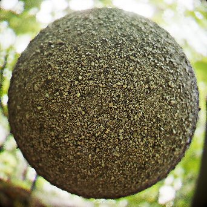

# Renderización PBR

<table>
<tr style="border: 0;">
<td width="41.60%" style="border: 0;" valign="top">

{width="250px"}

**En:** *Utilidades de filtros de materiales/PBR*

**Complejo**

</td>
<td width="58.30%" style="border: 0;" valign="top">

## Descripción

Procesa un material PBR en una esfera, plano o cilindro mediante Iluminación basada en imagen (IBL). Se trata de un motor de procesamiento dentro de un nodo, que puede resultar muy útil para generar miniaturas, previsualizaciones o recursos 2D. No es una representación como la vista 3D, sino una textura real que se genera en el gráfico.

Este nodo requiere al menos un material PBR completo para ser conectado. Lo ideal es utilizar los modos de creación de vínculos para conectar el material a la Renderización PBR. Además, necesitará un entorno HDRI desenvuelto esféricamente para que el renderizado calcule la iluminación. Los materiales para pruebas se encuentran en Materiales PBR, los mapas de entorno se encuentran en [Vista 3D en la biblioteca.](../../../../../../compositing-graphs/nodes-reference-for-com/node-library/3d-view-library/3d-view-library.md)

</td>
</tr>
</table>

>[!WARNING]
>
> Motor **CPU (SSE2)**
> 
> El nodo Renderización PBR es muy pesado y no funciona bien con el motor de CPU SSE2. Cambie a otro motor presionando F9, si el nodo funciona muy mal.

## Entradas

* **Canal de materiales** **entradas**\
  Se utilizan varias entradas de material para procesar el material en la geometría:
  * Color base
  * Normal
  * Emisivo
  * Rugosidad
  * Metálico
  * Nivel especular
  * Altura
  * Oclusión ambiental
  * Máscara de opacidad
  * Nivel de anisotropía
  * Ángulo de anisotropía
  * Translucidez
  * Escala de distancia de dispersión
* **Mapa de Dirt de lente**: *Entrada en escala de grises* Mapa personalizado del dirt de la lente que aparece cuando se ven destellos de lente.
* **Mapa de apertura de lente**: *Entrada en escala de grises* Se puede usar para invalidar la forma Bokeh fuera de enfoque. Cuanto más contrastado, más visible es. Tenga en cuenta que solo se muestra un círculo dentro de la textura, por lo que cualquier forma debe encajar dentro de un círculo.
* **Entrada en segundo plano**: *Entrada de color*\
  La asignación personalizada se usa como fondo cuando el parámetro **Background Mode** está establecido en *Background Input*
* **Mapa de entorno**: *Entrada de color* Mapa de entorno usado para calcular la iluminación. Se debe asignar esféricamente y en HDR

Salidas

* **Belleza**\
  El renderizado final
* **Irradiancia cruda**\
  Los datos de irradiancia del procesamiento final\
  *Alpha:* Mapa de opacidad
* **Specular sin procesar**\
  Los datos de specular del procesamiento final\
  *Alpha:* mapa de sombra de Specular
* **Espacio normal**\
  El espacio mundial normaliza los datos del renderizado final\
  *Alpha:* Mapa del height espacial mundial
* **Espacio Tangente Normal**\
  El espacio tangente normaliza los datos del procesamiento final\
  *Alpha:* Mapa del height espacial de Tangent
* **UV**\
  Los datos UV del procesamiento final\
  *Alpha:* Mapa de opacidad

## Parámetros

* **Forma**: *Esfera, Plano, Cilindro*\
  Define la forma utilizada para el procesamiento. Las formas personalizadas no son posibles.
* **Intensidad de Desplazamiento**: *0.0 - 0.5* Establece la intensidad del desplazamiento a partir del height.
* **Rotación de entorno**: *0.0 - 1.0*\
  Rota el entorno de iluminación. Gira previamente en comparación con mover la cámara.
* **Modo en segundo plano**: *Color, Entorno, Ambiente, Entrada De Fondo*\
  Establezca lo que se muestra en el fondo. Color es un color sólido, Entorno es el mapa que ha conectado con un desenfoque opcional. Ambient es una versión muy borrosa del entorno.
* **Color de fondo**: *(Valor de color)*\
  Solo está disponible cuando el modo Fondo está establecido en Color.
* **Desenfoque de fondo del entorno**: *0.0 - 1.0*\
  Solo está disponible cuando el modo de fondo está establecido en Entorno.
* **Forma**
  * **Escala**: *0.0 - 2.0*\
    Ajuste la escala de la esfera.
  * **Tamaño de plano**: *0.0 - 1.0*\
    Ajuste la escala del plano.
  * **Radio del cilindro**: *0.0 - 1.0*\
    Ajuste el radio del cilindro.
  * **Longitud del cilindro**: *0.0 - 1.0*\
    Establezca la longitud del cilindro.
  * **Rotación**: *0.0 - 1.0*\
    Gira la forma sin girar la iluminación.
  * **Dirección de rotación**: *0.0 - 1.0*\
    Define el eje de rotación en 2D.
  * **Giro en la dirección**: *0.0 - 1.0*\
    Gira la forma en el eje de rotación.
  * **Posición de forma**: *-1.0 - 1.0*\
    Mueve formas.
  * **Mosaico UV**: *1.0 - 6.0*\
    Define la cantidad de mosaico UV.
  * **Escala de UV de esfera**: *0.0 - 4.0*\
    Define la escala de los UV en la esfera.
  * **Escala de UV de plano**: *1.0 - 4.0*\
    Define la escala de los UV en el plano.
  * **Escala de UV del cilindro**: *1.0 - 6.0*\
    Establece la escala de UV en el cilindro.
  * **Desplazamiento de UV**: *0.0 - 1.0*\
    Desplazamientos de UV
  * **UV de inclinación**: *Falso/Verdadero*\
    Inclina los rayos UV 45 grados para la esfera.
* **Cámara**
  * **Exposición**: *-4.0 - 4.0*\
    Ajusta la exposición de la cámara
  * **Asignador de tonos**: *Hejl lineal, ACES y fílmico*\
    Defina la solución de asignación de tonos que se utilizará para la imagen final.
  * **Modo de cámara**: *Perspectiva, ortográfica*\
    Cambiar la cámara entre dos modos de proyección.
  * **Campo de visión**: *0,01 - 100,0*\
    Ajuste el ángulo FOV de la cámara.
  * **Distancia**: *0.0 - 4.0*\
    Establezca la distancia de la cámara desde el centro del objeto.
  * **Intensidad de viñeta**: *0.0 - 1.0*\
    Defina la intensidad del efecto de viñeta.
  * **Radio de viñeta**: *0.0 - 1.0*\
    Defina el radio del efecto de viñeta.
  * **Posición de la pantalla**:\
    Mueve la cámara alrededor del objeto, que también se puede cambiar con un gizmo en la vista 2D.
* **Profundidad de campo**
  * **Radio De Apertura** : *0.0 - 0.1* Define el radio de la apertura. Los valores más altos significan que las áreas desenfocadas se vuelven más borrosas (bokeh).
  * **Hojas de apertura**: *3 - 9*\
    Define la forma del desenfoque bokeh.
  * **Anillo de apertura**: *0.0 - 1.0*\
    Añade un degradado interior a la forma bokeh.
  * **Difracción de apertura**: *0.0 - 2.0*\
    Añade aberración cromática al efecto bokeh.
  * **Swirly Bokeh**: *0.0 - 1.0*\
    Añade un efecto de giro o giro a las áreas de desenfoque desenfocado.
  * **Modo de enfoque**: *Automático, punto*\
    Establecer si el foco está predeterminado o definido por el usuario. El enfoque de puntos le permite mover un punto en la vista 2D para determinar la distancia de enfoque.
  * **Punto de enfoque**:\
    Si el foco se establece en Punto, podrá mover ese punto. tiene un gizmo de vista 2D.
  * **Desplazamiento de enfoque**: *-0,5 - 0,5*\
    Si el foco está establecido en Automático, le permite cambiarlo de un lado a otro.
  * **Usar mapa de apertura personalizado**: *Falso/Verdadero*\
    Reemplaza la configuración de apertura anterior y utiliza la entrada del mapa de apertura para determinar la forma bokeh. Requiere una entrada.
* **Efectos posteriores**
  * **Habilitar efectos posteriores**: *Falso/Verdadero*\
    Alterna *todos los* efectos posteriores en el procesamiento final.
  * **Intensidad De Floración** : *0.0 - 2.0* Establece la intensidad del efecto de floración.
  * **Umbral de floración**: *0.0 - 2.0* Establece un umbral bajo para que aparezca la floración.
  * **Cambio de croma de floración** : *0.0 - 1.0*
  * **Intensidad de halo de lente**: *0.0 - 1.0* Ajusta la intensidad del efecto de halo de lente.
  * **Intensidad de destellos de lente** : *0.0 - 1.0* Ajusta la intensidad del destello de lente. Asegúrate de que la luz del fondo de tu entorno esté visible para poder ver correctamente este efecto.
  * **Intensidad de Dirt de la lente**: *0.0 - 1.0* Define el efecto del mapa de dirt de la lente en los destellos de la lente.
* **Configuración de procesamiento**
  * **Calidad de difusión**: *16 Muestras, 32 Muestras, 64 Muestras, 128 Muestras*\
    Cambiar entre niveles de calidad para el mapa difuso.
  * **Multiplicador emisivo de difusión**: *0.0 - 1.0*\
    Controla en qué medida las partes emisoras contribuyen a la irradiancia.
  * **Intensidad de sombra difusa**: *0.0 - 1.0*\
    Controla la intensidad de las sombras difusas.
  * **Tramado de Specular**: *0.0 - 1.0*\
    Establezca la cantidad de tramado para el specular.
  * **Multiplicador de sombras de Specular**: *0.0 - 1.0*\
    Controla la intensidad de las sombras en los reflejos del specular.
  * **Modo de opacidad** *Prueba de Alpha tramado, Fusión de Alpha simple*\
    Controla el método de aplicación de transparencia. El modo *Fusión simple de Alpha* es más visible en fondos uniformes.
  * **Intensidad de Oclusión ambiente**: *0.0 - 1.0*\
    Define la intensidad de las sombras de la oclusión ambiente.
* **Ajustes de material**
  * **Actualizar normales**: *Falso/Verdadero*\
    Las normales se calcularán de nuevo a partir del mapa de height según la intensidad del desplazamiento.
  * **Formato normal**: *DirectX, OpenGL*\
    Cambiar entre diferentes Formatos de mapa de normales (invierte el canal verde)
  * **Entrada F0 dieléctrica**: *Valor constante, entrada de Specular level*\
    Establecer qué controla los valores F0. La entrada de specular level significa que estará gobernada por un mapa de entrada.
  * **Dieléctrico F0**: *0,0 - 0,08*\
    Si se elige Valor constante para la entrada F0 dieléctrica, este regulador le permite definir el valor global.
* **Abrigo transparente**
  * **Habilitar capa transparente**: *Falso/Verdadero*\
    Permite añadir una capa transparente y simple sobre el material de entrada.
  * **Peso de la capa transparente**: *0.0 - 1.0*\
    Establece la intensidad o intensidad de la capa de capa transparente.
  * **Specular level transparente**: *0.0 - 1.0*\
    Define la rugosidad de la capa de capa transparente.
  * **Heredar normal de la capa base**: *False/True* Se establece si clearcoat omite o usa valores normales del material base.
* **Emissive**
  * **Habilitar iluminación emisora** *Verdadero/Falso* Cambia la contribución difusa de la iluminación emisora.
  * **Intensidad de emisión**: *0.0 - 10.0*\
    Define el multiplicador global para el mapa de emisiones.
* **Dispersión subsuperficial**
  * **Habilitar dispersión subsuperficial** *Verdadero/Falso*\
    Alterna la dispersión subsuperficial en el procesamiento final.\
    *Nota:* La dispersión subsuperficial requiere que el valor de entrada **Translucency** sea *mayor que 0.0*
  * **Distancia de dispersión** *0.0 - 1.0*\
    Ajusta la distancia máxima del efecto de dispersión.\
    *Nota:* Este valor se multiplica por el valor de entrada **Escala de distancia de dispersión** *por canal de color*.
  * **Cambio Rojo** *0.0 - 1.0*\
    Ajusta la intensidad del efecto Cambio de color rojo en la dispersión.
  * **Rayleigh** *0.0 - 1.0*\
    Ajusta la intensidad del efecto Rayleigh en la dispersión.

## Imágenes de ejemplo

Todas las imágenes se generaron directamente dentro de Designer, en la ventana gráfica 2D, utilizando materiales de la biblioteca [Substance 3D Assets](https://substance3d.adobe.com/assets).

| 

 | 

 | 

 | 

 |
| --- | --- | --- | --- |
|  |  |  |  |
| 

 | 

 | 

 | 

 |
|  |  |  |  |
