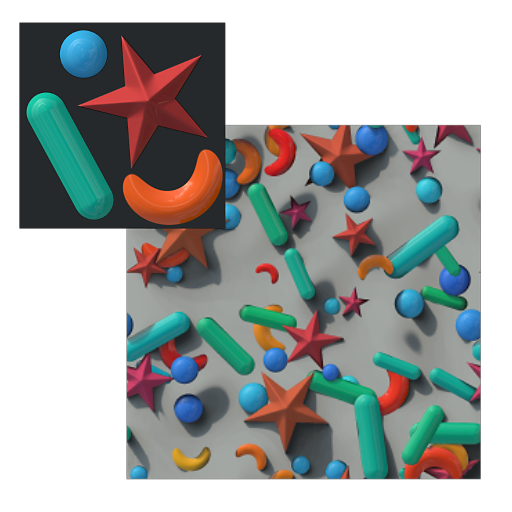

# Atlas scatter

<table>
<tr style="border: 0;">
<td style="border: 0;" valign="top">

{width="200px"}

## Atlas scatter

**En:** *Procesamiento De Escaneo/Filtros De Materiales*

**Complejo**

</td>
<td style="border: 0;" valign="top">

## Descripción

Extrae elementos de un atlas y dispersión sobre un fondo. Las entradas de Atlas son materiales completos, compuestos de elementos individuales dispuestos y empacados en una sola hoja de textura. Este nodo los divide (mediante un proceso [Atlas splitter](../../../../../../compositing-graphs/nodes-reference-for-com/node-library/material-filters/scan-processing/atlas-splitter/atlas-splitter.md) interno) y los dispersión, de forma similar a [Shape Splatter](../../../../../../compositing-graphs/nodes-reference-for-com/node-library/texture-generators/patterns/shape-splatter/shape-splatter.md). Atlas scatter requiere como mínimo una entrada de mapa de opacidad y una entrada de mapa de Height para que funcione el sistema Atlas.

>[!NOTE]
>
> Cientos de [Atlas](https://source.substance3d.com/allassets?assetType=substanceAtlas), listos para su uso en el nodo de Atlas scatter, están disponibles en [Substance Source](https://source.substance3d.com/).

## Entradas y parámetros

### Parámetros

* **Resolución de entrada de Atlas**: *Resolución, 1 a 12*\
  Establezca manualmente la resolución del atlas de entrada completo para garantizar una buena relación rendimiento/calidad.
* **Cantidad X**: *1 - 64*\
  Cantidad de X repeticiones del patrón.
* **Importe Y**: *1 - 64*\
  Cantidad de repeticiones Y del patrón.
* **Patrón**
  * **Intervalo de patrones**: *0 - 10*\
    Define el rango de patrones que se van a dispersar. Si se establece en 0, se utilizarán todos los patrones.
  * **Modo De Distribución De Patrones**: *Aleatorio, Índice de motivo, Índice de línea, Índice de columna* Define el orden en que se usan los elementos del atlas.
  * **Multiplicador de mapa de distribución de patrones**: *0.0 - 1.0*\
    Seleccione el patrón de forma en función del valor de escala de grises de la imagen de entrada.
  * **Rotación de motivo**: *0, 90, 180, 270*\
    Aplica una rotación fija a cada elemento del atlas en función de la cantidad de grados seleccionada.
  * **Aleatorio de rotación de motivo**: *0.0 - 1.0*\
    Aplica una rotación aleatoria a la parte definida de los elementos del atlas.
  * **Precisión de detección de formas de Atlas**: *Formas simples o pequeñas, Formas complejas o grandes, Modo sin errores*\
    Establece la precisión con la que se detectan las formas. Cuanto mayor sea la precisión, mayor será el impacto en el rendimiento.
  * **Opacidad de Atlas de escala baja (detección más rápida)**: *-4 - 0*\
    Permite controlar la proporción de disminución de escala del mapa de opacidad del atlas de entrada, que se utiliza para la detección de formas. Una resolución más baja mejora el rendimiento a costa de la precisión.
  * **Omitir forma menor que**: *0.0 - 1.0* Establece el tamaño mínimo que debe detectarse una forma, expresado como proporción de la imagen global
* **Tamaño**
  * **Escala**: *0.0 - 5.0*\
    Establece la escala relativa de las formas dispersas.
  * **Escala aleatoria**: *0.0 - 1.0*\
    Define el multiplicador para aplicar una escala aleatoria a cada forma dispersada.
  * **Escalar sin superposición**: *0.0 - 1.0*\
    Reduce la escala de la forma para que no se superpongan.
  * **Multiplicador de mapa de escala**: *0.0 - 1.0*\
    Multiplica la escala de la forma en función del valor de escala de grises de la imagen de entrada.
  * **Tamaño**: *0.0 - 1.0*\
    Establece la escala relativa de las formas dispersas por longitud (X) y anchura (Y).
  * **Proporción de tamaño de la Pendiente grande**: *0.0 - 1.0*\
    Modifica la proporción de tamaño de la forma en función de la pendiente de height de fondo.
  * **Conservar proporción**: *0.0 - 1.0*\
    Determina en qué medida se deben conservar las proporciones originales de las formas dispersas, en lugar de utilizar la proporción de celdas de cuadrícula, es decir, la proporción de los valores Cantidad X e Cantidad Y.
* **Posición**
  * **Posición aleatoria**: *0.0 - 2.0*\
    Un multiplicador para mover cada forma en una dirección aleatoria desde su punto inicial de cuadrícula.
  * **Distribución aleatoria**: *Gaussiano, uniforme*\
    Cambia de una distribución gaussiana a una distribución uniforme para la posición aleatoria. La distribución gaussiana producirá un resultado más orgánico en comparación con la distribución Uniforme.
  * **Multiplicador de mapa vectorial**: *0.0 - 1.0*\
    Controla la influencia de la entrada del mapa vectorial para mover las formas en la dirección del vector especificado por los canales rojo (X) y verde (Y) del mapa.
  * **Desplazamiento horizontal**: *-2.0 - 2.0*\
    Un multiplicador para el desplazamiento de posición a lo largo del eje X.
  * **Desplazamiento vertical**: *-2.0 - 2.0*\
    Un multiplicador para el desplazamiento de posición a lo largo del eje Y.
  * **Opción Fuera de los límites**: *Escalar forma, Restringir posición*\
    Debido a la naturaleza técnica de la salpicadura, las formas no pueden dibujarse a más de 2 celdas de su tamaño original. Si una forma se vuelve demasiado grande o se mueve demasiado lejos, tiene dos opciones: - Escalar forma reducirá el tamaño de la forma cuando llegue a un límite - Restringir posición moverá la forma de nuevo a su posición original
* **Rotación**
  * **Rotación**: *0.0 - 1.0*\
    Permite controlar la rotación local de todas las formas.
  * **Aleatorio de rotación**: *0.0 - 1.0*\
    Un multiplicador para una cantidad aleatoria de rotación aplicada por forma.
  * **Rotación desde Pendiente grande**: *0.0 - 1.0*\
    Modifica el giro de la forma en función de la pendiente de height de fondo. Normalmente se utiliza en combinación con el parámetro &quot;Proporción de tamaño de la Pendiente Bg&quot;
  * **Multiplicador de Mapa de rotación**: *0.0 - 1.0*\
    Multiplica el giro de la forma en función del valor de escala de grises de la imagen de entrada.
  * **Multiplicador de mapa vectorial**: *0.0 - 1.0*\
    Establece el giro de la forma en función de la entrada de imagen vectorial.
* **Height**
  * **Ajuste automático de escala de Height**: *Falso/Verdadero*\
    Ajusta automáticamente el height en función de la escala del motivo para mantener el height de la forma proporcional al height del fondo.
  * **Modo de fusión**: *Mezcla de Height, prueba de Alpha*\
    Establece el método para resolver superposiciones de formas.
  * **Desplazamiento de Height**: *-1.0 - 1.0*\
    Aplica un desplazamiento global al height de formas
  * **Aleatorio de desplazamiento de Height**: *0.0 - 1.0*\
    Un multiplicador para un desplazamiento de height aleatorio aplicado por forma
  * **Multiplicador de mapa de desplazamiento de Height**: *0.0 - 1.0*\
    Multiplica el desplazamiento del height de forma en función del valor de escala de grises de la imagen de entrada.
  * **Escala de Height**: *0.0 - 1.0*\
    Permite controlar la escala de height global de las formas dispersas
  * **Escala aleatoria de Height**: *0.0 - 1.0*\
    Un multiplicador para una escala de height aleatoria aplicada por forma
  * **Multiplicador de mapa de escala de Height**: *0.0 - 1.0*\
    Multiplica la escala de height de la forma en función del valor de escala de grises de la imagen de entrada.
  * **Ajustar al fondo**: *0.0 - 1.0*\
    En 0, el height de forma permanece intacto, en 1 el height de forma se deformará por el fondo del height subyacente.
  * **Fondo conformado suave**: *0.0 - 2.0*\
    Permite controlar la cantidad de suavizado aplicado a la deformación de height de la forma cuando se ajusta a su fondo.
  * **Sesgar desde Pendiente grande**: *0.0 - 1.0*\
    Deforma el height de forma en función de la pendiente de height de fondo local: se agrega al height de forma un degradado lineal correspondiente a la pendiente de fondo.
  * **Smoothness de Pendiente de fondo**: *0.0 - 2.0*\
    Controla la cantidad de suavizado aplicado a la pendiente de fondo cuando la forma se sesga en función de esa pendiente.
  * **Píxeles negros recortados**: *Falso/Verdadero*\
    Ignora el valor negro de las entradas de patrón.
  * **Acoplar base de patrón**: *Falso/Verdadero*\
    Permite acoplar el height de fondo debajo de una forma para que coincida con su height inicial.
* **Enmascaramiento**
  * **Aleatorio de máscara**: *0.0 - 1.0*\
    Enmascara una cantidad aleatoria de formas, expresada como proporción de la cantidad total.
  * **Multiplicador de mapa aleatorio de máscara**: *0.0 - 1.0*\
    Define la máscara de forma aleatoria en función de la entrada de imagen de escala de grises.
  * **Máscara de la Pendiente Big**: *-1.0 - 1.0*\
    Controla el enmascaramiento de las formas en función de la pendiente del fondo en su ubicación.
* **Color**
  * **Ajuste de color**: *-1.0 - 1.0*\
    Permite ajustar los colores de los elementos dispersos de forma global.
  * **Aleatorio de color**: *0.0 - 1.0*\
    Un multiplicador para cambiar los valores de color en una cantidad aleatoria por forma.
  * **Color de fondo**: *0.0 - 1.0*\
    Cambia los colores de la forma al color del fondo en su ubicación.
* **Normal**
  * **Sesgar desde Pendiente grande**: *0.0 - 1.0*\
    Sesgar la forma normal de acuerdo con el fondo normal.
  * **Aleatorio normal**: *0.0 - 1.0*\
    Un multiplicador para sesgar la forma normal en una cantidad aleatoria por forma.
  * **Formato normal**: *DirectX, OpenGL*\
    Cambiar entre diferentes Formatos de mapa de normales (invierte el canal verde)
* **Rugosidad**
  * **Ajuste de rugosidad**: *-1.0 - 1.0*\
    Permite desplazar la rugosidad de la forma global.
  * **Rugosidad del fondo**: *0.0 - 1.0*\
    Desplaza la rugosidad de las formas a la rugosidad del fondo en su ubicación.
  * **Aleación de rugosidad**: *0.0 - 1.0* Un multiplicador para compensar la rugosidad en una cantidad aleatoria por forma.

## Imágenes de ejemplo

{width="512px"}

</td>
</tr>
</table>
