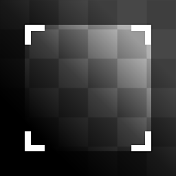

# Recortar

<table>
<tr style="border: 0;">
<td width="33.33%" style="border: 0;" valign="top">

{width="128px"}

{width="128px"}

<b>En:</b> Filtros de material > Procesamiento de escaneo

</td>
<td width="100.00%" style="border: 0;" valign="top">

## Descripción

Recortar es una versión paramétrica y no destructiva de la conocida herramienta Recortar. Seleccione un área de una imagen y se devolverá el resultado con las áreas no seleccionadas descartadas.

Puede ser útil de muchas maneras, ya que realizar una operación de recorte con nodos atómicos no es tan sencillo. Este nodo resulta muy útil, especialmente para convertir imágenes no cuadradas. Asegúrese de definir la resolución de entrada correctamente en ese caso.

Muy importante de entender es que para utilizar este nodo con facilidad, debe hacer un buen uso de la capacidad de previsualizar un nodo diferente de aquel cuyos parámetros está editando!\
En resumen: **Haga doble clic** en el nodo que está utilizando como entrada para este (la imagen original sin recortar) y, a continuación, **haga clic una vez** en el nodo de recorte que sigue justo después de él. A continuación, puede modificar el gizmo de recorte para que se ajuste al área que desea recortar.

</td>
</tr>
</table>

## Parámetros

|  |  |
|:---|:---|
| <b>Tamaño de entrada</b> <i>0 - 8192</i> | Resolución y proporciones de la imagen de entrada. Muy importante para imágenes no cuadradas. |
| <b>Fondo</b> <i>(Valor de color) / (Valor de escala de grises)</i> | Valor uniforme de fondo para áreas no cubiertas por Recorte. |
| <b>Transformar</b> <i>(Matriz de transformación)</i> | Rota y escala el resultado. El resultado se puede modificar interactuando directamente con el lienzo. |
| <b>Desplazamiento</b> <i>0.0 - 1.0</i> | Mueve o traduce el resultado. El resultado se puede modificar interactuando directamente con el lienzo. |
| <b>Es normal (solo para la versión Color)</b> <i>Falso/Verdadero</i> | Si la entrada debe tratarse o no como un mapa normal. |
