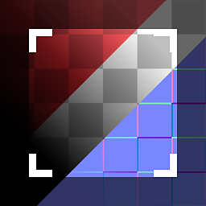

# Material Crop

<table>
<tr style="border: 0;">
<td width="33.33%" style="border: 0;" valign="top">

{width="128px"}

<b>En:</b> Filtros de material > Procesamiento de escaneo

</td>
<td width="100.00%" style="border: 0;" valign="top">

## Descripción

Este nodo es la versión de material completa y multicanal de [Crop](../../../../../../compositing-graphs/nodes-reference-for-com/node-library/material-filters/scan-processing/crop/crop.md). Permite realizar una operación de recorte en todos y cada uno de los canales de material en paralelo.

>[!NOTE]
>
> [Consulta el](../../../../../../compositing-graphs/nodes-reference-for-com/node-library/material-filters/scan-processing/crop/crop.md) [Recorte](../../../../../../compositing-graphs/nodes-reference-for-com/node-library/material-filters/scan-processing/crop/crop.md) [original para obtener más información.](../../../../../../compositing-graphs/nodes-reference-for-com/node-library/material-filters/scan-processing/crop/crop.md)

</td>
</tr>
</table>

## Parámetros

|  |  |
|:---|:---|
| <b>Canales</b> | Activa y desactiva los canales de material en este grupo cuando utilice mapas de Specular/Brillo en lugar de Metálico/Rugosidad, por ejemplo. |
| <b>Tamaño de entrada</b> <i>0 - 8192</i> | Resolución y proporciones de la imagen de entrada. Muy importante para imágenes no cuadradas. |
| <b>Fondo</b> <i>(Valor de color) / (Valor de escala de grises)</i> | Valor uniforme de fondo para áreas no cubiertas por Recorte. |
| <b>Transformar</b> <i>(Matriz de transformación)</i> | Rota y escala el resultado. El resultado se puede modificar interactuando directamente con el lienzo. |
| <b>Desplazamiento</b> <i>0.0 - 1.0</i> | Mueve o traduce el resultado. El resultado se puede modificar interactuando directamente con el lienzo. |
