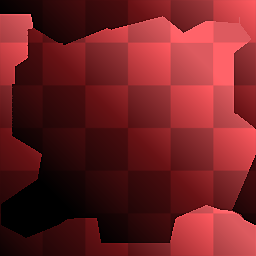

# Mosaico automático inteligente

<table>
<tr style="border: 0;">
<td style="border: 0;" valign="top">

{width="128px"}

## Mosaico automático inteligente

**En:** *Procesamiento De Escaneo/Filtros De Materiales*

**Complejo**

</td>
<td style="border: 0;" valign="top">

## Descripción

Este nodo convierte un conjunto no segmentado de mapas de altura, normales y de color base en una versión segmentada de acuerdo con el análisis inteligente de las entradas. Es similar a [Make It Tile Photo](../../../../../../compositing-graphs/nodes-reference-for-com/node-library/filters/tiling/make-it-tile-photo/make-it-tile-photo.md), pero mucho más avanzado ya que utiliza información de todos los canales para fusionar las cosas de la manera más inteligente (similar a lo que hace [Clone Patch](../../../../../../compositing-graphs/nodes-reference-for-com/node-library/material-filters/scan-processing/clone-patch/clone-patch.md)). También tiene una función interna [Crop](../../../../../../compositing-graphs/nodes-reference-for-com/node-library/material-filters/scan-processing/crop/crop.md) para determinar qué área se debe usar al aplicar el mosaico. Asegúrese de [leer más acerca del nodo Crop](../../../../../../compositing-graphs/nodes-reference-for-com/node-library/material-filters/scan-processing/crop/crop.md) para entender esta función correctamente.

Para utilizar este nodo, comience por definir el área Recortada y, a continuación, utilice la configuración de Borde para determinar cómo se fusionan los bordes en mosaico en el centro. Los parámetros del umbral son de importancia clave para esto. Tenga en cuenta que las áreas grandes y uniformes no funcionan muy bien con este efecto; cuanto más detalles y formas haya, más se necesita para trabajar.

## Parámetros

### Entradas

* **Máscara**: *Entrada en escala de grises*\
  Ranura de máscara utilizada para enmascarar los efectos del nodo. Se puede activar y desactivar con el parámetro &quot;Usar máscara&quot;.

### Parámetros

* **Recortar**
  * **Tamaño de entrada**: *0 - 8192* Resolución y proporciones de las imágenes de entrada. Muy importante para imágenes no cuadradas.
  * **Transformar**: *(Matriz de transformación)*\
    Rota y escala el resultado. El resultado se puede modificar interactuando directamente con el lienzo.
  * **Desplazamiento**: *0.0 - 1.0*\
    Mueve o traduce el resultado. El resultado se puede modificar interactuando directamente con el lienzo.
* **Edge**
  * **Detectar bordes**: *Falso/Verdadero* Activa o desactiva la fusión de bordes especiales detectados.
  * **Usar umbral por canal**: *Falso/Verdadero* Cambia entre un valor de umbral global o uno para cada canal.
  * **Umbral**: *0.0 - 1.0*
  * **Color base del umbral**: *0.0 - 1.0*
  * **Umbral normal**: *0.0 - 1.0*
  * **Height de umbral**: *0.0 - 1.0*
  * **Desplazamiento de corte**: *0.0 - 0.5* Control principal para mover el corte; los ejes X e Y están separados.
  * **Desenfocar**: *0.0 - 2.0* Difumina la transición de fusión.
  * **Smoothness**: *0.0 - 2.0* Controla la dentadura de los resultados del análisis de bordes.
  * **Resolución de cuadrícula**: *1 - 11* Resolución de calidad del análisis de bordes.
  * **Usar color base**: *Falso/Verdadero* Alterna el procesamiento del color base (entrada y salida).
  * **Usar normal**: *False/True* Alterna el procesamiento normal (entrada y salida).
  * **Usar Height**: *False/True* Alterna el procesamiento normal (entrada y salida).
  * **Usar máscara**: *Falso/Verdadero*\
    Activa o desactiva el uso del mapa de máscara para las formas de máscara de sello personalizadas.

## Imágenes de ejemplo

|  |
| --- |
| No hay imágenes adjuntas a esta página. |

</td>
</tr>
</table>
