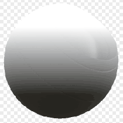

# De abajo arriba

<table>
<tr style="border: 0;">
<td width="33.33%" style="border: 0;" valign="top">

{width="128px"}

<b>En:</b> Generadores basados en malla > Generadores de máscaras

</td>
<td width="100.00%" style="border: 0;" valign="top">

## Descripción

Genera una máscara en blanco y negro basada en mapas con bake y ajustes de usuario. Similar a [Máscaras inteligentes](https://experienceleague.adobe.com/es/docs/substance-3d-painter/using/features/smart-materials-and-masks) en [Painter](https://experienceleague.adobe.com/es/docs/substance-3d-painter/using/home).

Esto genera una transición de blanco a negro desde la parte inferior a la superior de un modelo, útil para realizar falloffs y selecciones basadas en geometría.

</td>
</tr>
</table>

## Entradas

|  |  |
|:---|:---|
| <b>Posición</b> <i>Entrada de color</i> | Mapa de posición hecho un bake. ¡Obligatorio! |
| <b>Rugosidad</b> <i>Entrada en escala de grises</i> | Esto no tiene nada que ver con la rugosidad de la PBR, pero es un mapa de variación (opcional) para romper la transición. Solo aparece cuando el valor de Rugosidad es superior a 0. |
| <b>Máscara (opcional)</b> <i>Entrada en escala de grises</i> | Ranura de máscara utilizada para enmascarar los efectos del nodo. |

## Parámetros

|  |  |
|:---|:---|
| <b>Nivel</b> <i>0.0 - 1.0</i> | Cambia el nivel medio del resultado entre blanco o negro, como un ajuste de brillo. |
| <b>Contraste</b> <i>0.0 - 1.0</i> | Ajusta el contraste de la transición. |
| <b>Variación_de_rugosidad</b> <i>0.0 - 1.0</i> | Determina la cantidad del mapa de rugosidad en la que se fusionará para la variación. Si se aumenta este valor por encima de 0, se muestra la ranura del mapa. |

## Ejemplos

<table style="margin-top: 32px; margin-bottom: 32px">
    <tr style="border: 0">
        <td style="border: 0; background: transparent">
            
        </td>
    </tr>
</table>
