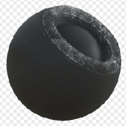

# Grasa

<table>
<tr style="border: 0;">
<td style="border: 0;" valign="top">

{width="128px"}

## Grasa

**En:** *Generadores Basados En Malla**/Generadores De Máscara*

**Simple**

</td>
<td style="border: 0;" valign="top">

## Descripción

Genera una máscara en blanco y negro basada en mapas con bake y ajustes de usuario. Similar a [Máscaras inteligentes](https://support.allegorithmic.com/documentation/display/SPDOC/Smart+Materials+and+Masks) en [Painter](https://support.allegorithmic.com/documentation/display/SPDOC/Substance+Painter).

Esta máscara está diseñada específicamente para las caras de los personajes y otras áreas específicas. Genera un tipo de máscara de grasa de piel en áreas de bajo thickness.

## Parámetros

### Entradas

* **Thickness**: *Entrada en escala de grises*\
  Mapa de Thickness al horno en el que se basa todo el efecto. ¡Obligatorio!
* **Ruido**: *Entrada en escala de grises*\
  Mapa de ruido opcional para anular la suciedad de grasa.
* **Máscara (opcional)**: *Entrada en escala de grises*\
  Ranura de máscara utilizada para enmascarar los efectos del nodo.

### Parámetros

* **Nivel**: *0.0 - 1.0*\
  Define la cantidad total de efecto que debe aparecer.
* **Contraste**: *0.0 - 1.0*\
  Ajusta el contraste del resultado.
* **Umbral de Thickness**: *0.0 - 1.0* Establece un thickness mínimo para que el efecto aparezca. Igual de importante que Level; retoca esto para que se ajuste a tu mapa de Thickness.
* **Anular ruido**: *Falso/Verdadero* Establecer para invalidar el mapa interno de suciedades de grasa con ranura de entrada personalizada.

## Imágenes de ejemplo

</td>
</tr>
</table>
