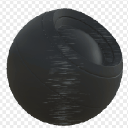

# Pincel de superficie

<table>
<tr style="border: 0;">
<td width="33.33%" style="border: 0;" valign="top">

{width="128px"}

<b>En:</b> Generadores basados en malla > Generadores de máscaras

</td>
<td width="100.00%" style="border: 0;" valign="top">

## Descripción

Genera una máscara en blanco y negro basada en mapas con bake y ajustes de usuario. Similar a [Máscaras inteligentes](https://support.allegorithmic.com/documentation/display/SPDOC/Smart+Materials+and+Masks) en [Painter](https://support.allegorithmic.com/documentation/display/SPDOC/Substance+Painter).

Esta máscara representa un efecto interesante del cepillado de metal en una superficie de objeto, ocluida por la geometría de objeto y el AO.

</td>
</tr>
</table>

## Entradas

|  |  |
|:---|:---|
| <b>Normal del Espacio Mundial</b> <i>Entrada de color</i> |  |
| <b>Curvatura</b> <i>Entrada en escala de grises</i> | Mapa con bake utilizado para efectos internos y máscaras. |
| <b>Oclusión de ambiente</b> <i>Entrada en escala de grises</i> | Mapa con bake utilizado para efectos internos y máscaras. |
| <b>Posición</b> <i>Entrada en escala de grises</i> |  |
| <b>Máscara (opcional)</b> <i>Entrada en escala de grises</i> | Ranura de máscara utilizada para enmascarar los efectos del nodo. |

## Parámetros

|  |  |
|:---|:---|
| <b>Nivel</b> <i>0.0 - 1.0</i> | Define el nivel de efecto global y lo revela gradualmente. |
| <b>Contraste</b> <i>0.0 - 1.0</i> | Ajusta el contraste del resultado. |
| <b>Longitud de Scratches</b> <i>0.0 - 8.0</i> | Define la longitud de los arañazos. Los valores más pequeños son más parecidos a los puntos, los valores más altos son rayas largas. |
| <b>Ocluir Axis</b> <i>X, Y, Z, ninguno</i> | Eje del objeto que debe recibir rasguños. No altera la dirección de los arañazos. |
| <b>Intensidad del eje de oclusión</b> <i>0.0 - 1.0</i> | Intensidad del efecto de oclusión del eje. |
| <b>Oclusión</b> <i>0.0 - 1.0</i> | Intensidad del AO en arañazos oclusivos. |
| <b>Intensidad de enfoque</b> <i>0.0 - 1.0</i> | Defina la cantidad de enfoque posterior que se aplicará a los arañazos. |

## Ejemplos

<table style="margin-top: 32px; margin-bottom: 32px">
    <tr style="border: 0">
        <td style="border: 0; background: transparent">
            
        </td>
    </tr>
</table>
