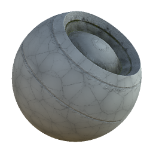

# Meteorización de rocas

<table>
<tr style="border: 0;">
<td width="33.33%" style="border: 0;" valign="top">

{width="128px"}

<b>En:</b> Generadores Basados En Malla > Meteorización

</td>
<td width="100.00%" style="border: 0;" valign="top">

## Descripción

</td>
</tr>
</table>

## Entradas

|  |  |
|:---|:---|
| <b>Oclusión de ambiente</b> <i>Entrada en escala de grises</i> | Mapa con bake utilizado para efectos internos y máscaras. |
| <b>Curvatura</b> <i>Entrada en escala de grises</i> | Mapa con bake utilizado para efectos internos y máscaras. |
| <b>WS normal</b> <i>Entrada de color</i> | Mapa normaldel espacio mundial hecho un bake utilizado para efectos internos y enmascaramiento. |
| <b>Máscara</b> <i>Entrada en escala de grises</i> | Ranura de máscara utilizada para enmascarar los efectos del nodo. Se puede activar y desactivar con el parámetro &quot;Mask&quot;. |

## Parámetros

|  |  |
|:---|:---|
| <b>Canales</b> | Activa y desactiva los canales de material en este grupo, por ejemplo, al utilizar mapas de Specular/brillo en lugar de Metálico/Rugosidad. |
| <b>Avanzado</b> |  |
| <b>Formato normal</b> <i>DirectX, OpenGL</i> | Cambia entre diferentes formatos de Mapa normal (invierte el canal verde). |
| <b>Máscara</b> <i>Falso/Verdadero</i> | Activa o desactiva el uso del mapa de máscara. |
| <b>Efecto</b> |  |
| <b>Dust</b> <i>0.0 - 1.0</i> |  |
| <b>Suciedad</b> <i>0.0 - 1.0</i> |  |
| <b>Bordes Con </b> <i>0.0 - 1.0</i> |  |
| <b>Roca usada</b> <i>0.0 - 1.0</i> |  |
| Escala de <b>Grietas</b> <i>1.0 - 60.0</i> |  |
| <b>Intensidad de Grietas</b> <i>0.0 - 1.0</i> |  |
| <b>Edad</b> <i>0.0 - 1.0</i> |  |
| <b>Umbral de edad</b> <i>0.0 - 1.0</i> |  |
| Escala de Scratches de <b>Bordes afilados</b> <i>1.0 - 32.0</i> |  |
| <b>Intensidad de deformación de los Scratches de bordes afilados</b> <i>0.0 - 1.0</i> |  |
| <b>Desaturación de roca usada</b> <i>0.0 - 1.0</i> |  |
| <b>Brillo de roca usado</b> <i>0.0 - 1.0</i> |  |
| <b>Fusión</b> |  |
| <b>Intensidad de Difuso</b> <i>0.0 - 1.0</i> | Intensidad de fusión de la difusión. |
| <b>Intensidad de Color base</b> <i>0.0 - 1.0</i> | Intensidad de fusión del color base. |
| <b>Intensidad normal</b> <i>0.0 - 64.0</i> | Intensidad de fusión de la Normal. |
| <b>Intensidad del Specular</b> <i>0.0 - 1.0</i> | Fusión del Specular. |
| <b>Intensidad de Brillo</b> <i>0.0 - 1.0</i> | Fuerza de fusión del Brillo. |
| <b>Intensidad de rugosidad</b> <i>0.0 - 1.0</i> | Fuerza de fusión de la rugosidad. |
| <b>Intensidad de Oclusión ambiental</b> <i>0.0 - 1.0</i> | Fuerza de fusión de la Oclusión ambiente. |
| <b>Intensidad de Height</b> <i>0.0 - 1.0</i> | Fusión del Height. |

## Ejemplos

<table style="margin-top: 32px; margin-bottom: 32px">
    <tr style="border: 0">
        <td style="border: 0; background: transparent">
            
        </td>
    </tr>
</table>
