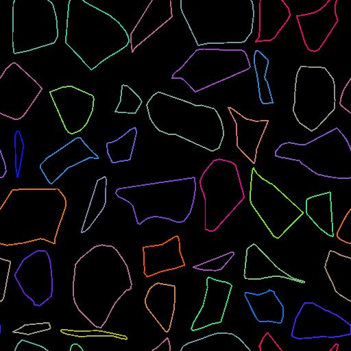

# Deformación de trazados

<table>
<tr style="border: 0;">
<td width="33.33%" style="border: 0;" valign="top">

<b>En:</b> Herramientas de spline y trazado > Herramientas de trazado

</td>
<td width="100.00%" style="border: 0;" valign="top">

## Descripción

Deforme las rutas de entrada según la <b>Entrada de degradado</b>. (Mismo efecto que el nodo [Warp](../../../../../../compositing-graphs/nodes-reference-for-com/atomic-nodes/warp/warp.md).)

</td>
</tr>
</table>

## Entradas

|  |  |
|:---|:---|
| <b>Rutas</b> <i>Color</i> | Una lista de los segmentos codificados de las rutas. Conecte esta entrada al resultado de [Mask to Paths](../../../../../../compositing-graphs/nodes-reference-for-com/node-library/spline-paths-tools/path-tools/mask-to-paths/mask-to-paths.md) o a otro nodo de procesamiento de rutas. |
| <b>Entrada de degradado</b> <i>Escala de grises</i> | Entrada similar a un height que controla tanto la cantidad como la dirección de la deformación. (Mismo efecto que el nodo [Warp](../../../../../../compositing-graphs/nodes-reference-for-com/atomic-nodes/warp/warp.md).) |

## Salidas

|  |  |
|:---|:---|
| <b>Rutas</b> <i>Color</i> | Los trazados transformados. Puedes usar [rutas de vista previa](../../../../../../compositing-graphs/nodes-reference-for-com/node-library/spline-paths-tools/path-tools/preview-paths/preview-paths.md) para hacerte una idea de lo que representa el resultado, usar otro nodo de procesamiento de rutas o escribirlo en [rutas de acceso a spline](../../../../../../compositing-graphs/nodes-reference-for-com/node-library/spline-paths-tools/path-tools/paths-to-spline/paths-to-spline.md) para procesarlo aún más como splines. |

## Parámetros

|  |  |
|:---|:---|
| <b>Intensidad</b> <i>Flotante</i> | El parámetro <b>Intensity</b> establece la intensidad de la deformación. |
| <b>Número de pasos</b> <i>Entero</i> | Utilice un valor más alto para deformar las rutas de entrada en varios incrementos pequeños. Esto puede impedir que la ruta se cruce sola, especialmente cuando se usan valores altos de <b>Intensity</b>. |

## Ejemplos

<table>
<tr style="border: 0;">
<td style="border: 0;" valign="top">

<table>
  <tr>
    <td>
      
       <i>Antes</i>
    </td>
    <td>
      
       <i>Después De</i>
    </td>
  </tr>
</table>

</td>
<td style="border: 0;" valign="top">

<table>
  <tr>
    <td>
      
       <i>Antes</i>
    </td>
    <td>
      
       <i>Después De</i>
    </td>
  </tr>
</table>

</td>
</tr>
</table>

<table>
<tr style="border: 0;">
<td style="border: 0;" valign="top">

</td>
<td style="border: 0;" valign="top">

</td>
</tr>
</table>
