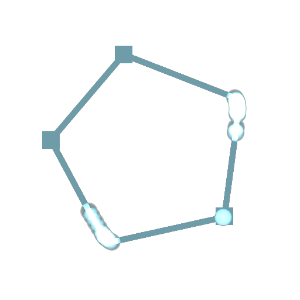
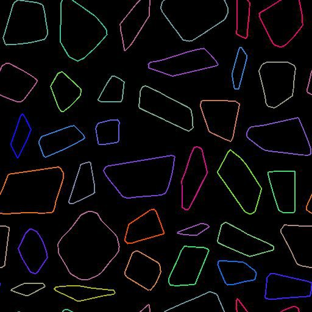

# Previsualizar trazados

<table>
<tr style="border: 0;">
<td width="33.33%" style="border: 0;" valign="top">

<b>En:</b> Herramientas de spline y trazado > Herramientas de trazado

</td>
<td width="100.00%" style="border: 0;" valign="top">

## Descripción

Traza segmentos y vértices del trazado sobre el fondo dado. Un color aleatorio por trazado.

Obtendrás un resultado similar al de la salida de <b>Vista previa</b> de [Máscara a trazados](../../../../../../compositing-graphs/nodes-reference-for-com/node-library/spline-paths-tools/path-tools/mask-to-paths/mask-to-paths.md), pero con más opciones.

</td>
</tr>
</table>

## Conectores de entrada

<b>Fondo</b> *Color*\
Una imagen de fondo encima de con muestra el trazado. Esto también controla el tamaño de procesamiento.

<b>Rutas</b> *Color*\
Una lista de los segmentos codificados de las rutas. Conecte esta entrada al resultado de [Mask to Paths](../../../../../../compositing-graphs/nodes-reference-for-com/node-library/spline-paths-tools/path-tools/mask-to-paths/mask-to-paths.md) o a otro nodo de procesamiento de rutas.

## Parámetros

<b>Mostrar vértices</b> *Boolean*\
Muestra un cuadrado en cada vértice marcado como esquina (fusión aditiva).

<b>Mostrar vértices</b> *Boolean*\
Muestra una forma circular en cada vértice (fusión aditiva). Las esquinas se siguen mostrando como cuadrados.

<b>Thickness de segmentos (px)</b> *Float*\
Ajusta el thickness de los segmentos procesados en píxeles.

## Ejemplos

<table>
<tr style="border: 0;">
<td style="border: 0;" valign="top">

</td>
<td style="border: 0;" valign="top">

</td>
</tr>
</table>
